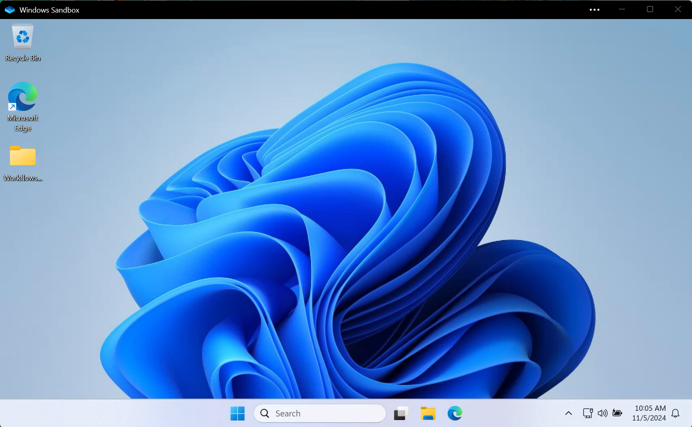
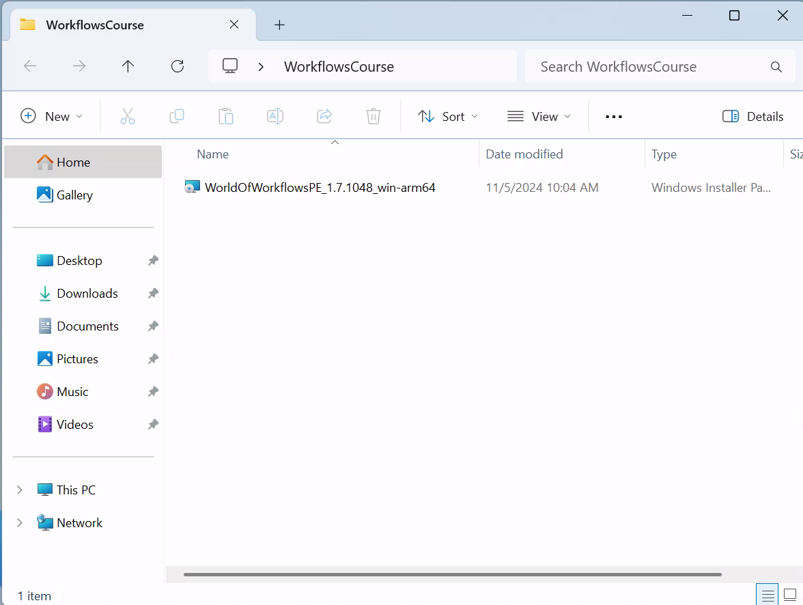
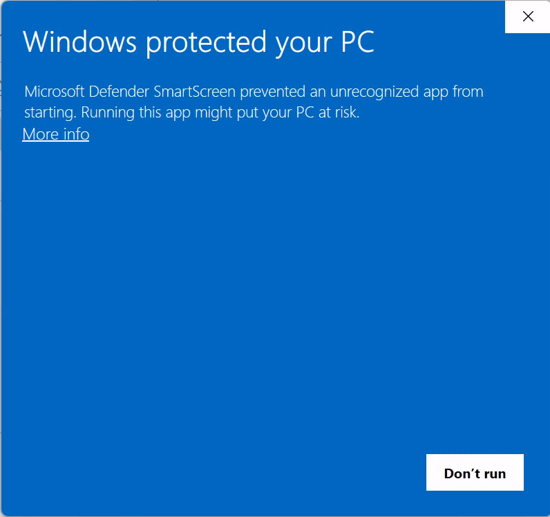
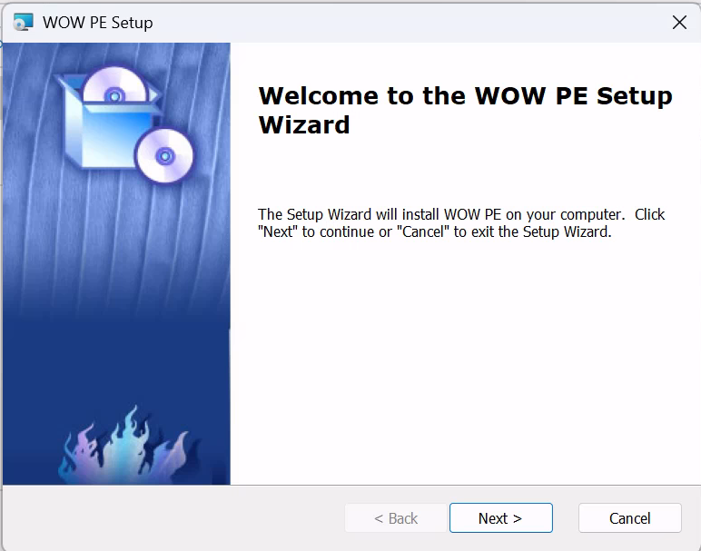
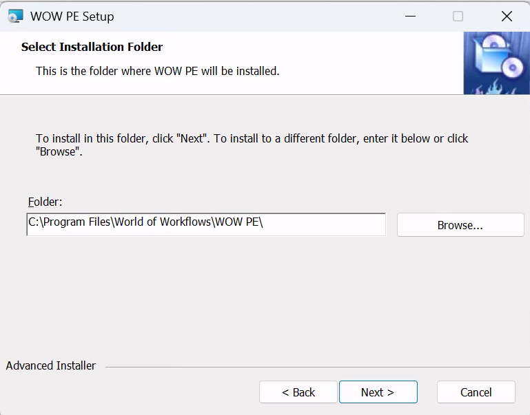
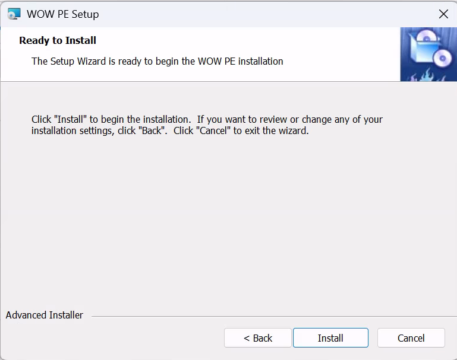
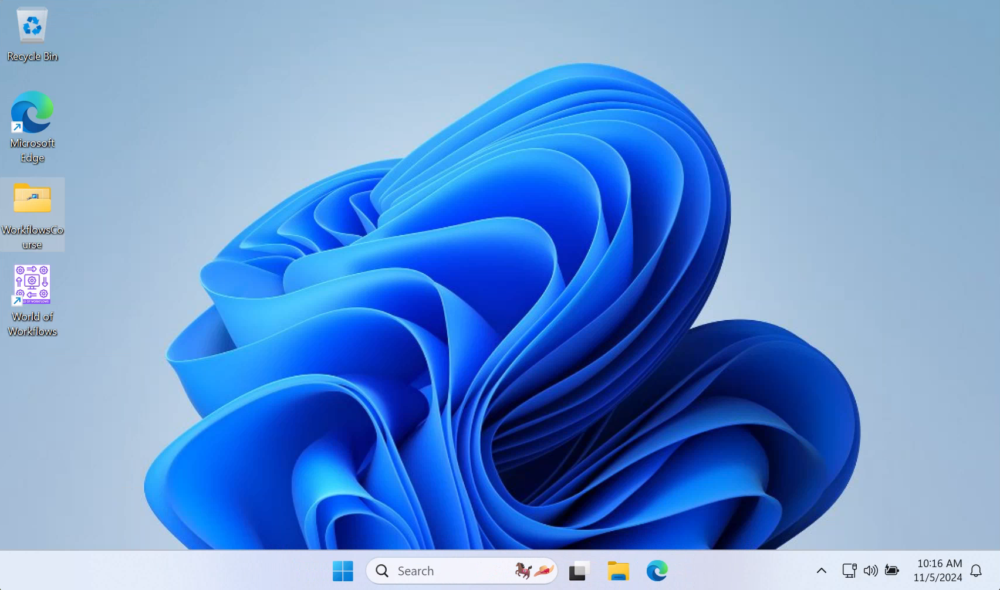
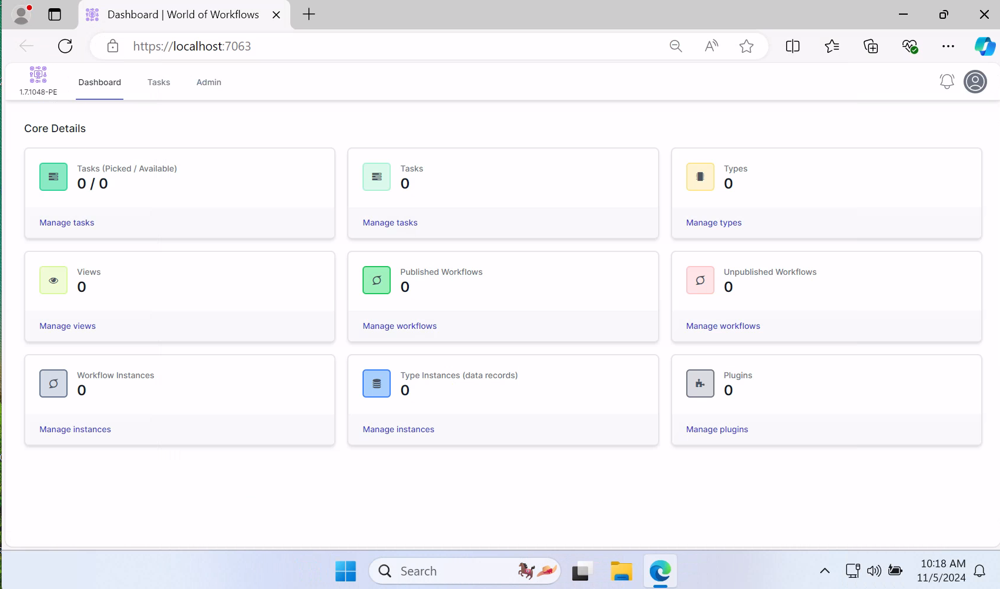

# Lab 02 - Installing World of Workflows

> **Note:** On ARM Windows Devices, you will need to install dotnet 8 as a pre-requisite. Dotnet 8 is available from https://dotnet.microsoft.com/en-us/download/dotnet/8.0.

## 1. Obtain binaries

1. Navigate to the releases area of World of Workflows on GitHub: [World of Workflows Releases](https://github.com/World-of-Workflows/WorkflowsUniversity/releases/tag/v1.7.1048-RC6)
2. Download WorldofWorkflowsPE_1.7.1048-RC6_win-x64.msi or WorldofWorkflowsPE_1.7.1048-RC6_win-arm64.zip, depending on your operating system.
3. Copy the file to c:\dev\WorkflowsCourse
4. Run the Windows Sandbox using the icon on your desktop called WorkflowsCourse.
   
5. Double click the WorkflowsCourse folder
   
6. Run the MSI by double-clicking the file.
   
7. Click **More Info** and then **Run Anyway**
   
8. Click **Next**
   
9. Click **Next**
    
10. Click **Install**
11. When complete, click **Finish**
12. The Desktop will now have a World of Workflows icon
    
13. Double click the icon to launch World of Workflows
    
14. Enter your registration details and click **Register**
15. Installation is now complete
    

> **Important:** If you ever close the sandbox, you will need to run this lab to install World of Workflows again.