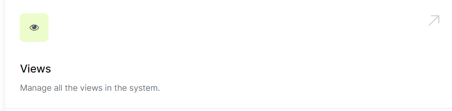
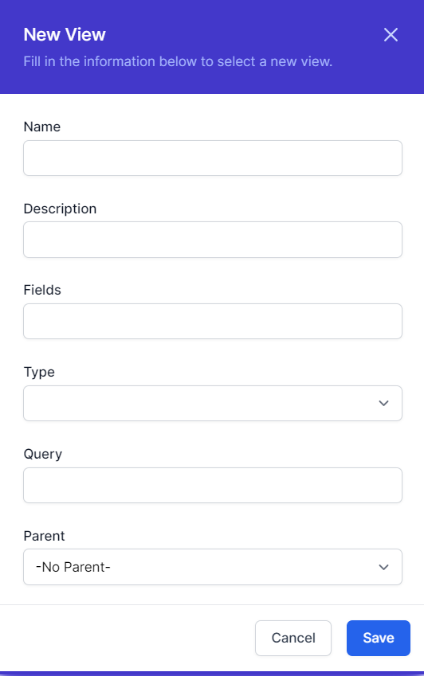
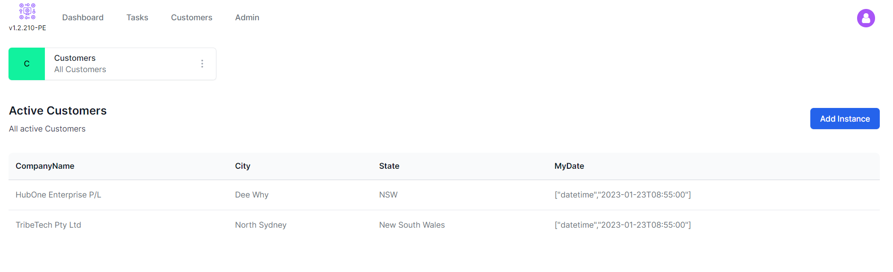

# Views

[](https://youtu.be/PJfxGTonlYw)
*Click to watch the video*

Welcome to the training module on views. In this module, you'll learn about views and how to use them to access and manipulate data from the database. 

Views are how you create a user interface for your users, allowing them access to just the data you want them to see, and control which data is displayed.

A view is a customised list of data from the database that is saved as a virtual table. You can use views to present data in a specific way, or to hide certain columns or rows from the original table. 

You'll learn how to create and manage views, and how to use them to access and query data from the database. 

By the end of this module, you'll have a solid understanding of views and be able to use them effectively in your work with databases. Let's get started.

## Creating a View
Views are created from the Admin Page in the Views section.



To create a view, click the **"Add View"** button.



Views require the following information:

- **Name** - This is the name of the view and will be visible in the user interface. Good Names are *All customers* or *All active leads*.
  > A good practice is to ensure your capitalisation of words is consistent across your views for all views. For example, if you have a view called *All Customers*, you should have a view called *All Leads* and not *All leads*.
- **Description** - The description should describe what the view does, for example, *All customers in the system*.
- **Fields** - This is a list of fields or columns that should be shown to the user. The list should be comma separated and not include spaces or other characters. For example, ```first_name,last_name,email,phone```.
- **Query** - This is a query that can be applied to the data, for example, Status=="Active". See the section later on queries for more information.
- **Parent** - Views have a hierarchy. Views with no parent appear on the top menu and children appear in buttons at the top of the view.

## Query Syntax
In this version of Workflows, all query data is presented as an ```object```. This provides some limitations to querying but it can still be highly effective.

The following operators are available:

| Operator | Name | Description |
| -- | -- | -- |
| ``eq`` | Equals | Returns true if the left and right operands are equal. |
| ``ne`` | Not Equals | Returns true if the left and right operands are not equal. |
| ``lt`` | Less Than | Returns true if the left operand is less than the right operand. |
| ``le`` | Less Than or Equal To | Returns true if the left operand is less than or equal to the right operand. |
| ``gt`` | Greater Than | Returns true if the left operand is greater than the right operand. |
| ``ge`` | Greater Than or Equal To | Returns true if the left operand is greater than or equal to the right operand. |

If your left operand, the field, is a date, or number then use the following syntax:

```field ge 100````

## Navigating Views

Here is an example of a number of views:

| View Id | Name | Description | Fields | Type | Query | Parent |
|---------|------|-------------|--------|------|--------|-------|
| 1 | Customers | All Customers | Title | 1 |  | 0 | 
| 2 | Active Customers | All active Customers | Title,City,State,MyDate | 1 | Status eq 2 | 1 | 
| 3 | Retired Customers | All retired customers | Title,City,State | 1 | Status eq 3 | 1 | 
| 4 | New Customers | All new customers | Title,City,State | 1 | Status eq 1 | 1 | 

The view with the Id of 1 is the parent view. This view is the top level view and is shown in the top menu. The other views are children of this view and are shown as buttons at the top of the view.


When a button is clicked to navigate, the leftmost button is the parent view and any children populate after that.




Previous [Database](database.md) | Next [Tasks](tasks.md)

