# HOWTO: Setup Azure AD to work with World of Workflows

## Introduction

This document describes how to setup Azure AD to work with World of Workflows. World of Workflows includes a **Credential Manager** which allows you to store and process credentials for external applications. However to connect to Azure AD you need to setup a **Registered Application** and connect the credential. This simple guide shows you how to perform that.

## Prerequisites
- Application Read/Write/Create Permissions in your Azure AD

## Output Table
*Complete this table as you move through the steps*

| Item | Value | Description |
| ---- | ----- | ----------- |
| Client Secret |  | This is a secret value that identifies this application |
| Authorization URL |  | This is the URL Workflows will use to access Azure AD |
| Access Token URL |  | This is the Access Token URL Workflows will use to access Azure AD |
| Client ID |  | This is the Client ID Workflows will use to access Azure AD |
| Scope | ```offline_access Mail.ReadWrite Mail.Send```| This is the Scope Workflows will use to access Azure AD |

## Steps to configure Azure AD

1. Connect to [Microsoft Azure Portal](https://portal.azure.com/#home) and navigate to Azure AD. Alternatively click [here](https://portal.azure.com/#view/Microsoft_AAD_IAM/ActiveDirectoryMenuBlade/~/Overview)
    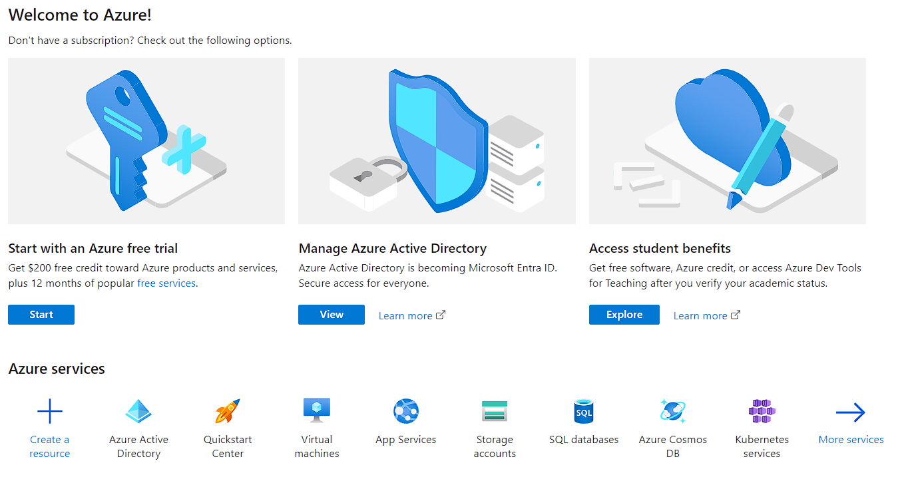
    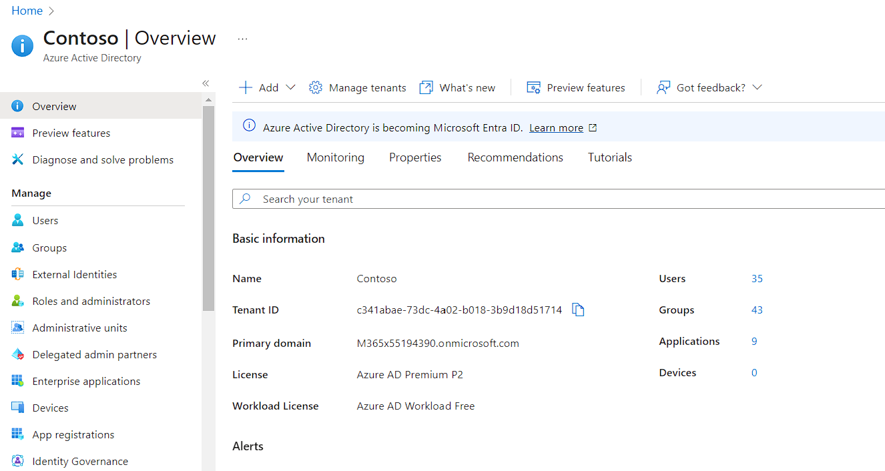
2. Click **App registrations** on the left menu or click [here](https://portal.azure.com/#view/Microsoft_AAD_IAM/ActiveDirectoryMenuBlade/~/RegisteredApps).
    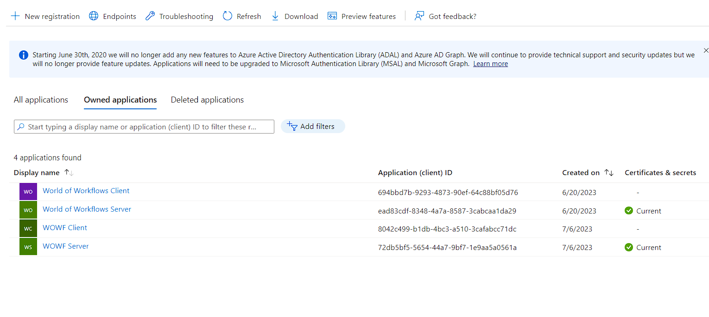
3. Click **New registration**
4. Type the name of this application. It's important to make this something you can understand later. In this example, we're going to call it **World of Workflows HOWTO**. Ensure **Accounts in this organizational directory only** is checked and click **Register**.
   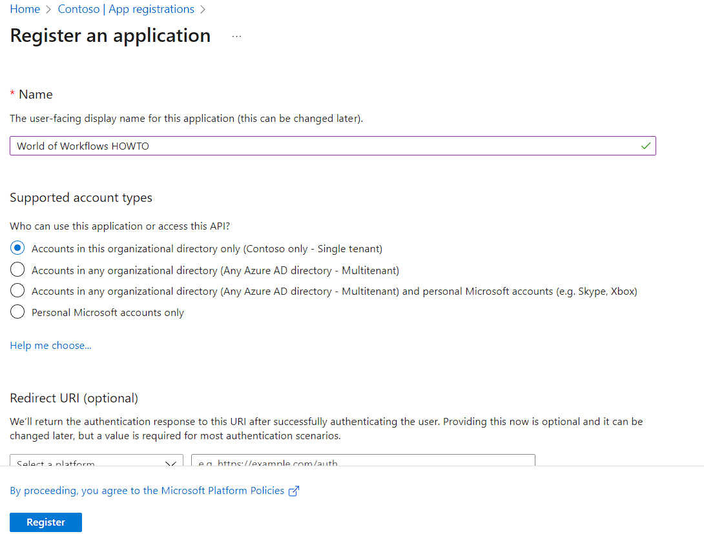
5. Click on **Endpoints**
    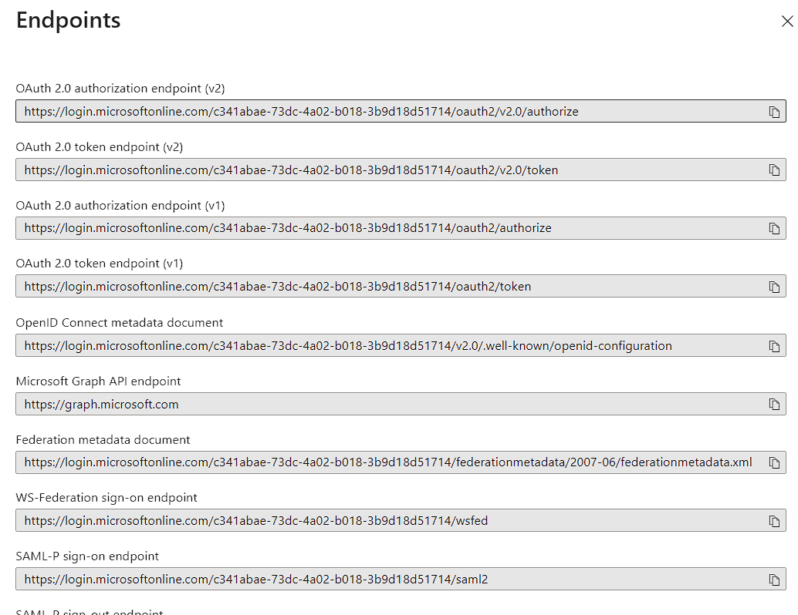
6. Copy the OAuth 2.0 authorization endpoint (v2) into the **Authorization URL** field in the table above
7. Copy the OAuth 2.0 token endpoint (v2) into the **Access Token URL** field in the table above
8. Close Endpoints
   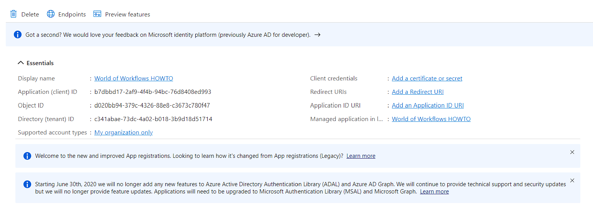
9.  Copy the Application (client) ID into the table above under Client ID
10. Choose **Certificates and secrets** from the menu on the left
    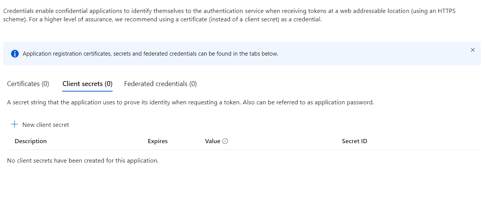
11. Click **+ New client secret**
    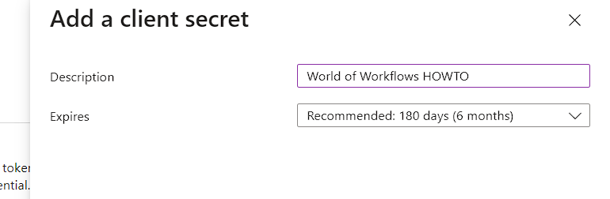
12. Now give the secret a description and an expiry date. In this example, we're going to call it **World of Workflows HOWTO** and set the expiry to **180 days**. Click **Add**
    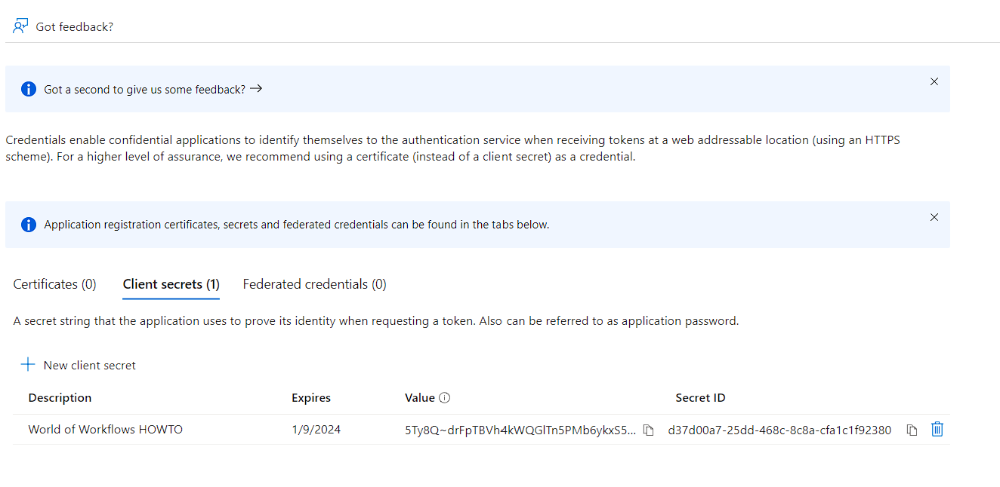
13. **IMPORTANT** Copy the value of the secret in the table above. You will need this later and this is the last time it will appear in the portal. If you lose this value, you will need to create a new secret.
14. Click **API Permissions** omn the left pane
    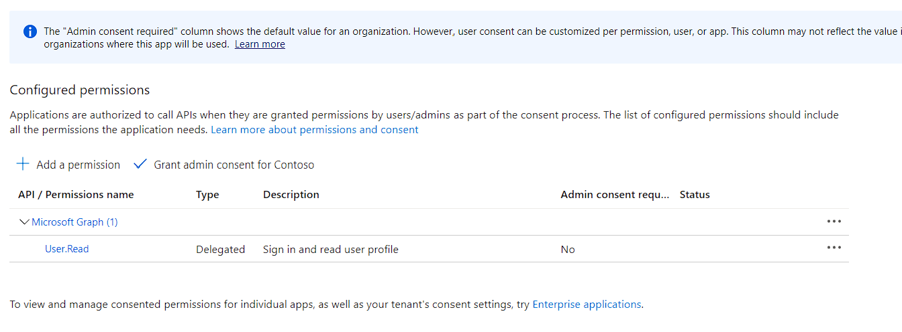
15. Click **Grant Admin Consent** and click **Yes**
    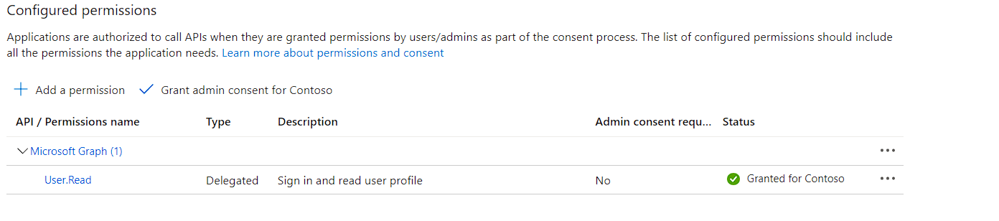
16. Click **Authentication** on the left pane
    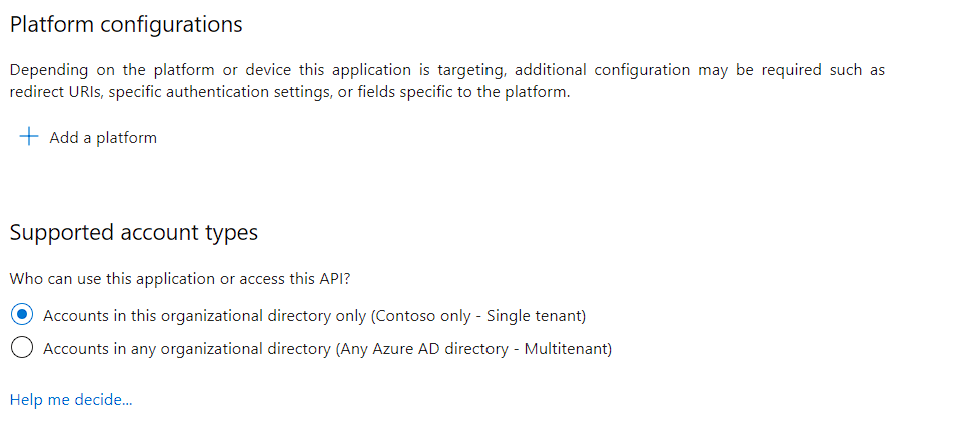
17. Click **Add a Platform**
    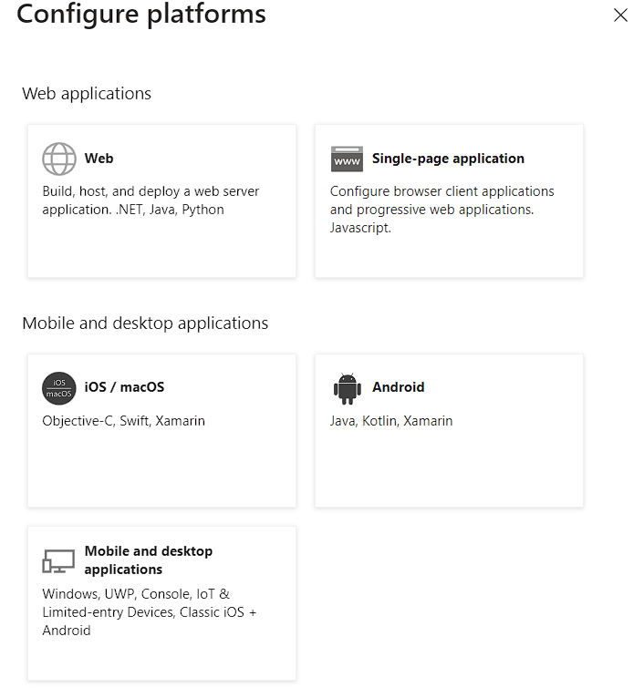
18. Click **Web**
19. Enter the redirect URI ```https://localhost:7063/v1/oauth2/callback``` for Personal Edition, for Business Edition, the address will be ```https//<WOWServer>/v1/oauth2/callback```
    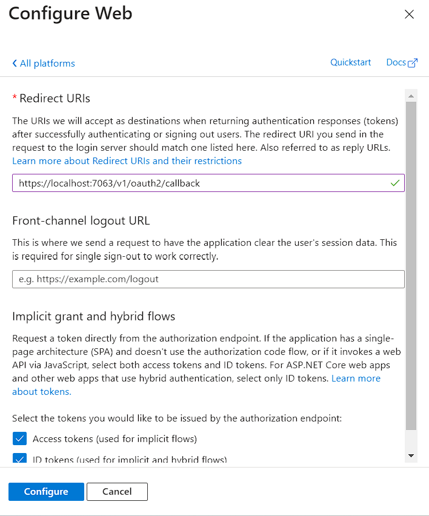
20. Check Access Tokens and ID Tokens and click **Configure**

Finally you need to choose scopes. These will determine what actions World of Workflows will perform with Office 365 and Azure AD. 

There are hundreds of scopes available [here](https://learn.microsoft.com/en-us/graph/permissions-reference) however here are some common ones:

- **offline_access** - always add this scope to ensure that the system keeps a persistent conneciton with Azure AD and you don't need to continually reauthenticate.
- **Mail.ReadWrite** - Allows the app to create, read, update, and delete email in user mailboxes. Does not include permission to send mail.
- **Mail.ReadWrite.Shared** - Allows the app to create, read, update, and delete mail that the user has permission to access, including the user's own and shared mail. Does not include permission to send mail.
- **Mail.Send** - Allows the app to send mail as users in the organization. 

Record the ones you need in the table above.

## Configure a credential in World of Workflows

1. Navigate to World of Workflows
2. Click **Admin -> Workflows**
3. Click **Credential Manager**
    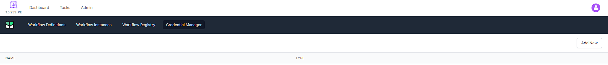
4. Click **Add New**
   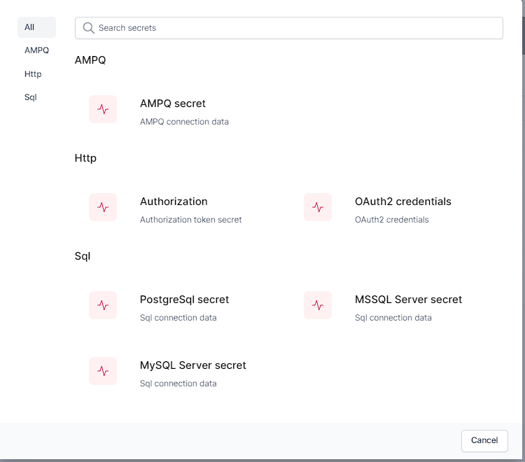
5. Choose **oAuth2 credentials**
6. Give your new credential a name, and change the Grant Type to **Authorization Code**
7. Now enter the **Authorization URL**, **Access Token URL**, **Client ID**, **Client Secret** and **Scope** from the table above.
   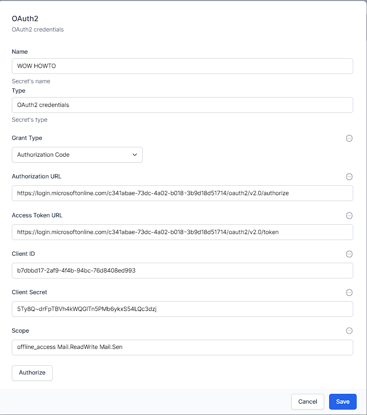
8. Click **Authorize**
   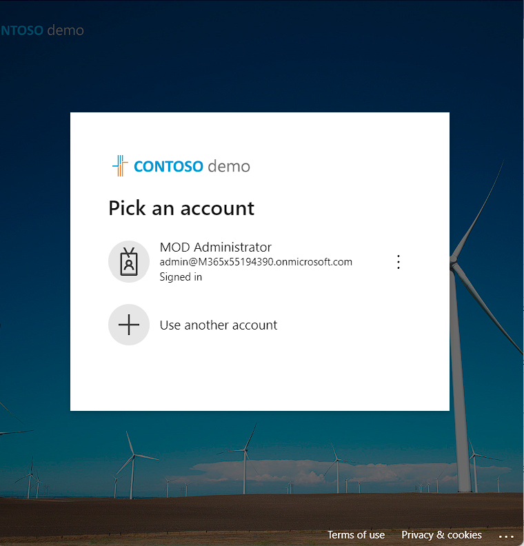
9. Login to Azure AD.'
    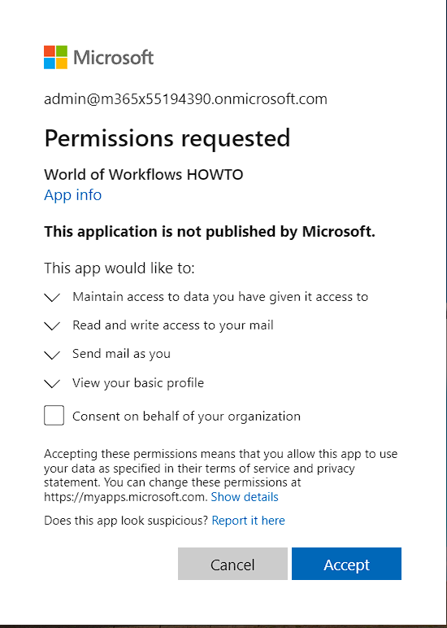
10. Check the permissions are correct and click **Accept**
11. Finally, click **Save** when returned to Credential Manager

This credential is now available for use when calling Microsoft Graph using HTTP or through any Office 365 or Microsoft Graph plugin.
