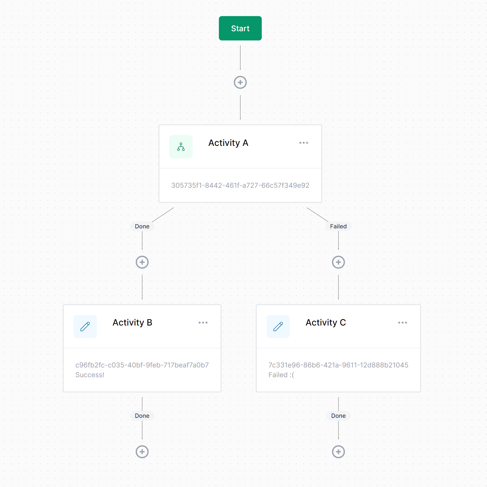
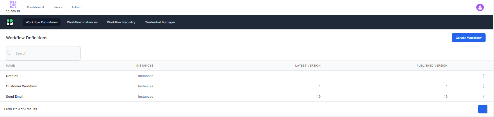
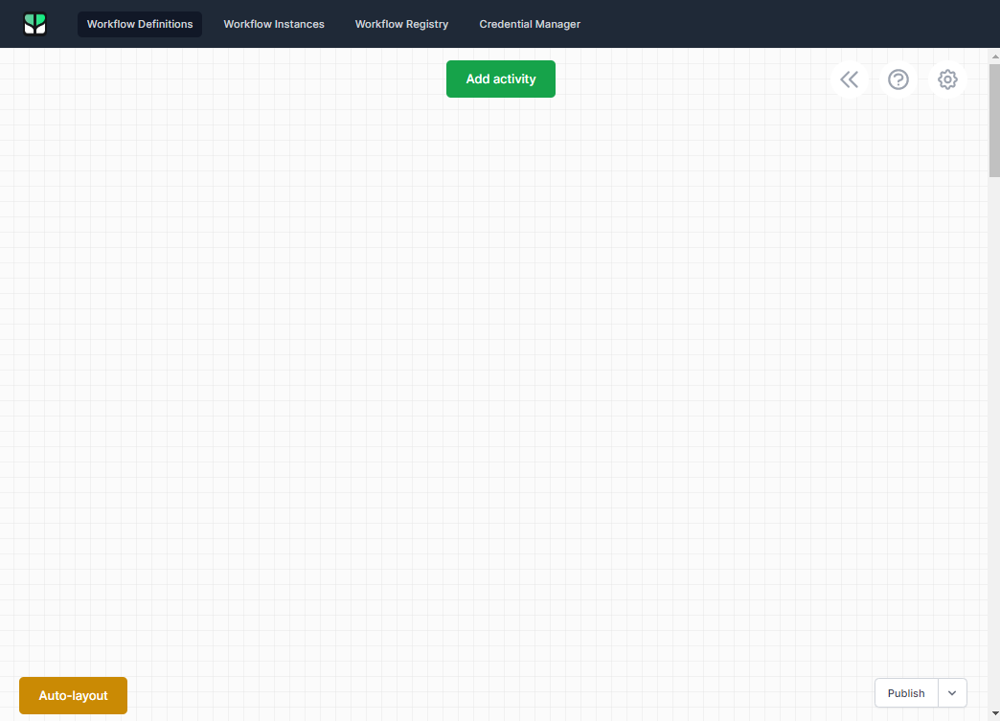
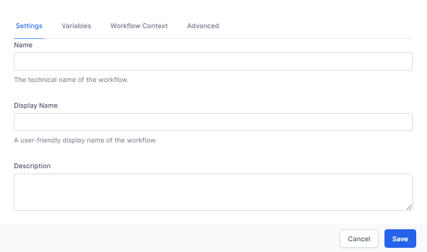
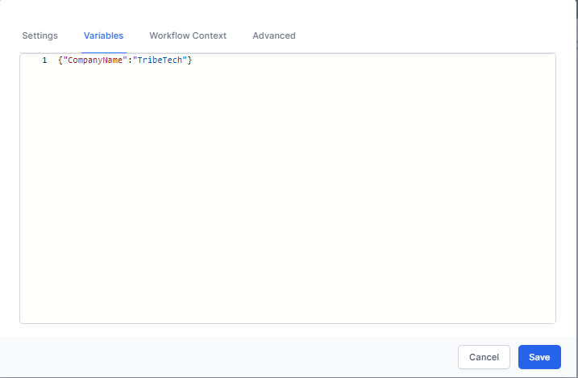

# Workflow Development

A workflow consists of a series of steps called activities that are connected to one another. A workflow maintains all sorts of information, such as the following:

- Which activity is currently executing.
- What variables are set.
- What activities are blocking further execution.

Once an activity is done executing, the workflow checks its outcome and if there's another activity connected to it. If so, that activity is scheduled for execution.

This goes on until there are either no more activities to execute, or an activity is encountered that instructs the workflow runner to **suspend** the workflow.

## Connection
A connection represents a connection between two activities. This is how the workflow runner knows what activities to execute next. A connection between two activities holds 3 pieces of information:

- The source activity ID.
- The source outcome name (e.g. Done).
- The target activity ID.

For each possible outcome of a given activity, a connection can be established from that outcome to another activity.

For example, let's say we have a workflow with three activities called Activity A, Activity B and Activity C. Activity A has 2 outcomes called Done and Failed, and we wish to connect the Done outcome to Activity B and Failed to Activity C.

This means we need the following two connections:

**Connection 1**
- Source: Activity A
- Outcome: Done
- Destination: Activity B

**Connection 2**
- Source: Activity A
- Outcome: Failed
- Destination: Activity C

Visually, this would look like this:

Workflow development is performed through the Workflow Dashboard (Admin -> Workflows)

**Workflow Definitions** could be considered templates for workflows. When these run, these are called **Workflow Instances**. Most work developing workflows is performed through Workflow Definitions.

## Create a new Workflow
To create a new workflow, click **Create Workflow**.

The workflow designer will appear. This is where you will create your workflow.

The features of the workflow designer is as follows:

- **Add Activity** (top middle) allows you to add an activity. An activity is a step in the workflow which does something.
- **Auto Layout** (bottom left) re-arranges the workflow.
- **Publish** (bottom right) allows you to **publish** the current version of the workflow, **Import** or **Export** the workflow from or to a file.
- The **<<** icon (top right) shows information on the workflow, including version history.
- The **?** icon (top right) shows some help in using the workflow designer surface
- The **cog** icon allows for general settings about the workflow.

> Workflows support version control and the system stores the current version of a workflow and all historical versions. This allows you to revert to an older version if you make a mistake.

## Workflow Settings
Clicking the **cog** icon on the top right of the workflow designer shows the settings page which is configured as follows:

### Basic Settings

- The **Name** is a technical name of the workflow to refer to it later. We suggest making this one word with no spaces.
- The **Display Name** is how it is shown in the workflow designer and in the Types Interface. Make this descriptive.
- The **Description** helps you understand what a workflow does and how it works. Ensure you add a detailed description for your workflows to ensure you can understand it in the future.

### Variables
Every workflow instance can have a set of workflow variables.

A workflow variable is a simple key/value pair stored as part of the workflow instance, and is useful to store information that can later be used by other activities.

### Default Variables
Although variables can be created on the fly within a workflow as it executes, you can declare variables up-front on the workflow definition itself.

You set default variables through the variables tab in settings.

### Workflow Context

The Workflow Context can match a type. This is an advanced usage for specfic scenarios.

