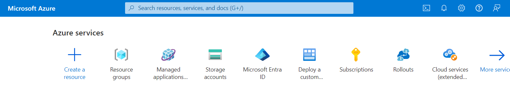
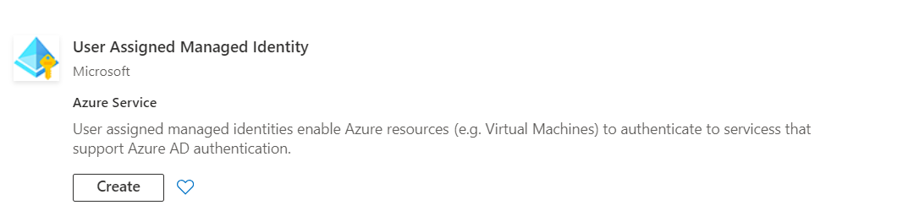
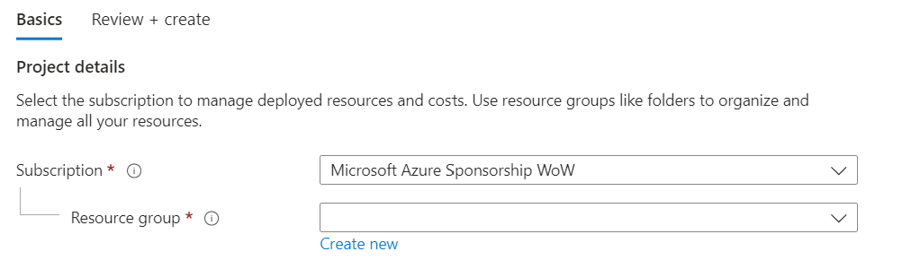
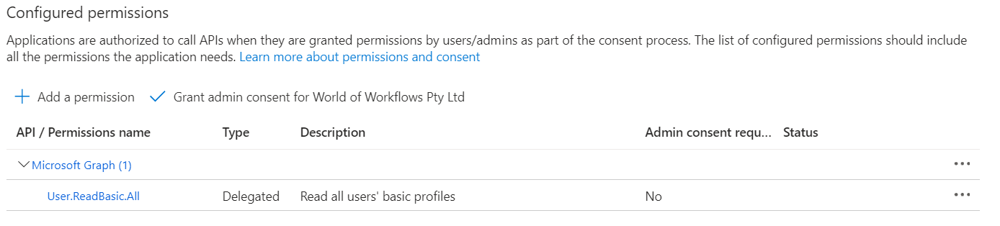

# Installation/Setup
This document contains instructions on how to install and configure World of Workflows on your machine.


## World of Workflows Personal Edition

### Windows Installation

1. Navigate to the [latest release](https://github.com/World-of-Workflows/WorkflowsUniversity/releases)
2. Download the Windows Version of PE [WorldOfWorkflowsPE_1.xxx_win-x64.exe](https://github.com/World-of-Workflows/WorkflowsUniversity/releases/download/1.7.461/WorldOfWorkflowsPE_1.7.461_win-x64.exe)
3. Run the downloaded application
   
4. Click **I agree to the License terms and conditions**
5. Click **Install**
   
6. Click **Finish**

**World of Workflows PE (Windows Installation)** is complete

### Apple M1 or M2 Installation

*Coming Soon*

### Linux Installation

1. Install dotnet 8 on your version of linux using the link [here](https://dotnet.microsoft.com/en-us/download)
2. Open a terminal window on your linux device
3. navigate to ```~```
4. Create a new folder for World of Workflows
   ```bash
   mkdir WoW
   cd WoW
   ```
5. In your browser, navigate to the [latest release folder](https://github.com/World-of-Workflows/WorkflowsUniversity/releases)
6. Right Click **WorldOfWorkflowsxPE_xxx_linux_x64.zip**
7. Download to your linux pc using a command like the one below:
   ```bash
   wget  https://github.com/World-of-Workflows/WorkflowsUniversity/releases/download/1.7.539/WorldOfWorkflowsPE_1.7.539_linux-x64.zip
   ```
8. Extract World of Workflows using the following command
   ```bash
   unzip WorldOfWorkflowsPE_1.7.539_linux-x64.zip
   rm WorldOfWorkflowsPE_1.7.539_linux-x64.zip
   ```
9. copy the files to their production location
   ```bash
   sudo cp -r . /var/www/WorldOfWorkflows
   ```
10. Create a new Service file
    ```
    sudo nano /etc/systemd/system/kestrel-wow.service
    ```
11. Enter the following information
    ```
    [Unit]
    Description=World of Workflows 1.7

    [Service]
    WorkingDirectory=/var/www/WorldofWorkflows
    ExecStart=/var/www/WorldofWorkflows/HubOneWorkflowsApp.Server
    Restart=always
    # Restart service after 10 seconds if the dotnet service crashes:
    RestartSec=10
    KillSignal=SIGINT
    SyslogIdentifier=world-of-workflows
    User=root
    Environment=ASPNETCORE_ENVIRONMENT=Production
    Environment=DOTNET_NOLOGO=true

    [Install]
    WantedBy=multi-user.target
    ```
12. Start the service with the following command
    ```bash
    sudo systemctl start kestrel-wow
    ```
13. Check the service is running with
    ```bash
    sudo systemctl status kestrel-wow
    ```
14. You should see the following
    ```
    ● kestrel-wow.service - World of Workflows 1.7
      Loaded: loaded (/etc/systemd/system/kestrel-wow.service; enabled; preset: disabled)
      Active: active (running) since Thu 2024-02-29 12:44:42 AEDT; 26min ago
      Main PID: 177798 (HubOneWorkflows)
      Tasks: 24 (limit: 48864)
      Memory: 342.5M
      CPU: 10.471s
      CGroup: /system.slice/kestrel-wow.service
             └─177798 /var/www/WorldofWorkflows/HubOneWorkflowsApp.Server
    ```
15. If the service is not running, try the following steps:
    1.  Change the permissions on the executable
        ```bash
        sudo chmod 777 /var/www/WorldofWorkflows/HubOneWorkflowsApp.Server
        sudo systemctl start kestrel-wow
        ```
    2. Change the SELinux policy. *Note, Changing SEinux policies can be complex and depends on your specific setup. The step belwo sets the file to a permissive tyope to test if SELinux is the issue*
       ```bash
       sudo chcon -t bin_t /var/www/WorldofWorkflows/HubOneWorkflowsApp.Server
       ```
16. Finally, to connect to World of Workflows using https, you need to trust the dotnet certificate. You do this using the following command:
    ```bash
    dotnet dev-certs https --trust
    ```
17. You may need to trust the certificate. To do this, follow the instructions below:
    1. Export the certificate to a file
        ```bash
        dotnet dev-certs https -ep ${HOME}/.aspnet/https/aspnetapp.pfx -p <password>
        ```
    2. Convert to PEM Format
       ```bash
       openssl pkcs12 -in ${HOME}/.aspnet/https/aspnetapp.pfx -out ${HOME}/.aspnet/https/aspnetapp.pem -nodes -password pass:<password>
       ```
    3. Add to trusted stores
       1. Ubuntu/Debian
          ```bash
          sudo cp ${HOME}/.aspnet/https/aspnetapp.pem /usr/local/share/ca-certificates/aspnetapp.crt
          sudo update-ca-certificates
          ```
       2. Fedora/RedHat
          ```bash
          sudo cp ${HOME}/.aspnet/https/aspnetapp.pem /etc/pki/ca-trust/source/anchors/
          sudo update-ca-trust
          ```


## World of Workflows Business Edition

World of Workflows Business Edition is available on the Azure Marketplace here:

[Azure Marketplace](https://azuremarketplace.microsoft.com/en-us/marketplace/apps/worldofworkflows.wowbe?tab=Overview)

### Installation Instructions

#### Installing Pre-requisites

1. Navigate to the [Azure Portal](https://portal.azure.com/#home)
   
2. Click **[+ Create a resource](https://portal.azure.com/#create/hub)**
   
3. Search for **User Managed Identity**.
   
4. Under User Managed Identity, click **Create**
5. Create or choose a **Resource Group**, Set the Region to be your local region and give the Identity a name. We commonly use **WOWBEInstaller**.
   
6. Click **Review + Create**
7. Give your managed Identity Permissions as follows:
   - for the subscription where you will install World of Workflows, make the managed Identity an **Owner**.
   - In Entra Id, in the directory you will install World of Workflows, make the managed Identity an **Application Administrator**

**Note: ** *The managed identity can be deleted after deployment is complete.*

#### Installing World of Workflows

1. Navigate to the [Azure Portal](https://portal.azure.com/#home)
   
2. Click **[+ Create a resource](https://portal.azure.com/#create/hub)**
   
3. Search for **User World of Workflows** or click the link to the [Azure Marketplace](https://azuremarketplace.microsoft.com/en-us/marketplace/apps/worldofworkflows.wowbe?tab=Overview).
4. Choose your plan and click **Create**
5. Complete the form as follows:
   1. **Project Details**
   
      - Enter the subscription where you would like to install world of Workflows and create a new **Resource Group** by clicking **Create new**
   2. **Instance Details**
   
       - Choose the region where you want to install Wold of Workflows and choose a **Site Name** and **Server Plan Name**.
       - **Site Name**: This is the name of the application. It can be anything you want, must be unique and will become ```https://<sitename>.azurewebsites.net``` when deployment is complete.
       - **Server Plan Name**: This can be anything you want and is the plan the server sits under. You use this for scaling your instance up and down.
   3. **User assigned managed identity**
   
       - Choose the user assigned managed identity created in pre-requisites above. Identities need Owner Access to the subscription and Application Administrator access to Entra Id. This identity can be deleted after deployment is complete.
   4. **Single Selector**
   
       - Create a new **storage account** for World of Workflows by clicking **Create New**.
       
       - Ensure the storage account has a unique name and is configured for **File Shares** as the account kind. When done click **Ok**
       - Enter the name for the Client Application and Server Application in Entra Id. This will create the applications we will use to assign permissions and access the World of Workflows API from other applications.
   5. **Managed Application Details**
   
       - Enter the Application Name (for example **World of Workflows**)
       - Edit the Managed Resource Group if required .
6. Click **Review and Create**
7. Accept the Terms and Conditions and click **Create**

After about 15 minutes, navigate to ```https://<sitename>.azurewebsites.net```

#### Granting Permissions
Granting permissions in World of Workflows requires you first to configure the Server Entra Id Application and then assign permissions.

**Important:** Wait until deployment is complete before performing the tasks below.

1. **Setting up Server Application**
   1. You only need perform this once
   2. Navigate to [Azure Portal --> Entra Id --> App Registrations](https://portal.azure.com/#view/Microsoft_AAD_IAM/ActiveDirectoryMenuBlade/~/RegisteredApps)
   3. Click **All Applications**
   4. Search for the Server application configured in step iv. above.
   5. Click **API Permissions**
   
   6. Click **Add a permission**
   7. Click **Microsoft Graph**
   8. Click **Delegated Permissions**
   9. Select **email, offline_access, openid and profile**
   10. Click **Add Permissions**
   11. Click **Grant Admin Consent**
   12. Click **Yes**
   

2. **Granting Permissions**
   1. Navigate to [Azure Portal --> Entra Id --> Enteprrise Applications](https://portal.azure.com/#view/Microsoft_AAD_IAM/StartboardApplicationsMenuBlade/~/AppAppsPreview/menuId~/null) 
   2. Click **X** next to Application type == Enteprrise Applications.
   
   3. Search for and select the server applcation congfigured in step iv above.
   4. Under **Manage**, choose **Users and Groups**
   
   5. Click **Add user/group**
   
   6. Click **None Selected**
   7. Search for and select the User you want to grant permissions to
   
   8. Click **Select**
   9. Click **Assign**. *Administrator is the only role available in this version*

Now you can navigate to your new server and login.