# World of Workflows Business Edition

World of Workflows Business Edition is available on the Azure Marketplace here:

[Azure Marketplace](https://azuremarketplace.microsoft.com/en-us/marketplace/apps/worldofworkflows.wowbe?tab=Overview)

## Installation Instructions - Obsolete

### Installing Pre-requisites

1. Navigate to the [Azure Portal](https://portal.azure.com/#home)  
   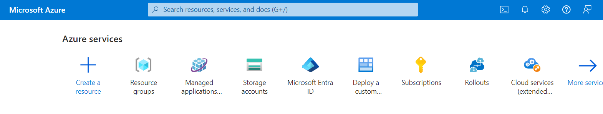
2. Click **[+ Create a resource](https://portal.azure.com/#create/hub)**  
   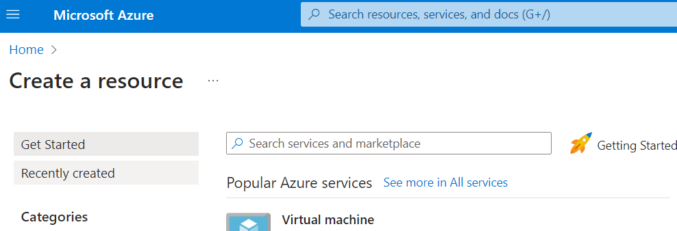
3. Search for **User Managed Identity**.
   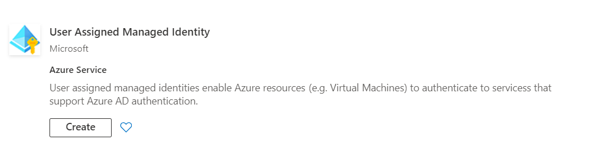
4. Under User Managed Identity, click **Create**
5. Create or choose a **Resource Group**, Set the Region to be your local region and give the Identity a name. We commonly use **WOWBEInstaller**.  
   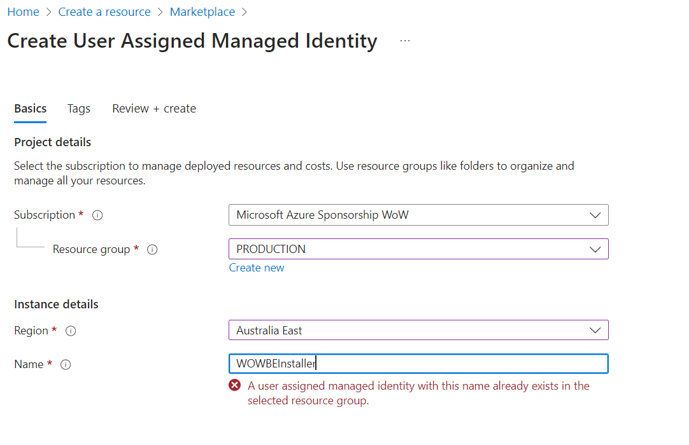
   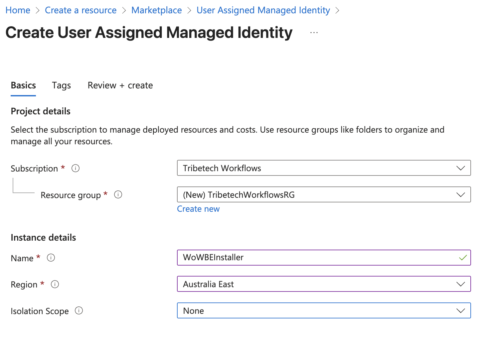
6. Click **Review + Create**
7. Give your managed Identity Permissions as follows:
   - for the subscription where you will install World of Workflows, make the managed Identity an **Owner**.  
      - Find the Managed Identity Resource:  
      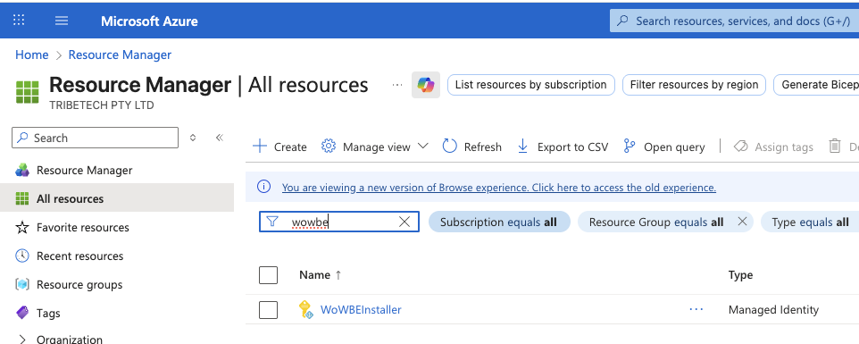  
      - Add the Owner role  
      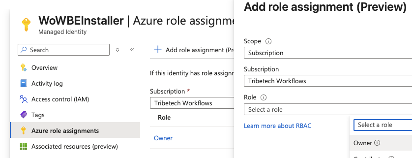
   - In Entra Id, in the directory you will install World of Workflows, make the managed Identity an **Application Administrator**  
      - Go to Microsoft Entra ID (left menu).
	   - Click **Manage -> Roles and administrators**
      — Open the **Application Administrator** Role
	   - Click Add assignments  
      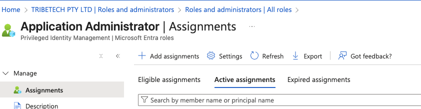
	   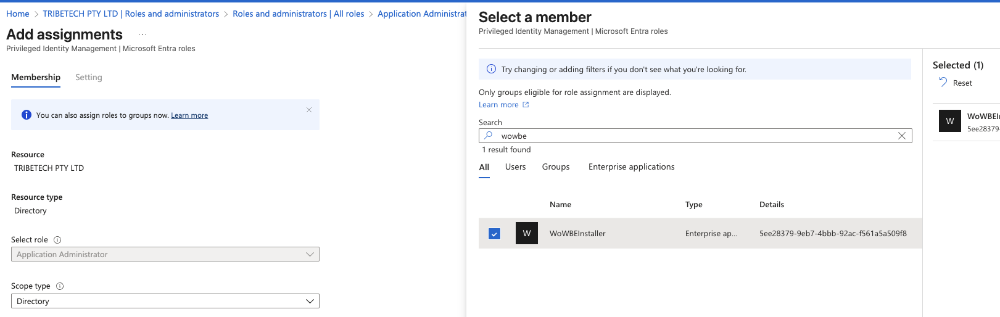
	   - Click Add.
      You will now see an active assignment for WoWBEInstaller (your Managed Identity) 

{: .key }
   > This **can only** be done by a user with appropriate authority.  Without the correct authority you will not see the the **Add Assignment** button.   

{: .key }  
   *The managed identity can be deleted after deployment is complete.* 
Add role to the managed identity  
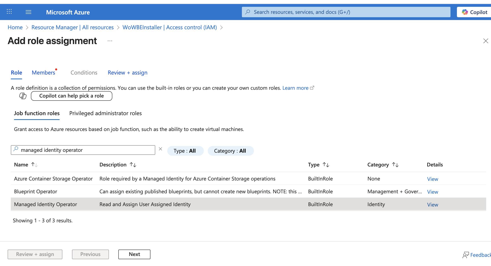  
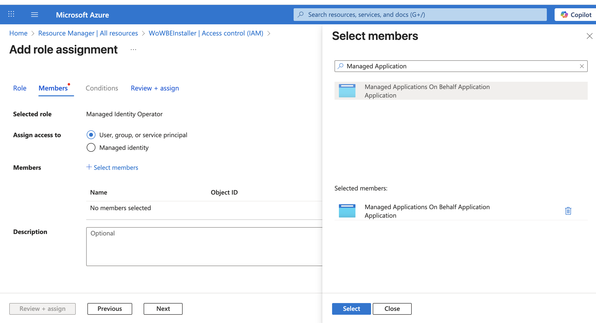  
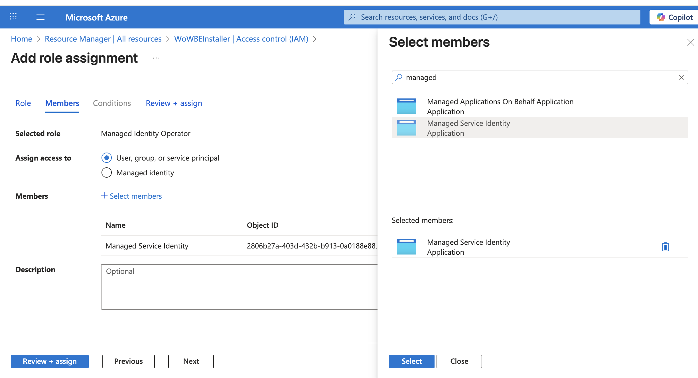  

8. Ensure your subscription has the Resource provider Microsoft.web registered.  In the Azure portal:
	1.	Go to Subscriptions.  
	2.	Open subscription your subscription.  
	3.	In the left menu, choose **Settings -> Resource providers**.  
	4.	Search for Microsoft.Web.  
	5.	Click Register. 

For example:  
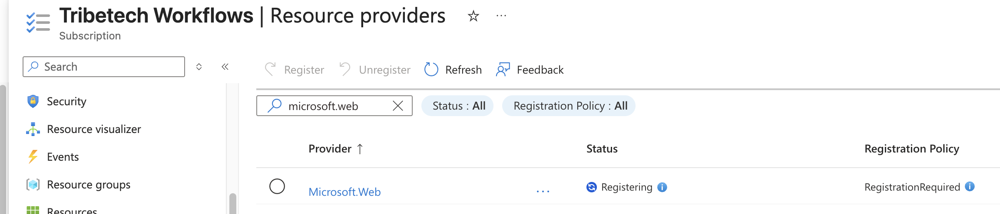


### Installing World of Workflows

1. Navigate to the [Azure Portal](https://portal.azure.com/#home)
   
2. Click **[+ Create a resource](https://portal.azure.com/#create/hub)**
   
3. Search for **User World of Workflows** or click the link to the [Azure Marketplace](https://azuremarketplace.microsoft.com/en-us/marketplace/apps/worldofworkflows.wowbe?tab=Overview).
4. Choose your plan and click **Create**
5. Complete the form as follows:
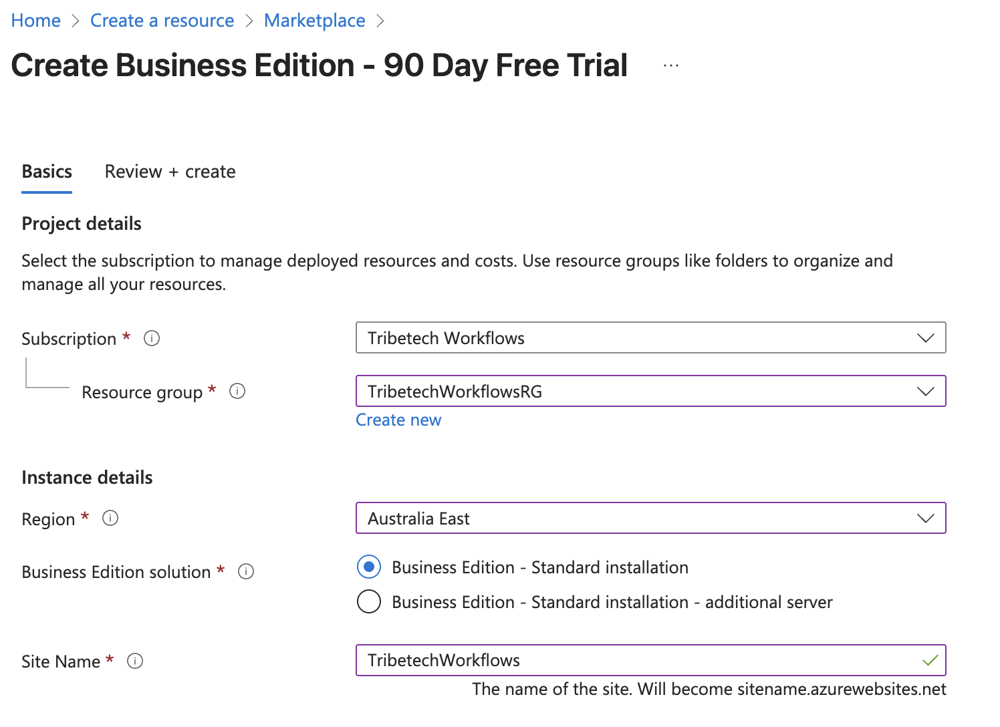  
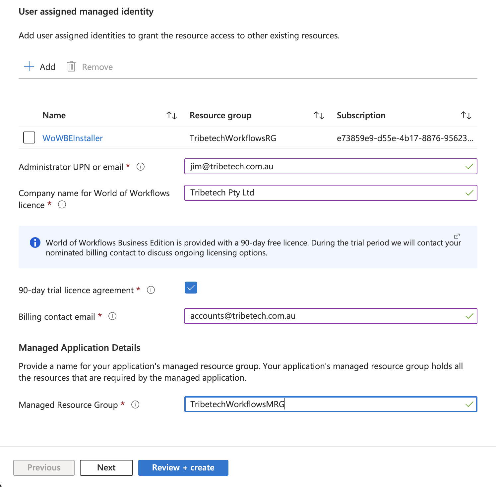
   1. **Project Details**
   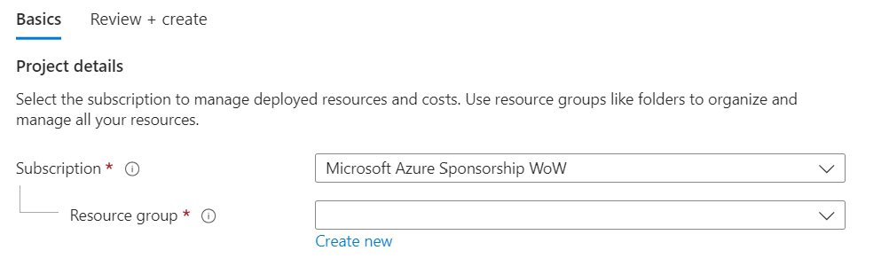
      - Enter the subscription where you would like to install world of Workflows and create a new **Resource Group** by clicking **Create new**
   2. **Instance Details**
   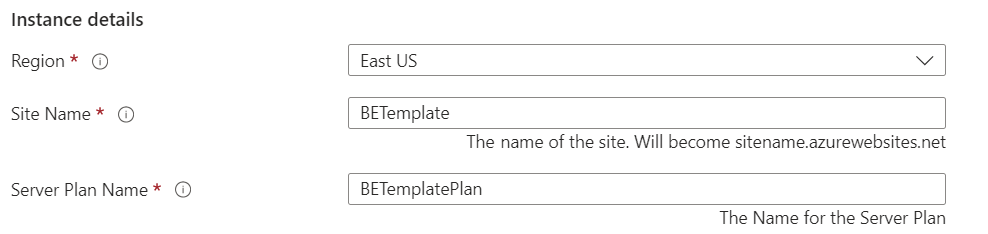
       - Choose the region where you want to install Wold of Workflows and choose a **Site Name** and **Server Plan Name**.
       - **Site Name**: This is the name of the application. It can be anything you want, must be unique and will become ```https://<sitename>.azurewebsites.net``` when deployment is complete.
       - **Server Plan Name**: This can be anything you want and is the plan the server sits under. You use this for scaling your instance up and down.
   3. **User assigned managed identity**
   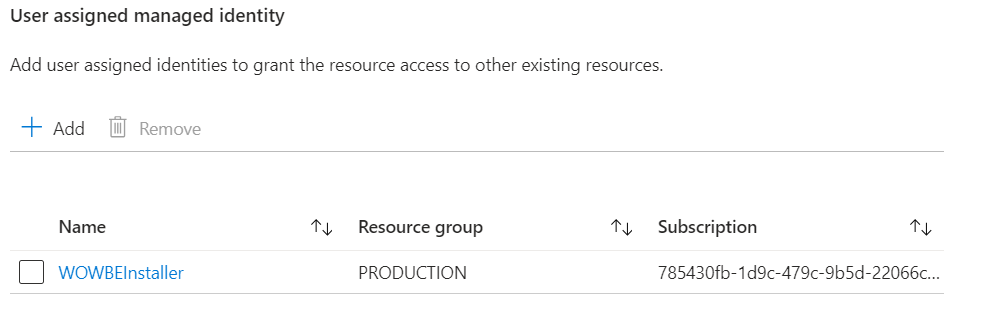
       - Choose the user assigned managed identity created in pre-requisites above. Identities need Owner Access to the subscription and Application Administrator access to Entra Id. This identity can be deleted after deployment is complete.
   4. **Single Selector**
   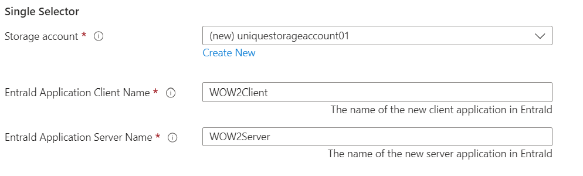
       - Create a new **storage account** for World of Workflows by clicking **Create New**.
       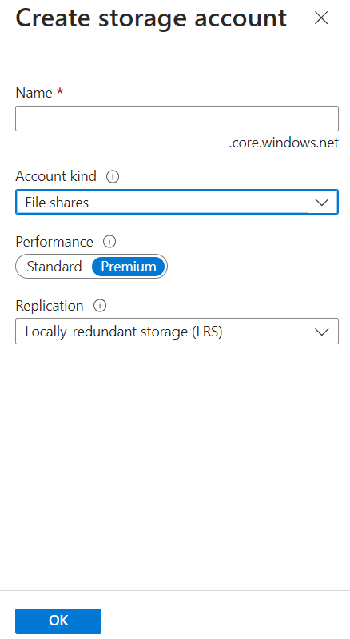
       - Ensure the storage account has a unique name and is configured for **File Shares** as the account kind. When done click **Ok**
       - Enter the name for the Client Application and Server Application in Entra Id. This will create the applications we will use to assign permissions and access the World of Workflows API from other applications.
   5. **Managed Application Details**
   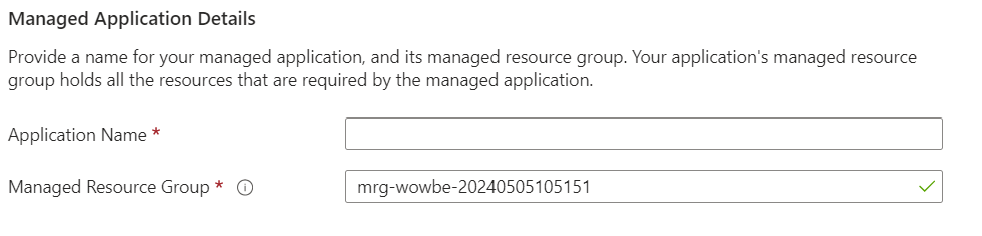
       - Enter the Application Name (for example **World of Workflows**)
       - Edit the Managed Resource Group if required .
6. Click **Review and Create**
7. Accept the Terms and Conditions and click **Create**

After about 15 minutes, navigate to ```https://<sitename>.azurewebsites.net```

### Granting Permissions
Granting permissions in World of Workflows requires you first to configure the Server Entra Id Application and then assign permissions.

**Important:** Wait until deployment is complete before performing the tasks below.

1. **Setting up Server Application**
   1. You only need perform this once
   2. Navigate to [Azure Portal --> Entra Id --> App Registrations](https://portal.azure.com/#view/Microsoft_AAD_IAM/ActiveDirectoryMenuBlade/~/RegisteredApps)
   3. Click **All Applications**
   4. Search for the Server application configured in step iv. above.
   5. Click **API Permissions**
   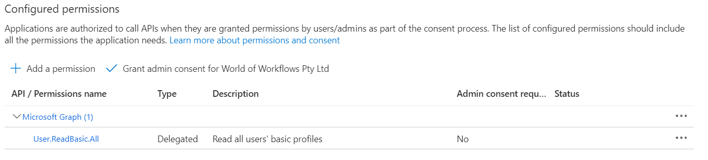
   6. Click **Add a permission**
   7. Click **Microsoft Graph**
   8. Click **Delegated Permissions**
   9. Select **email, offline_access, openid and profile**
   10. Click **Add Permissions**
   11. Click **Grant Admin Consent**
   12. Click **Yes**
   

2. **Granting Permissions**
   1. Navigate to [Azure Portal --> Entra Id --> Enteprrise Applications](https://portal.azure.com/#view/Microsoft_AAD_IAM/StartboardApplicationsMenuBlade/~/AppAppsPreview/menuId~/null) 
   2. Click **X** next to Application type == Enteprrise Applications.
   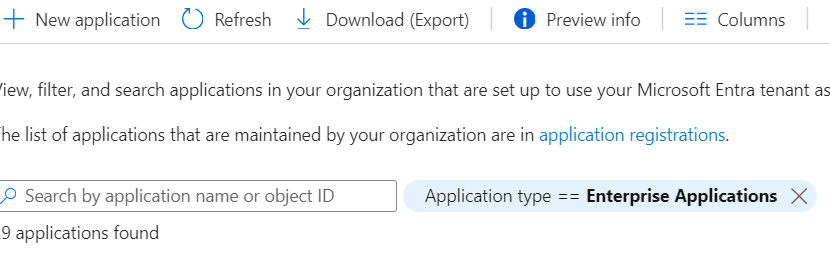
   3. Search for and select the server applcation congfigured in step iv above.
   4. Under **Manage**, choose **Users and Groups**
   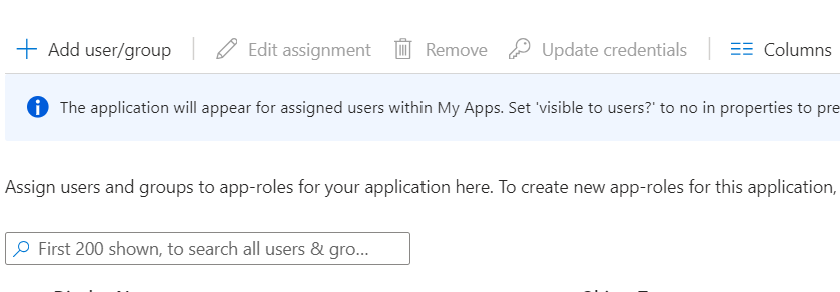
   5. Click **Add user/group**
   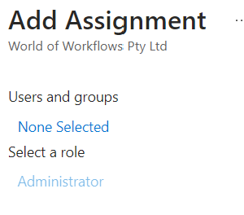
   6. Click **None Selected**
   7. Search for and select the User you want to grant permissions to
   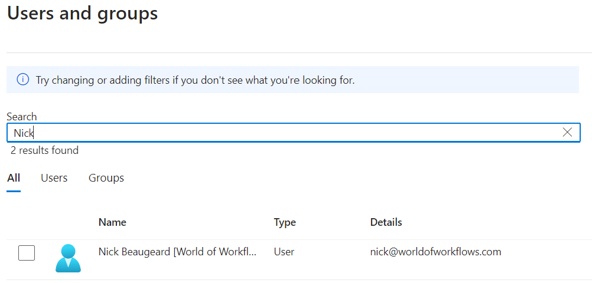
   8. Click **Select**
   9. Click **Assign**. *Administrator is the only role available in this version*

Now you can navigate to your new server and login.


## Installation Instructions - Powershell installer

gotcha: make sure the GA user has this turned on in Tenant Propertie
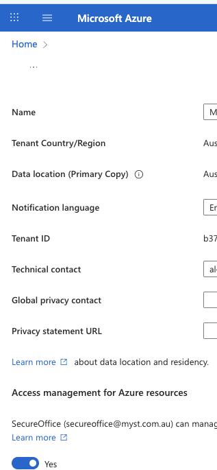