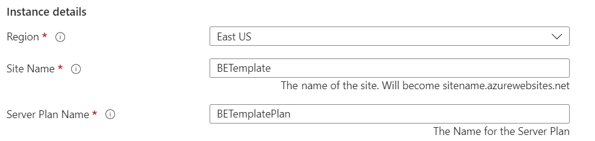
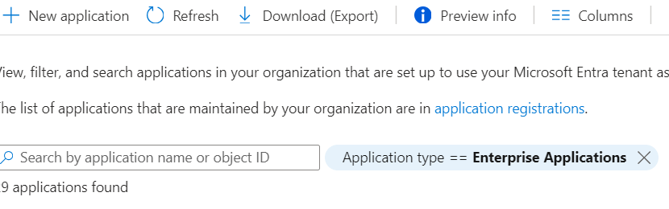
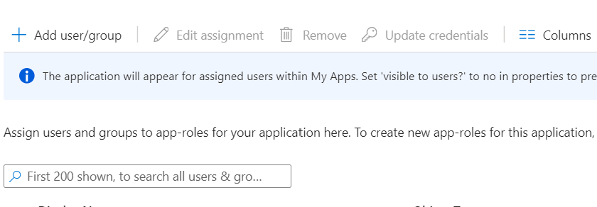
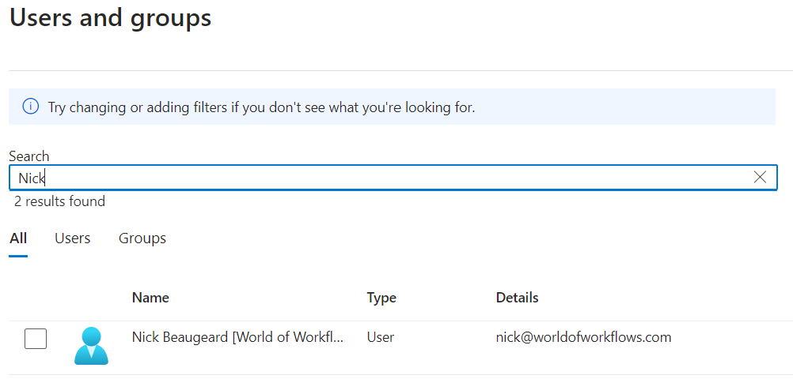

# World of Workflows Business Edition

World of Workflows Business Edition is available on the Azure Marketplace here:

[Azure Marketplace](https://azuremarketplace.microsoft.com/en-us/marketplace/apps/worldofworkflows.wowbe?tab=Overview)

## Installation Instructions

### Installing Pre-requisites

1. Navigate to the [Azure Portal](https://portal.azure.com/#home)
   
2. Click **[+ Create a resource](https://portal.azure.com/#create/hub)**
   
3. Search for **User Managed Identity**.
   
4. Under User Managed Identity, click **Create**
5. Create or choose a **Resource Group**, Set the Region to be your local region and give the Identity a name. We commonly use **WOWBEInstaller**.
   
6. Click **Review + Create**
7. Give your managed Identity Permissions as follows:
   - for the subscription where you will install World of Workflows, make the managed Identity an **Owner**.
   - In Entra Id, in the directory you will install World of Workflows, make the managed Identity an **Application Administrator**

**Note: ** *The managed identity can be deleted after deployment is complete.*

### Installing World of Workflows

1. Navigate to the [Azure Portal](https://portal.azure.com/#home)
   
2. Click **[+ Create a resource](https://portal.azure.com/#create/hub)**
   
3. Search for **User World of Workflows** or click the link to the [Azure Marketplace](https://azuremarketplace.microsoft.com/en-us/marketplace/apps/worldofworkflows.wowbe?tab=Overview).
4. Choose your plan and click **Create**
5. Complete the form as follows:
   1. **Project Details**
   
      - Enter the subscription where you would like to install world of Workflows and create a new **Resource Group** by clicking **Create new**
   2. **Instance Details**
   
       - Choose the region where you want to install Wold of Workflows and choose a **Site Name** and **Server Plan Name**.
       - **Site Name**: This is the name of the application. It can be anything you want, must be unique and will become ```https://<sitename>.azurewebsites.net``` when deployment is complete.
       - **Server Plan Name**: This can be anything you want and is the plan the server sits under. You use this for scaling your instance up and down.
   3. **User assigned managed identity**
   
       - Choose the user assigned managed identity created in pre-requisites above. Identities need Owner Access to the subscription and Application Administrator access to Entra Id. This identity can be deleted after deployment is complete.
   4. **Single Selector**
   
       - Create a new **storage account** for World of Workflows by clicking **Create New**.
       
       - Ensure the storage account has a unique name and is configured for **File Shares** as the account kind. When done click **Ok**
       - Enter the name for the Client Application and Server Application in Entra Id. This will create the applications we will use to assign permissions and access the World of Workflows API from other applications.
   5. **Managed Application Details**
   
       - Enter the Application Name (for example **World of Workflows**)
       - Edit the Managed Resource Group if required .
6. Click **Review and Create**
7. Accept the Terms and Conditions and click **Create**

After about 15 minutes, navigate to ```https://<sitename>.azurewebsites.net```

### Granting Permissions
Granting permissions in World of Workflows requires you first to configure the Server Entra Id Application and then assign permissions.

**Important:** Wait until deployment is complete before performing the tasks below.

1. **Setting up Server Application**
   1. You only need perform this once
   2. Navigate to [Azure Portal --> Entra Id --> App Registrations](https://portal.azure.com/#view/Microsoft_AAD_IAM/ActiveDirectoryMenuBlade/~/RegisteredApps)
   3. Click **All Applications**
   4. Search for the Server application configured in step iv. above.
   5. Click **API Permissions**
   
   6. Click **Add a permission**
   7. Click **Microsoft Graph**
   8. Click **Delegated Permissions**
   9. Select **email, offline_access, openid and profile**
   10. Click **Add Permissions**
   11. Click **Grant Admin Consent**
   12. Click **Yes**
   

2. **Granting Permissions**
   1. Navigate to [Azure Portal --> Entra Id --> Enteprrise Applications](https://portal.azure.com/#view/Microsoft_AAD_IAM/StartboardApplicationsMenuBlade/~/AppAppsPreview/menuId~/null) 
   2. Click **X** next to Application type == Enteprrise Applications.
   
   3. Search for and select the server applcation congfigured in step iv above.
   4. Under **Manage**, choose **Users and Groups**
   
   5. Click **Add user/group**
   
   6. Click **None Selected**
   7. Search for and select the User you want to grant permissions to
   
   8. Click **Select**
   9. Click **Assign**. *Administrator is the only role available in this version*

Now you can navigate to your new server and login.

## Appendix: Installing SQlite3

Below are detailed instructions for installing the SQLite3 command-line utilities on Windows, macOS, and Linux. These steps should help you get up and running so you can interact directly with SQLite databases on the command line.


### Windows

**Method 1: Download Pre-compiled Binaries**

1. **Visit the SQLite Downloads Page**: Go to the official SQLite website at [https://www.sqlite.org/download.html](https://www.sqlite.org/download.html).
2. **Select the Windows Binary**: Under the "Precompiled Binaries for Windows" section, locate the download link for the `sqlite-tools-win32-x86-*` zip file. Even if you have a 64-bit machine, the 32-bit version works fine.
3. **Download and Extract**: Save the ZIP file to your computer. Once downloaded, right-click on the ZIP file and select “Extract All…” to extract the contents into a folder of your choice. You should now have `sqlite3.exe` in that folder.
4. **Add to Path (Optional)**: To run `sqlite3` from any directory in the command prompt, add the folder containing `sqlite3.exe` to your system’s PATH:
   - Press **Windows + R**, type `sysdm.cpl` and hit Enter.
   - Go to the **Advanced** tab and click **Environment Variables**.
   - Under **System variables**, find the `Path` variable, select it, then click **Edit**.
   - Click **New**, then type the path of the folder containing `sqlite3.exe`, and click **OK**.
   - Open a new Command Prompt and type `sqlite3` to ensure it runs correctly.

**Method 2: Using a Package Manager (e.g., Chocolatey)**

1. **Install Chocolatey** (if you haven’t already):  
   - Open PowerShell as Administrator.
   - Run:  
     ```powershell
     Set-ExecutionPolicy Bypass -Scope Process -Force; `
     [System.Net.ServicePointManager]::SecurityProtocol = [System.Net.ServicePointManager]::SecurityProtocol -bor 3072; `
     Invoke-Expression ((New-Object System.Net.WebClient).DownloadString('https://community.chocolatey.org/install.ps1'))
     ```
2. **Install SQLite3**:  
   ```powershell
   choco install sqlite
   ```
3. **Verify Installation**: Open a new Command Prompt or PowerShell window and run:  
   ```powershell
   sqlite3 --version
   ```

---

### macOS

**Method 1: Using Homebrew**

1. **Install Homebrew** (if you haven’t yet): In Terminal, run:  
   ```bash
   /bin/bash -c "$(curl -fsSL https://raw.githubusercontent.com/Homebrew/install/HEAD/install.sh)"
   ```
2. **Install SQLite3**: Once Homebrew is installed, run:  
   ```bash
   brew install sqlite
   ```
3. **Verify Installation**:  
   ```bash
   sqlite3 --version
   ```

**Method 2: Using MacPorts**

1. **Install MacPorts**: If you prefer MacPorts, first install it from [https://www.macports.org/install.php](https://www.macports.org/install.php).
2. **Install SQLite3**:  
   ```bash
   sudo port install sqlite3
   ```
3. **Verify Installation**:  
   ```bash
   sqlite3 --version
   ```

**Note**: SQLite may already be included on macOS by default. You can simply open Terminal and type `sqlite3`. If it’s already installed, it will open the SQLite prompt. If not, use one of the methods above.

---

### Linux

On most Linux distributions, SQLite3 is readily available via the default package manager.

**For Debian/Ubuntu-Based Distributions**:

1. **Update Package Lists**:  
   ```bash
   sudo apt update
   ```
2. **Install SQLite3**:  
   ```bash
   sudo apt install sqlite3
   ```
3. **Verify Installation**:  
   ```bash
   sqlite3 --version
   ```

**For Fedora/CentOS/RHEL**:

1. **Install SQLite3**:  
   ```bash
   sudo dnf install sqlite
   ```
   *(On older distributions, you may need `yum` instead of `dnf`.)*
2. **Verify Installation**:  
   ```bash
   sqlite3 --version
   ```

**For Arch Linux**:

1. **Install via Pacman**:  
   ```bash
   sudo pacman -S sqlite
   ```
2. **Verify Installation**:  
   ```bash
   sqlite3 --version
   ```

**For Other Distributions**: Consult your distribution’s package manager or software repositories. Typically, a command like `sudo zypper install sqlite3` (for openSUSE) or similar will work.


### Conclusion

After following the above instructions for your operating system, you should have the SQLite3 command-line tool installed. You can verify a successful installation by opening your terminal or command prompt and running `sqlite3 --version`. If it returns a version number rather than an error, you’re all set!

