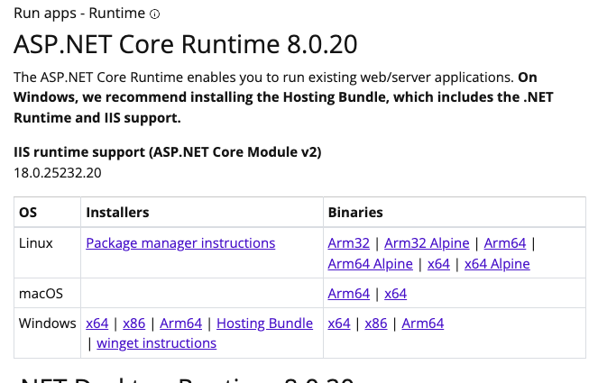
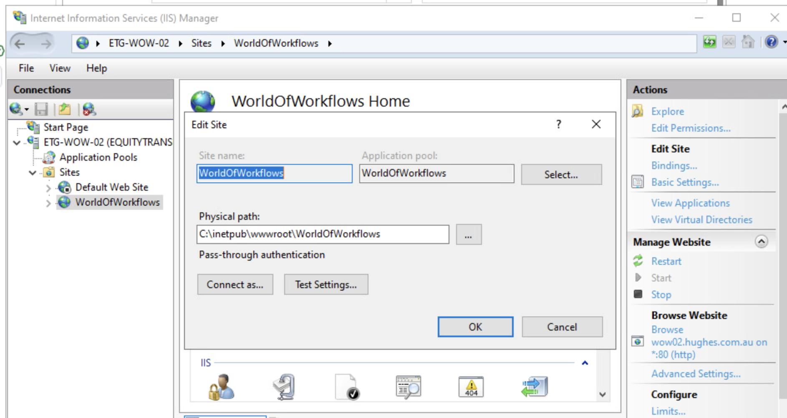
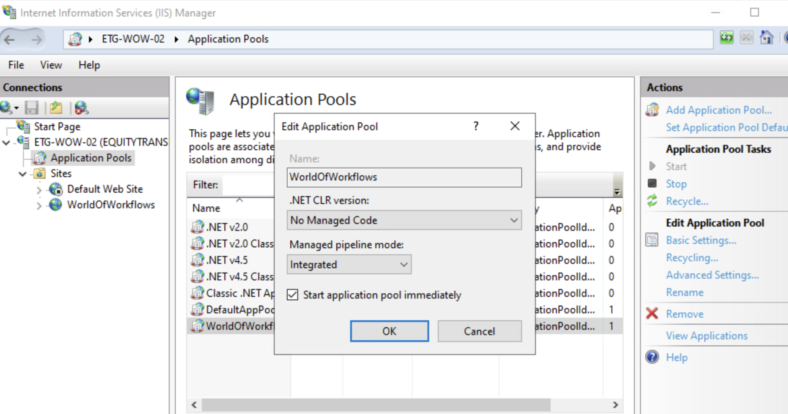
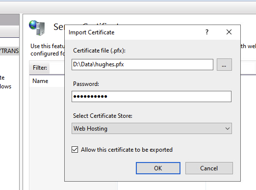
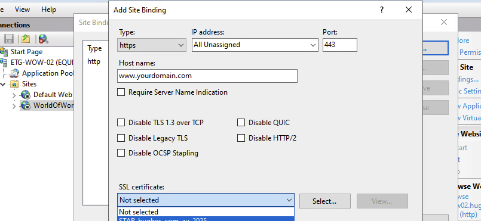
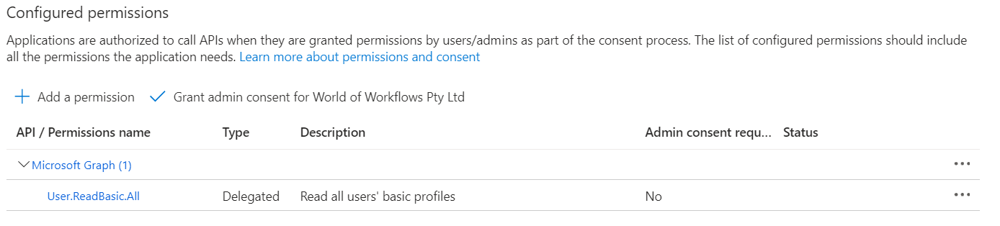
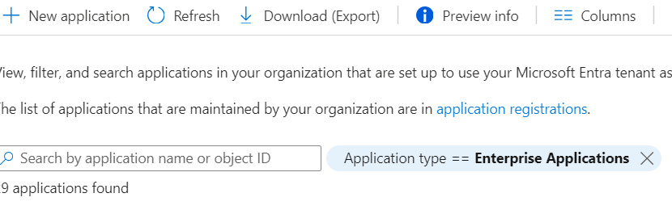
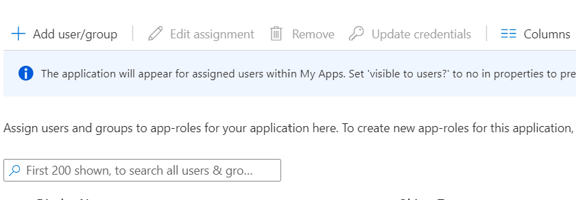
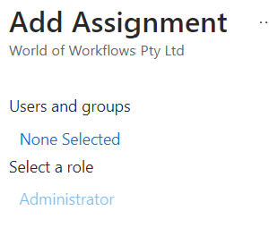
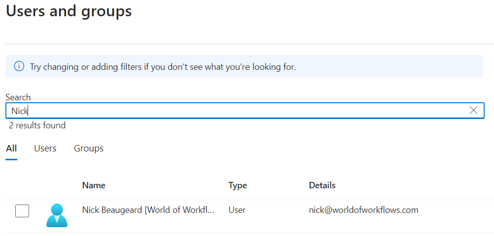

# World of Workflows Business Edition

World of Workflows Business Edition can be downloaded from here: [latest release](https://github.com/World-of-Workflows/WorkflowsUniversity/releases)

## Installation Instructions

### Installing Pre-requisites

These instructions assume that you have administrative rights to your Windows Server.

#### 1. Install IIS (if not already installed)

1.	Open Server Manager → Manage → Add Roles and Features.
2.	Choose Role-based or feature-based installation.
3.	Under Server Roles, check `Web Server (IIS)`
4.	Under Role Services, include:  
•	Web Server →  
   Application Development →  
      •	 ASP.NET (both versions if available, e.g., ASP.NET 4.8)  
      •	.NET Extensibility  
      •	ISAPI Extensions & Filters
   •	Security → 
      •  Request Filtering  
   •	Common HTTP Features → 
      •  Static Content, 
      •  Default Document  
5.	Complete installation and reboot if required.  

#### 2. Install the .NET 8 Hosting Bundle

On your Windows Server:  

1.	Download the .NET 8 Hosting Bundle from Microsoft:  
       [ Download .NET 8 Hosting Bundle](https://dotnet.microsoft.com/en-us/download/dotnet/8.0)  
      

2.	Run the installer — it will:  
      •	Install the .NET Runtime.  
      •	Install the ASP.NET Core Module for IIS (so IIS can reverse-proxy to Kestrel).  
      •	Register the module automatically with IIS.  
3.	Reboot the server after installation.  


### Install World of Workflows

1. Download World of Workflows Business Edition  

   Download the latest code from here: [latest release](https://github.com/World-of-Workflows/WorkflowsUniversity/releases).  
   Choose the file WorldOfWorkflowsBE-`<version >`-win-x64.zip

2. Extract the .zip contents to a permanent folder, e.g.:  
   ```C:\inetpub\wwwroot\WorldOfWorkflows  ```

3. Make sure the folder has Read & Execute permissions for the IIS AppPool user (IIS_IUSRS).

4. Configure IIS Site
	1.	Open IIS Manager → Right-click Sites → Add Website.  
      •	Site name: WorldOfWorkflows  
      •	Physical path: C:\inetpub\wwwroot\WorldOfWorkflows  
      
      •	Binding: http on port 80 (or another port if 80 is used). 
      •	HostName: set the server's hostname - eg wow.yourdomain.com. 
      
	2.	IIS will create an Application Pool:  
      •	Set .NET CLR Version to No Managed Code  
         (ASP.NET Core doesn’t run on the IIS CLR — it runs on Kestrel).  
       

   3.	Ensure the Identity of the App Pool (ApplicationPoolIdentity  by default) has Read/Write access to the app folder if the app logs or writes files.  
   Grant read/write access to `C:\inetpub\wwwroot\WorldOfWorkflows` folder for the user `IIS AppPool\WorldOfWorkflows`

         Also set the same full control to the data folder where you will store your databases (d:\Data in the example appsettings.json)
   4. Stop the `Default Web Site` site

      {: .key }  
         Note: the Site name is also used by IIS to create an Application Pool.  
         A `local` user is created called `IIS AppPool\<sitename>`.  This is the user you will need to grant access to `C:\inetpub\wwwroot\WorldOfWorkflows` and the database folder. 
  
5. Verify/update Web.Config
   The World of Workflows Business Edition .zip should already include a web.config with an ```< aspNetCore />``` section.
   If you need to, update the logging to be enabled, like this:

   ```
      <?xml version="1.0" encoding="utf-8"?>
      <configuration>
      <location path="." inheritInChildApplications="false">
         <system.webServer>
            <handlers>
               <add name="aspNetCore" path="*" verb="*" modules="AspNetCoreModuleV2" resourceType="Unspecified" />
            </handlers>
            <aspNetCore processPath=".\HubOneWorkflowsApp.Server.exe" stdoutLogEnabled="true" stdoutLogFile=".\logs\stdout" hostingModel="inprocess" />
         </system.webServer>
      </location>
      </configuration>
   ```

6. Create a logs folder  
   Create the folder   
    ```C:\inetpub\wwwroot\WorldOfWorkflows\logs```  
   if you enabled log output in `web.config`
   
7. Grant read/write access to the logs folder for the user `IIS AppPool\WorldOfWorkflows`

#### Update appsettings.json  
   Here is a <a href="./appsettings.json" download>sample `appsessings.json` </a> file.
   There are a number of items you will need to update:  

   1. The ConnectionStrings section contains the location and filename of your two World of Workflows databases.
      - the Elsa database holds the Workflow Definitions and  Workflow Instance logs.
      - the WorldOfWorkflows holds all the persistent data you create in `Tables` World of Workflows.
      ```
      "ConnectionStrings": {  
            "Elsa": "Data Source=D:\\Data\\WoWWorkflows.db",  
            "WorldOfWorkflows": "Data Source=D:\\Data\\WoWData.db;cache=shared"  
         },  
      ```

      {: .key }  
      A note on SQLite database settings.  

      You may improve performance slightly by enabling 'wal' mode on a database, but only if the database is on a local disk.  'wal' mode uses a shared memory file, which must not be located on a network drive. 
      
      {: .key }  
      You must not enable 'wal' mode on a database located on a network drive.

      {: .key }  
      To alter the journal_mode on a database, use a SQLite database editor, or a SQLite cli.  The commands to change the journal_mode are:
         - Check the current journal_mode:  
         ``sqlite3 {filename}.db "pragma journal_mode;"``
         - Enable 'wal' mode:   
         ``sqlite3 {filename}.db "pragma journal_mode=wal;"``
         - Disable 'wal' mode:  
         ``sqlite3 {filename}.db "pragma journal_mode=delete;"``
      
      {: .key }  
      Use `;cache=shared;` on the connection string to a SQLite database when the journal_mode of the database is set to 'delete'.  If you change the database journal_mode to 'wal' you must remove `;cache=shared;` from the connection string.
      


   2. The ClientConfiguration contains details on how authentication is set up within Entra AD.
      The `Authority` must be set with your Azure Subscriptions Tenant Id.  
      The `ClientId` must be changed to your App Registration's Client Id.  
      ```
      "WorldOfWorkflows": {
         "ClientConfiguration": {
            "WorldOfWorkflows": {
               "Server": {
                  "Scopes": {
                     "Default": [
                        "api://xxxxxxxx-xxxx-xxxx-xxxx-xxxx/.default"
                     ]
                  }
               }
            },
            "AzureAd": {
               "Authority": "https://login.microsoftonline.com/xxxxxxxx-xxxx-xxxx-xxxx-xxxx",
               "ValidateAuthority": true,
               "ClientId": "xxxxxxxx-xxxx-xxxx-xxxx-xxxx"
            }
         }
      }
      ```
   3. Add your server web url name to the `Cors` setting, and any other servers you want to be able to access your server
      ```
      "Cors": {
         "AllowedOrigins":[ "https://xxx.domain.com","http://localhost"]
      },
      ```
   4. Add your server web url name to the `Kestrel.Enpoints.Public.Url` setting and set your https certificate filename and password.
         ``` 
            "Kestrel": {
               "Endpoints": {
                  "Public": {
                  "Url": "https://wow.xxx.com.au:443",
                  "Protocols": "Http1",
                  "Certificate": {
                        "Path": "D:\\Data\\xxx.pfx",
                        "Password": "xxx"
                     }
                  }
               }
            }
         ```

#### Set up web site for HTTPS / SSL

Import your ssl certificate into the IIS system.  
Open IIS and go to the server settings.  
Find `Server Certificates` and import your .pfx file.  You will need to know the password.  
     

Next, go the bindings on your World of Workflows website and add HTTPS:  



### Granting Permission to access the World of Workflows Admin page

Granting permissions in World of Workflows requires you first to configure the Server Entra Id Application and then assign permissions.

1. **Setting up Server Application**
   1. You only need perform this once
   2. Navigate to [Azure Portal --> Entra Id --> App Registrations](https://portal.azure.com/#view/Microsoft_AAD_IAM/ActiveDirectoryMenuBlade/~/RegisteredApps)
   3. Click **All Applications**
   4. Search for the Server application configured in step iv. above.
   5. Click **API Permissions**
   
   6. Click **Add a permission**
   7. Click **Microsoft Graph**
   8. Click **Delegated Permissions**
   9. Select **email, offline_access, openid and profile**
   10. Click **Add Permissions**
   11. Click **Grant Admin Consent**
   12. Click **Yes**
   

2. **Granting Permissions**
   1. Navigate to [Azure Portal --> Entra Id --> Enteprrise Applications](https://portal.azure.com/#view/Microsoft_AAD_IAM/StartboardApplicationsMenuBlade/~/AppAppsPreview/menuId~/null)   

   2. Click **X** next to Application type == Enteprrise Applications.  
   
   3. Search for and select the server applcation congfigured in step iv above.  
   4. Under **Manage**, choose **Users and Groups**  
    
   5. Click **Add user/group**  
   
   6. Click **None Selected**  
   7. Search for and select the User you want to grant permissions to
   
   8. Click **Select**  
   9. Click **Assign**. *Administrator is the only role available in this version*

Now you can navigate to your new server and login.


### Install a SQLite database tool  

To maintain the database you might need a SQLite database editor.  This is an example application:  
http://sqlitebrowser.org/dl

{: .key }  
To avoid database corruption, stop the IIS Service before making any changes to the SQLite databases, or even opening them in write mode.  

It is generally safe to open the SQLite databases in ReadOnly mode while the IIS Service is running.
