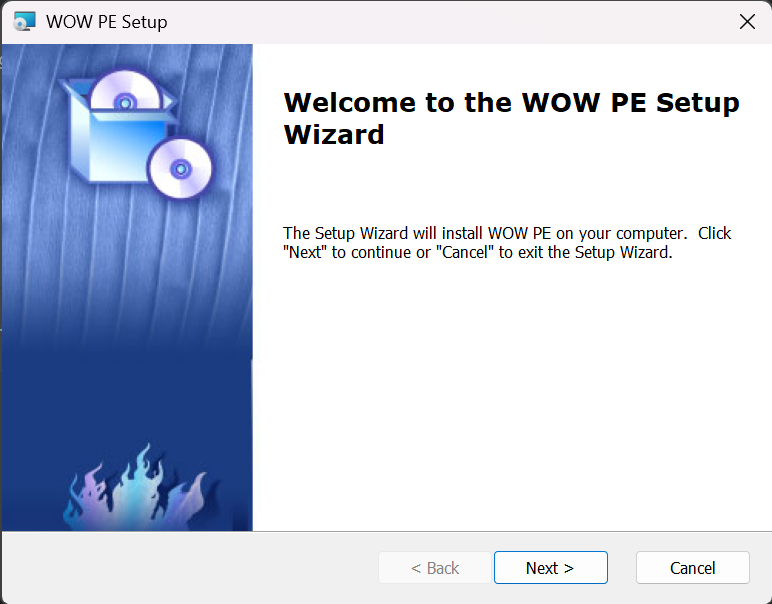
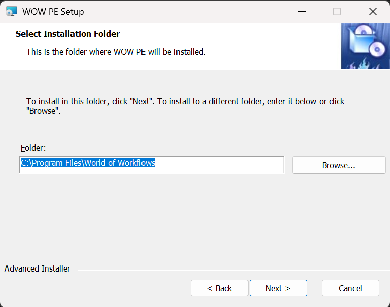
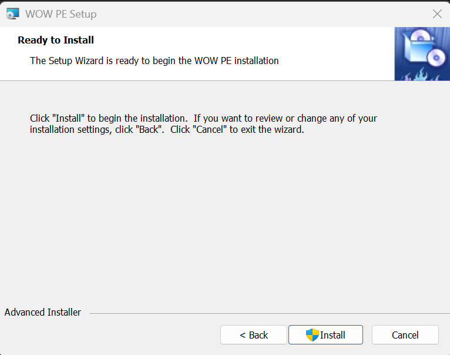
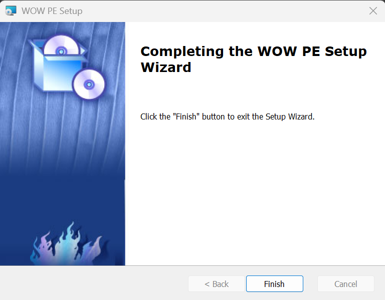

## Windows Installation

1. Navigate to the [latest release](https://github.com/World-of-Workflows/WorkflowsUniversity/releases)
2. Download the Windows Version of PE for either ARM or X64
   >There is an ARM version to run on ARM processors, and x64 version to run on Intel processors.  The ARM versin will also run well in a VM on MacOS on an M1 or later porocessor.
3. Run the downloaded application
   
4. Click **Next >**
   
5. Accept or change the folder and click **Next >**
   
4. Click **Install**
   
6. Click **Finish**

**World of Workflows PE (Windows Installation)** is complete

To run World of Workflows, go to [https://localhost:7063/admin](https://localhost:7063/admin){:target="_blank"}