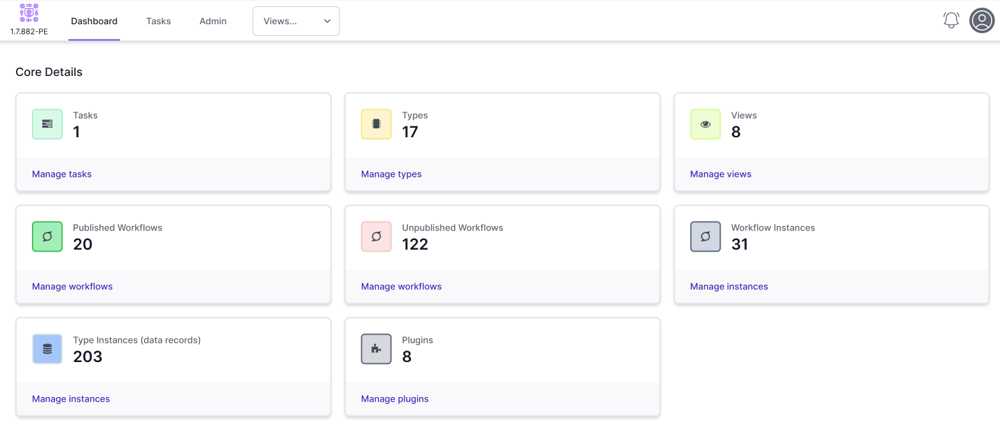
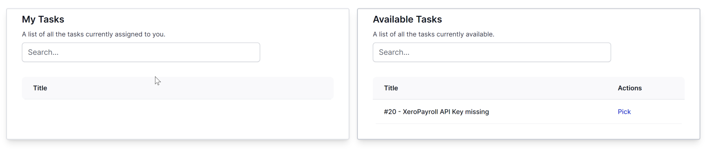
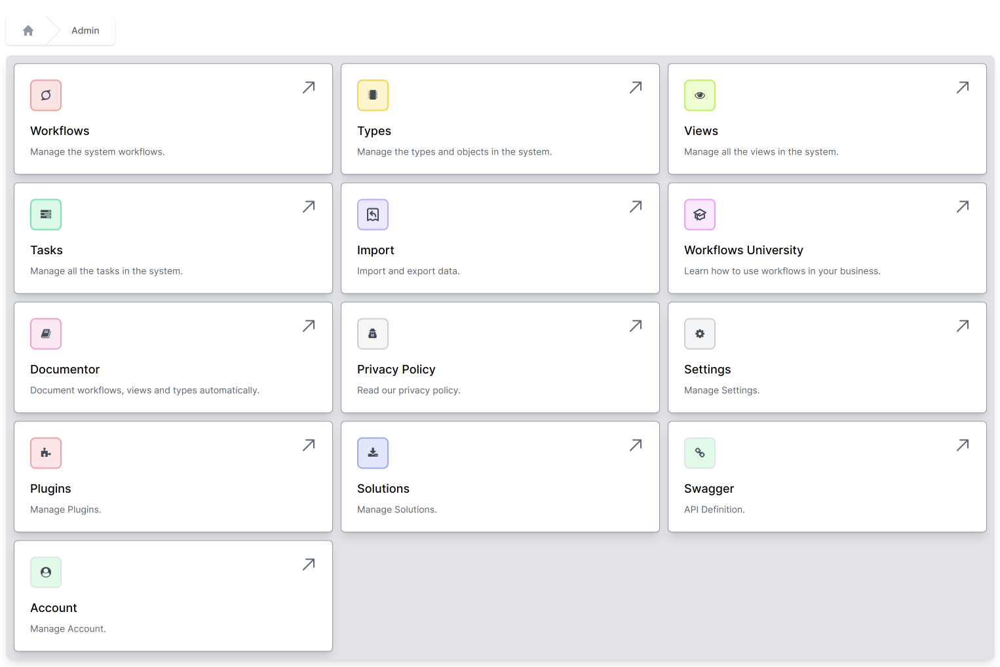

# Navigation

## Home Page

The home page has a number of **tiles** that show various statistics of your World of Workflows installation.  You can use these tiles to navigate to these icons.

The top navigation includes the **Dashboard** or home page. **Tasks** take you to the task page and Admin is the rest of the navigation.

*This will change when you add **views**.*

## Tasks

The tasks page consists of two columns. The left-hand column shows tasks you have picked and are in your queue. The right-hand column shows the current available tasks to pick.

## Admin

The admin page allows you to navigate between the various aspects of the system and manipulate data, workflows, tasks and more.

The sections of the Admin page are defined below:

### Workflows

This gives you access to the Workflows which allows you to manage all of the Workflows in the system. Workflows are ways of visually describing what your process should do and instructing World of Workflows to perform tasks that you want it to perform.

### Types

Types give you access to the inbuilt database within World of Workflows. Here you can add, retrieve and manipulate data across the system.

### Views

While Types allows you to manipulate the underlying data, **Views** allows you to choose what the users of the system see. You can choose which fields they see and apply filters. Within views, you can easily set up navigation hierarchies for end users.

### Tasks

World of Workflows has a built-in task management and queuing system that allows for tasks that not only instruct users but allow them to manipulate data in task and have multiple options for task completion. This tab gives administrators access to the entire list of tasks.

### Import

The Import system allows you to import any data from CSV using an intuitive and powerful import wizard.

### Workflows University

This site is available from within the application at any time.

### Documentor

The documentor automatically creates a document of the database, data dictionary, workflows and contents of the workflows for your records.

### Privacy Policy

This is the World of Workflows Privacy Policy

### Settings

The Settings area allows you to back up the database, restart the service and check if the service is running.

### Plugins

Plugins are small applications that extend the Workflows in World of Workflows to make it easier to work with other systems, such as Microsoft 365, Xero or OpenAI.

### Solutions

Solutions allow you to import and export your entire configuration (or part of it) for loading on another World of Workflows system.

### Swagger

This shows API Definitions as it applies to your own World of Workflows installation.  The API extends as you create new Types and publish new workflows. 

### Account

This shows the information on your account, license key and more.

