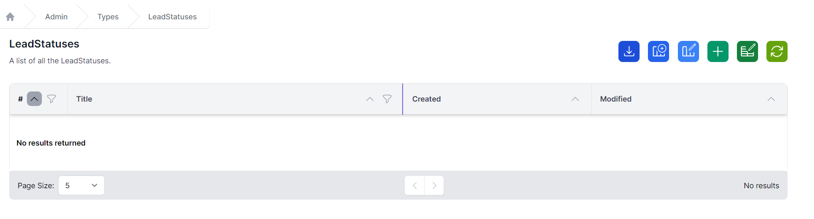
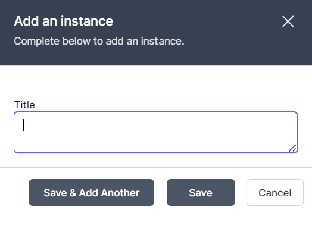
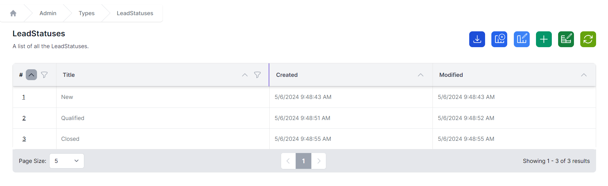
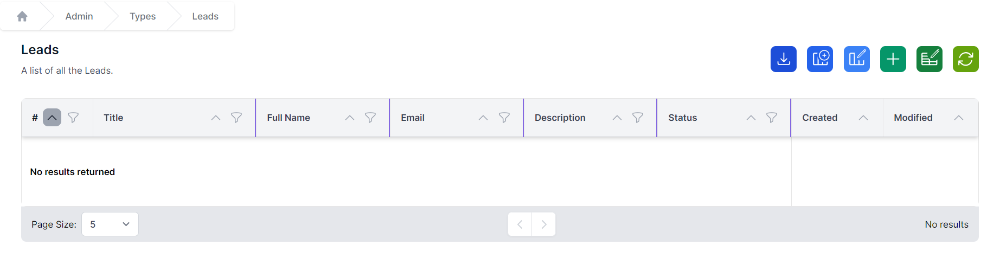
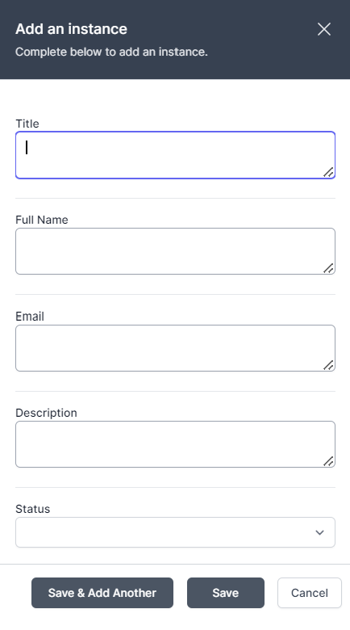
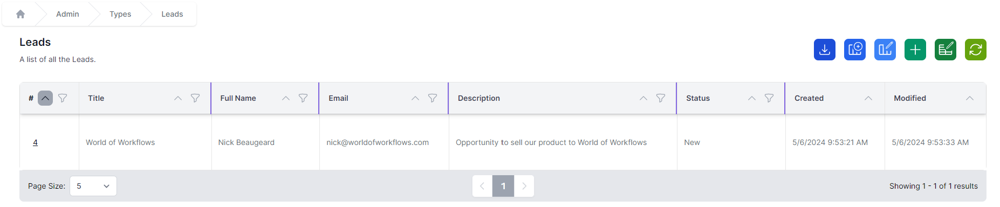

# Adding Data

## Status

In this section, we are going to add some lead statuses, and our first couple of leads.

1. Navigate to **Admin** -> **Types** -> **LeadStatus**
   
2. Click **+** to add a new Lead Status
   
3. Add details as follows:
   1. **Title:** New
4. Click **Save & Add Another**
5. Add details as follows:
   1. **Title:** Qualified
6. Click **Save & Add Another**
7. Add details as follows:
   1. **Title:** Closed
8. Click **Save**
9. LeadStatus will look like the screen shot below. Click on the Id of items to change or delete them.
    

## Leads

1. Navigate to **Admin** -> **Types** -> **Lead**
   
2. Click **+** to add a new Lead
   
3. Add details as follows:
   1. **Title:** World of Workflows
   2. **Full Name:** Nick Beaugeard
   3. **Email:** nick@worldofworkflows.com
   4. **Description:** opportunity to sell our product to World of Workflows
   5. **Status:** New
4. Click **Save**
5. The list of leads should look like the screen shot below. *Note in this case I modified a mistake, so the modified date is greater than the created date.*
   

You have successfully created the data so can go to **[step 3, create workflow](./create-workflow.html)**
