# Create Workflow

1. Navigate to **Admin** --> **Workflows**
   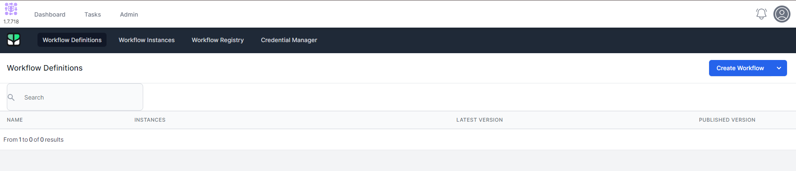
2. Click **Create Workflow**
   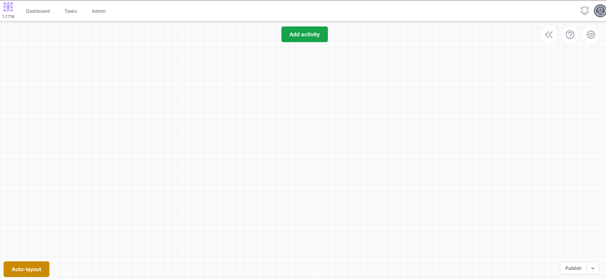
3. Click the  icon in the top right
   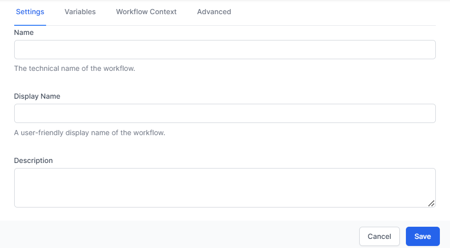
4. Make the name **Review Lead** and click **Save**
5. Click **Add Activity**
6. On the left, choose **Data**
   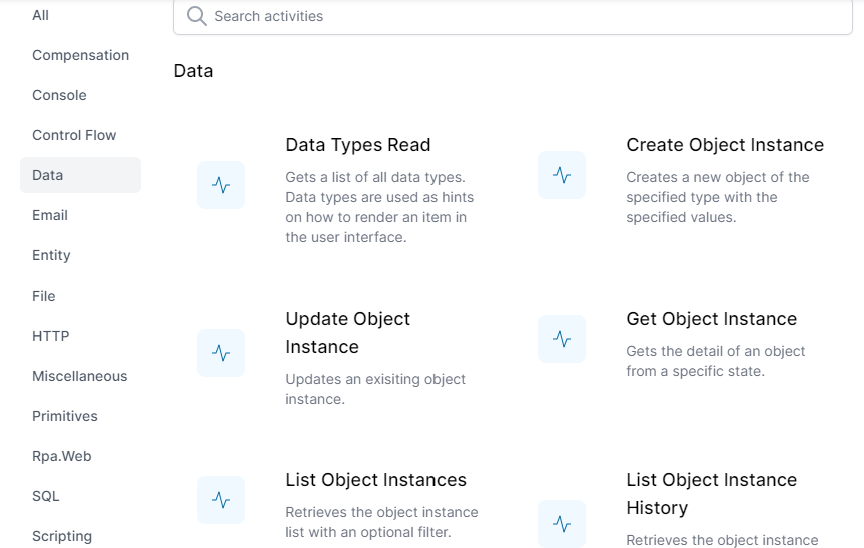
7. Scroll down and choose **Object Instance Trigger**
   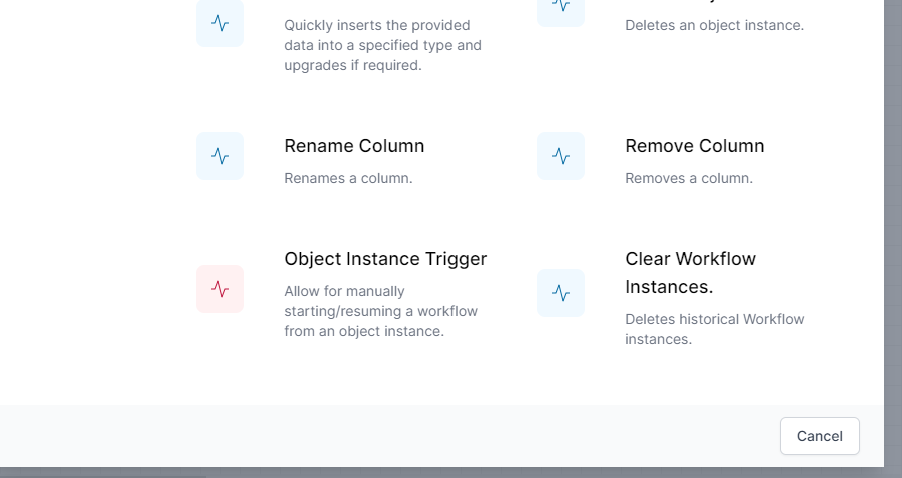
8. Drag the new activity to a position on the left
   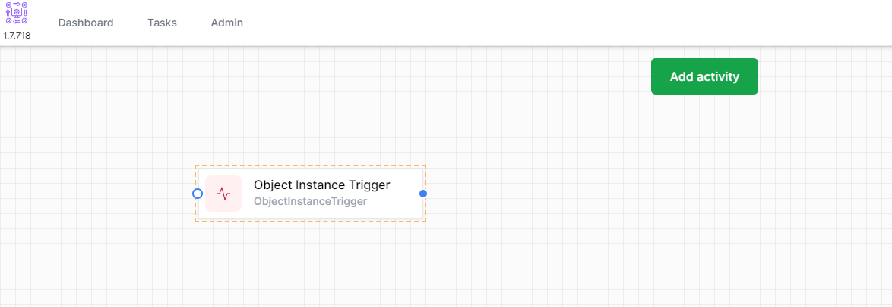
9. **Right Click** the **Object Instance Trigger** and click **Edit**
    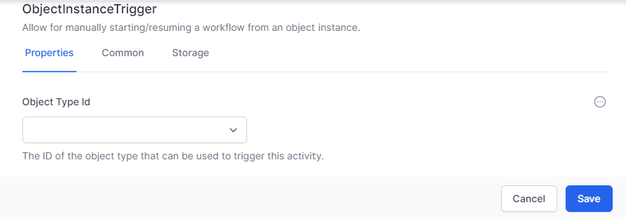
10. Select **Lead** under Object Type Id and Choose the **Common** Tab.
11. Change the **Name** to **LeadTrigger** and the Display Name to **Review Lead**
    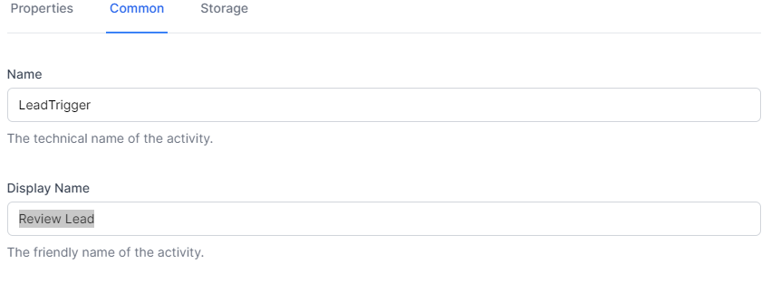
12. Click **Save**
13. Click **Add Activity**
14. On the left, choose **Tasks** and choose **Task Create**
15. Drag the **Task Create** activity to the right of the **Review Lead** Activity
    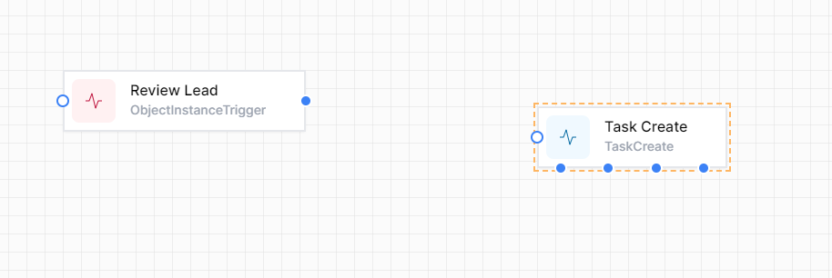
16. Now using the blue dot to the right of the **Review Lead** activity, connect it to the blue circle on the Task Create Activity. It should look like the below:
    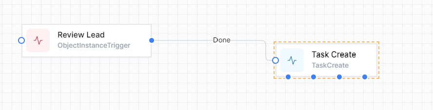
17. Right Click the **Task Create** activity and choose **Edit**
    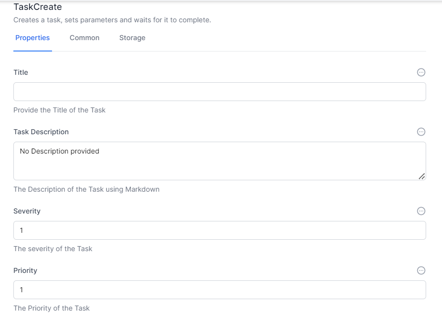
18. To the right of the Title, click  and choose **Liquid**
19. In the Title Type ```Review Lead #{{Activities.LeadTrigger.InstanceId}}```
20. In the description, type 
    ```
    # Review Lead
    It is time to review this lead. Please review it
    ```
21. Leave the Severity, Priority and Due.
    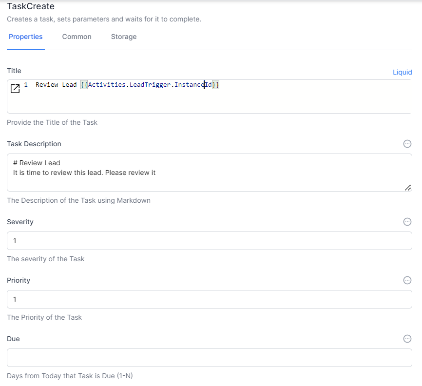
22. In the related ObjectId, click  and choose **Liquid**
23. Enter ```{{Activities.LeadTrigger.ObjectId}}``` in the Related Object Id
24. In the Data Questions Add ```Status``` for **Name** and ```Status``` for **Value**
25. In Branches, add the text "Done" and click Enter.
    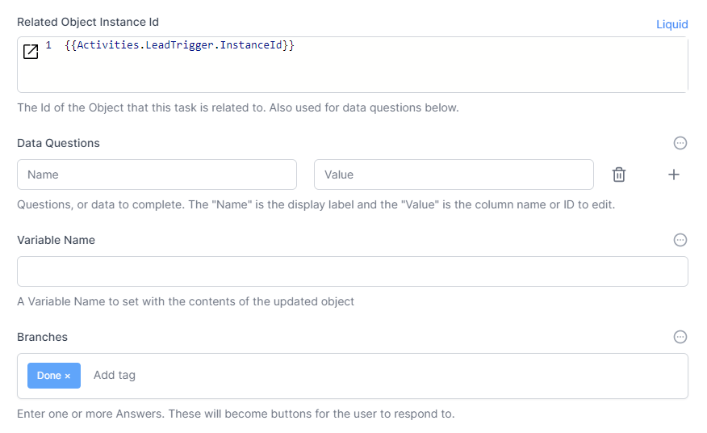
26. Click **Save**
27. Click **Publish**

**Congratulations.** You have created your first workflow. When you click the option on a lead it should create a task to update the lead. You can now [Try it out](./try_it_out.html).

**Note:** The **Liquid** system is a way of reading and writing data between activities. In World of Workflows, we support Liquid and JavaScript for this. 

