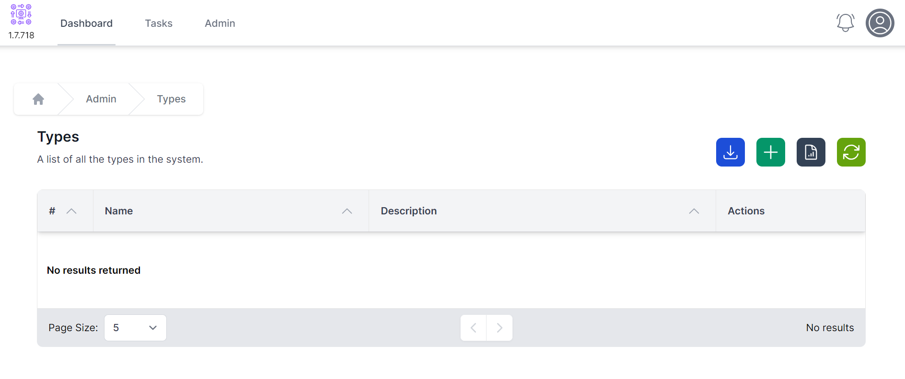
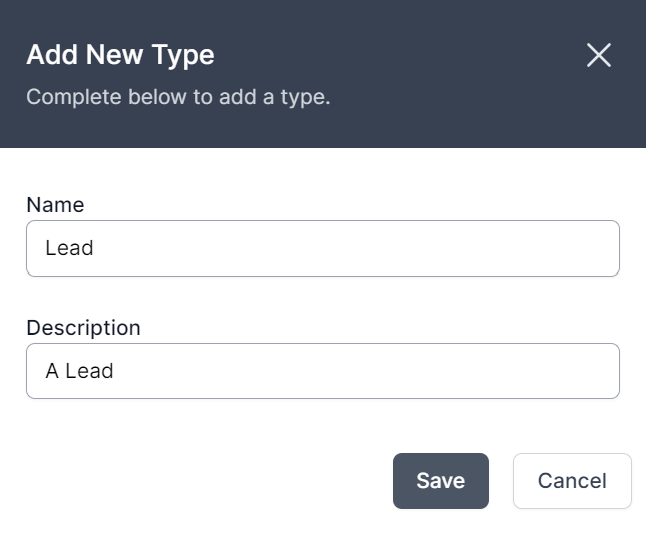
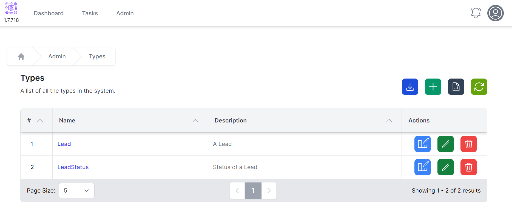
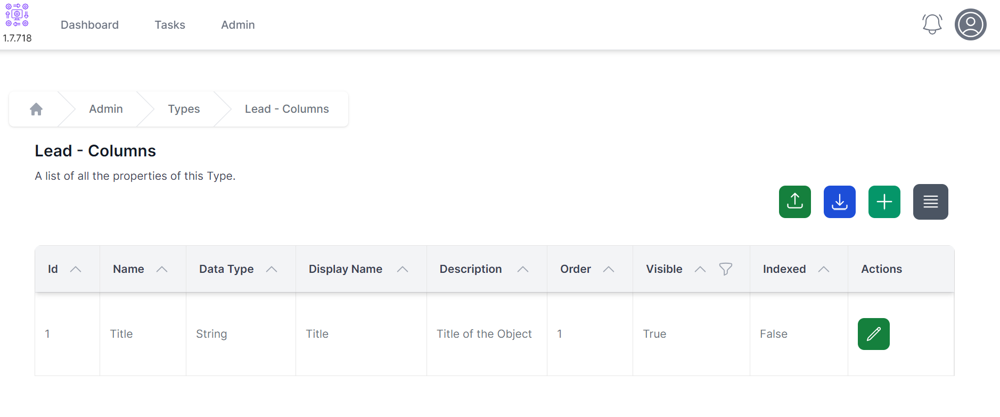
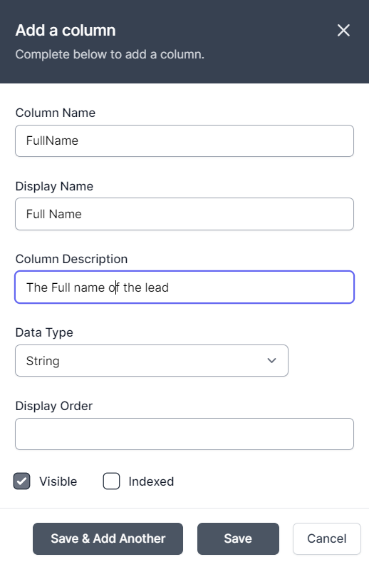
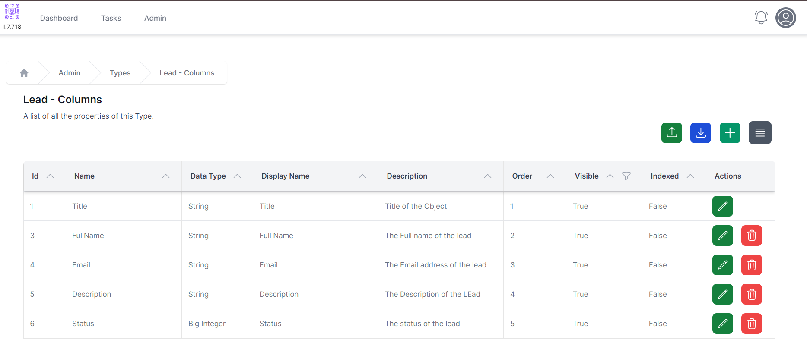

# Creating a data structure

We're going to create two types:

- **Lead** contains information on the lead
- **LeadStatus** contains the status of the lead.

*Note: we use singular names by convention when creating types.*

## Creating Types

1. Navigate to Admin -> Types
   
2. Click **+** to create a New Type
   
3. Enter the Name as **Lead** and the Description as **A Lead**. Click **Save**.
4. Click **+** to create another new Type
5. Enter the Name as **LeadStatus** and the Description as **Status of a Lead**
6. Types should look like the screenshot below. If not, use the delete or edit buttons to make the relevant amendments.
   

## Creating Columns

1. Click the  button next to the **Lead** Type.
2. As you can see, we have an existing column, the Title Column. *Title columns are important but you can change their name, display name, description, display order and whether they are visible.*
   
3. Click **+** to add a new Column
   
4. Enter details as follows:
   1. **Column Name:** FullName
   2. **Display Name:** Full Name
   3. **Description:** The Full name of the lead
   4. **DataType:** String
   5. **Display Order:** Leave Blank
   6. **Visible:** Checked
   7. **Indexed:** Not Checked
5. Click **Save & Add Another**
6. Enter Details as follows:
   1. **Column Name:** Email
   2. **Display Name:** Email
   3. **Description:** The Email address of the lead
   4. **DataType:** String
   5. **Display Order:** Leave Blank
   6. **Visible:** Checked
   7. **Indexed:** Not Checked
7. Click **Save & Add Another**
8. Enter Details as follows:
   1. **Column Name:** Description
   2. **Display Name:** Description
   3. **Description:** The Description of the lead
   4. **DataType:** String
   5. **Display Order:** Leave Blank
   6. **Visible:** Checked
   7. **Indexed:** Not Checked
9. Click **Save & Add Another**
10. Enter Details as follows:
    1. **Column Name:** Status
    2. **Display Name:** Status
    3. **Description:** The status of the lead
    4. **DataType:** Reference
    5. **Object Type:** LeadStatus
    6. **Display Order:** Leave Blank
    7. **Visible:** Checked
    8. **Indexed:** Not Checked
 11. Click **Save**
 12. Your Lead Columns should look like the screenshot below. If not, use the edit and delete buttons to fix it.
    

You have successfully created the data structure so can go to **[step 2, adding data](./adding_data.html)**