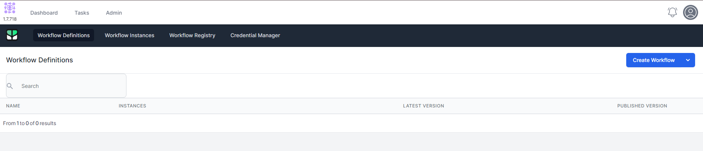

# Exporting, Importing and Duplicating your Workflows

In World of Workflows a Workflow is a graphocal representation of a specific type of .json file.  If you need a similar workflow, you can easily duplicate your workflow by exporting it, importing it and renaming the new workflow.

## Exporting a Workflow 
1. Navigate to **Admin** --> **Workflows**
2. Open your workflow by clicking on the name of the workflow
3. On the bottom right of the canvas is the Publish/Unpublish button.  It has a submenu, exposed by click on the arrow on the right: 
4. Select **Export**
5. A .json file will be downloaded in your browser downloads folder.  It's name will be a variation of your workflow's name.

You can copy this workflow to another location and Import it into a new Workflow

## Importing a workflow

You can import your own exported workflow, or another workflow from this University or a colleague running World of Workflows.

1. Navigate to **Admin** --> **Workflows**
   
2. Click **Create Workflow**
   
3. On the bottom right of the canvas is the Publish/Unpublish button.  It has a submenu, exposed by click on the arrow on the right: 
4. Select **Import**
5. Select a .json file which has been exported from any World of Workflows workflow.
6. Click the  icon in the top right
   

7. Click the  icon in the top right
   
8. Change or Correct the name if needed and click **Save**
9. 