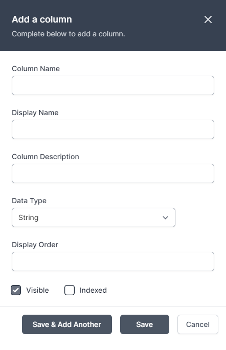
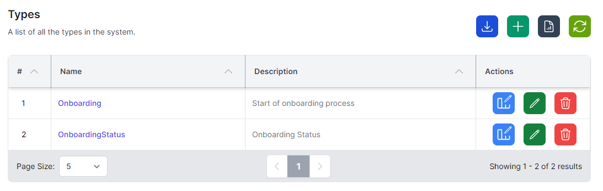

## Creating and managing tables

To create a new *Type* (table) in the User Configurable Database, follow these steps:

1.  Navigate to the User Configurable Database section in World of Workflows, by going to *Admin* then *Types*
2.  Click on the **Add Types** button. 
    
3.  Enter a name for the table and a brief description (optional).
4.  Click **Save** to confirm.

Once your *Type* is created, you can begin adding fields:

1.  In the list of types, identify the type or table you want to work with.
2.  Click 
3.  Click on the **Add Column** button. 
    
4.  Enter a name for the column and choose the Name, Display Name, Column Description and an appropriate data type (e.g., text, number, date, etc.).
5.  Configure additional column properties, such as display order, visible and indexed.
6.  Click **Save** to confirm or **Save & Add Another** to save and add another.

To manage existing tables, you can:

- Edit table names, descriptions, and field properties by clicking on the corresponding  button.

- Delete tables or fields by clicking on the  button (be cautious, as this action is irreversible and is designed to work only if you don’t have any entries for this *Type*).

## A word about data types

Every time you create a column, it needs to have a data type. This tells World of Workflows how to display the data and is efficient in how the data is stored by the database. The list of available data types is below:

| Name        | Description                                                                                                                                                     | Example Uses                                                                                                               |
|-------------|-----------------------------------------------------------------------------------------------------------------------------------------------------------------|----------------------------------------------------------------------------------------------------------------------------|
| Big Integer | The Big Integer represents an arbitrarily large integer whose value *in theory* has no upper or lower bounds. Integers are whole numbers, positive or negative. | Commonly used as Id’s for items where they may grow large, this is the type used as the Id for every object in the system. |
| Reference | Connects two Types together by a key field.|The Title column of the referenced Type will be used in dropdowns of the referenced Type's data|
| Integer     | Whole number, positive or negative.                                                                                                                             | The integer is a whole number which commonly is used to represent a count of objects, e.g. 3 people or 5 cats.             |
| Decimal 2   | Number with two decimal places.                                                                                                                                 | This is a number with two decimal places, commonly used to represent currency                                              |
| Decimal 5   | Number with five decimal places                                                                                                                                 | This is commonly used to represent the results of calculations, or distance                                                |
| True/False  | The Boolean or Bit Type                                                                                                                                         | This is used to represent where we have a state that can be true/false, yes/no or off/on.                                  |
| String      | A collection of characters                                                                                                                                      | The string can store words, sentences, paragraphs, books or any other data stored as Base64Encoded.                        |
| DateTime    | The Date and Time                                                                                                                                               | Used to store instances in time, this is stored in the system as UTC[^1] and is presented in the system in local time.     |
| Url         | Uniform Resource Locator                                                                                                                                        | This is a web link                                                                                                         |
| Embed       | Embed Code                                                                                                                                                      | Not currently used, this is a string which gets rendered in the page as an embed code.                                     |

## Relationships

You can create relationships between types in World of Workflows. You do this by adding a column with the data type **Reference** and choosing the type you would like to relate to.

Relationships allow you to define how objects are related to each other.

However, World of Workflows offers a single way to create relationships, but you can implement the three types of relationships by following the guide below:

Imagine we have Type A and Type B

- A one-to-one (1:1) relationship is easily established by adding a column in Object A with data type Relationship and Type the type of Object B.
- A one-to-many (1:∞) relationship between A and B is established by adding a column in Object B with data type reference and Type the type of Object A.
- A many-to-many (∞:∞) relationship between objects A and B is created by creating a new type (Type C). This has two columns, one is a relationship with the type of Object A and the other is a relationship with the type of Object B.

{: .highlight }
> Whilst the first two types will appear in the user interface, the interface does not understand many to many relationships, however it is possible to develop a workflow that understands this structure, and therefore a custom web UI that is able to work with and manipulate it..

## Editing Columns

To edit a column, Navigate to the type itself by going to *Admin* then *Types* and then clicking the type.

You can then click *Columns* to see the list of columns and click **Edit** to edit each one.

## Deleting Types

If you navigate to *Admin* then *Types* you can click **Delete Type** icon under Actions to delete a type. *Note: this only works if there are no data instances in the type.*

Clicking **Delete** will immediately delete the type. If you have done this in error, you can easily recreate the type.
