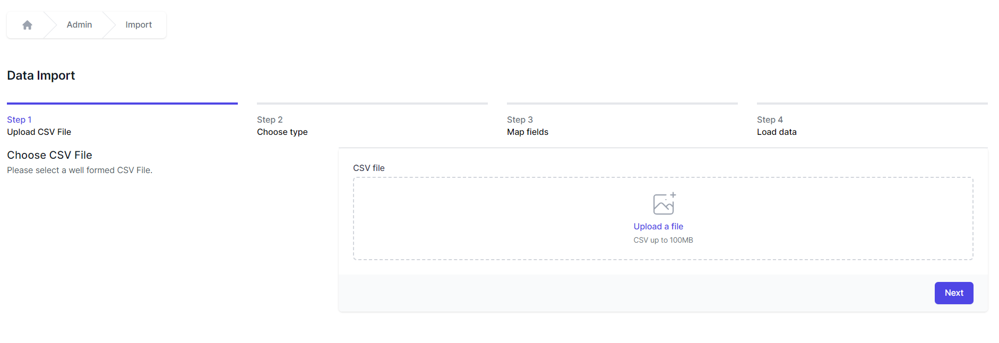

# Importing and exporting data

This chapter focuses on how to move data into and out of World of Workflows.

World of Workflows admin page supports data import and export in CSV.  Your workflows can of course use any sort of data.  

## Export

To export data, follow these steps:

1.  Navigate to *Admin* -\> *Tables* and select the desired table.
2.  Click on the  button.
3.  A CSV file will shortly download.
4.  You can also [filter](./working-with-data.html#sort-and-filter) the data and the export will only export the filtered data.

## Import

The following section describes how to import data into World of workflows.

1.  Prepare a CSV with the required data and remove any columns that you do not want to import. *Column removal is not mandatory but helps speed up the process.*
   
    Note that this process can be used ***BEFORE*** a data type is created: `Import` will create the structure you require in the User Configuarable Database.

2.  Navigate to *Admin* -\> *Import*
    
3.  Click **Upload a file** and browse to the CSV file you want to upload.  
    
4.  When you see the correct details for your CSV file, click **Next.**
    
5.  If you are creating a new Table with this import, under the **Table** dropdown choose **New** and name the new type. If you are importing data to an existing *Table*, select the type name in the dropdown and click **Next.**
    
6.  The system will automatically suggest fields for your import. You can change these and choose:
    1.  **Skip** - This column will be ignored
    2.  **New** - A new Column in your Table will be created in the database from the data in your CSV file. You can enter a Name, Data Table, Display Name, Description, Display Order, whether the column should be Visible and whether it will be a Title column.
    
        >What is a `Title` column?  Every Table has 1 Title column.  By default it is called Title, but you can rename it. 
        
        >The 'title' column in a Table typically represents a key attribute or identifier that provides a descriptive or meaningful name for each record or entry within that Table. This column is often used to display a readable and user-friendly name or label for the items, making it easier for users to understand and manage the data associated with that Table.  
        
        >It will be used in the dropdown when another Table uses this Table as a Reference field.
    3.  \<Column name\> – choose an existing column name and your CSV data will be added to this column.
    4.  **Id** - This is the match to the ObjectId or Instance Id and will update records with the same Id if they exist in the database.
7.  Click **Next** when your fields are correct  
    
8.  Click **Import** to copy the data from your CSV file into the database. 
    

