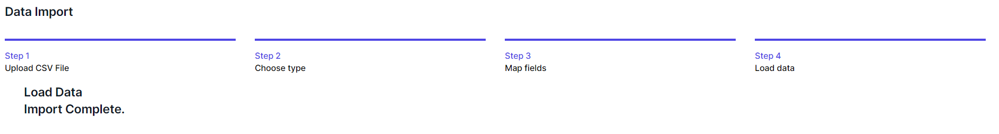

# Overview of the database functionality

The User Configurable Database offers a flexible and intuitive platform for managing your data, allowing you to:

- Create custom *Types* (tables) with user-defined fields, data types, and relationships.
- Import and export data in various formats, such as CSV
- Search, filter, and sort records to quickly find the information you need.
- Integrate with external databases and APIs for seamless data synchronization and access.
- Use the database directly within workflows and tasks

# Creating and managing tables

To create a new *Type* (table) in the User Configurable Database, follow these steps:

1.  Navigate to the User Configurable Database section in World of Workflows, by going to *Admin* then *Types*
2.  Click on the **Add Types** button. 
    
3.  Enter a name for the table and a brief description (optional).
4.  Click **Save** to confirm.

Once your *Type* is created, you can begin adding fields:

1.  In the list of types, identify the type or table you want to work with.
2.  Click 
3.  Click on the **Add Column** button. 
    
4.  Enter a name for the column and choose the Name, Display Name, Column Description and an appropriate data type (e.g., text, number, date, etc.).
5.  Configure additional column properties, such as display order, visible and indexed.
6.  Click **Save** to confirm or **Save & Add Another** to save and add another.

To manage existing tables, you can:

- Edit table names, descriptions, and field properties by clicking on the corresponding  button.

- Delete tables or fields by clicking on the  button (be cautious, as this action is irreversible and is designed to work only if you don’t have any entries for this *Type*).

## A word about data types

Every time you create a column, it needs to have a data type. This tells World of Workflows how to display the data and is efficient in how the data is stored by the database. The list of available data types is below:

| Name        | Description                                                                                                                                                     | Example Uses                                                                                                               |
|-------------|-----------------------------------------------------------------------------------------------------------------------------------------------------------------|----------------------------------------------------------------------------------------------------------------------------|
| Big Integer | The Big Integer represents an arbitrarily large integer whose value *in theory* has no upper or lower bounds. Integers are whole numbers, positive or negative. | Commonly used as Id’s for items where they may grow large, this is the type used as the Id for every object in the system. |
| Integer     | Whole number, positive or negative.                                                                                                                             | The integer is a whole number which commonly is used to represent a count of objects, e.g. 3 people or 5 cats.             |
| Decimal 2   | Number with two decimal places.                                                                                                                                 | This is a number with two decimal places, commonly used to represent currency                                              |
| Decimal 5   | Number with five decimal places                                                                                                                                 | This is commonly used to represent the results of calculations, or distance                                                |
| True/False  | The Boolean or Bit Type                                                                                                                                         | This is used to represent where we have a state that can be true/false, yes/no or off/on.                                  |
| String      | A collection of characters                                                                                                                                      | The string can store words, sentences, paragraphs, books or any other data stored as Base64Encoded.                        |
| DateTime    | The Date and Time                                                                                                                                               | Used to store instances in time, this is stored in the system as UTC[^1] and is presented in the system in local time.     |
| Url         | Uniform Resource Locator                                                                                                                                        | This is a web link                                                                                                         |
| Embed       | Embed Code                                                                                                                                                      | Not currently used, this is a string which gets rendered in the page as an embed code.                                     |

## Relationships

You can create relationships between types in World of Workflows. You do this by adding a column with the data type **Reference** and choosing the type you would like to relate to.

Relationships allow you to define how objects are related to each other.

However, World of Workflows offers a single way to create relationships, but you can implement the three types of relationships by following the guide below:

Imagine we have Type A and Type B

- A one-to-one (1:1) relationship is easily established by adding a column in Object A with data type Relationship and Type the type of Object B.
- A one-to-many (1:∞) relationship between A and B is established by adding a column in Object B with data type reference and Type the type of Object A.
- A many-to-many (∞:∞) relationship between objects A and B is created by creating a new type (Type C). This has two columns, one is a relationship with the type of Object A and the other is a relationship with the type of Object B.

{: .highlight }
> Whilst the first two types will appear in the user interface, the interface does not understand many to many relationships, however it is possible to develop a workflow that understands this structure, and therefore a custom web UI that is able to work with and manipulate it..

## Editing Columns

To edit a column, Navigate to the type itself by going to *Admin* then *Types* and then clicking the type.

You can then click *Columns* to see the list of columns and click **Edit** to edit each one.

## Deleting Types

If you navigate to *Admin* then *Types* you can click **Delete Type** icon under Actions to delete a type. *Note: this only works if there are no data instances in the type.*

Clicking **Delete** will immediately delete the type. If you have done this in error, you can easily recreate the type.

## Editing Data

World of Workflows offers sorting, filtering, inline editing and bulk editing of your data. These features make it incredibly simple to manipulate your data in the system to ensure you have the correct data ready to work with.

Clicking on *Admin* then *Types* then clicking the name of the type you want to work with takes you to the data editing screen

This screen allows you to manipulate your data as follows:

## Columns

Columns can be resized and reordered. You can resize columns by hovering over the vertical separator between the column headers, clicking and dragging left and right.

Columns can be re-ordered by clicking a column header and dragging it to a new location.

## Sort and Filter

To sort your data by column, click the **^** icon in the column header. When sorted the **^** icon in the column header will be highlighted as shown below:

To filter your data, click the  icon in any column header. This will bring up the filter window.

Either type into the filter window or click the null or not-null radio buttons to create your filter.

When a column is filtered, the filter button will be shown as highlighted

To clear all filters, click the  button on the top of the data table, and to edit filters, click the Filters dropdown at the top of the table.

## Export

To export your data, click the  button at the top of the data table. Your browser will automatically download a CSV of that data.

## Add Columns

To add a column, click the  button on top of the data table. You will see the same interface as in add column, above.

## Edit Columns

To edit columns, click the  button on top of the data table. You will then be navigated to the column editing screen.

## Add Item

To add an item, click the  button. The same slide-in will appear as in *add an item* above.

## Inline edit

Clicking  will change the mode to Inline Edit. From here, you can individually edit all the items.

Click  to exit inline edit.

## Bulk Delete

To bulk delete, enter inline edit mode, select several items by clicking the checkboxes and click the  button.

## Bulk Edit

To bulk Edit, enter inline edit mode, select a number of items and click . By entering data in the slide-in, you will be able to edit multiple rows at once.

## Refresh data

To refresh the data, click the  button on the top right which will reload the data for you.

## To Choose the number of rows shown

To choose the number of rows shown, click the page size dropdown, bottom left.

## Move between pages

To move between pages, click the **\<** or **\>** buttons on the bottom middle of the data editor.

## Importing and exporting data

World of Workflows supports data import and export in CSV.

### Export

To export data, follow these steps:

1.  Navigate to *Admin* -\> *Types* and select the desired table.
2.  Click on the  button.
3.  A CSV file will shortly download.

### Import

The following section describes how to import data into World of workflows.

1.  Prepare a CSV with the required data and remove any columns that you do not want to import. *Column removal is not mandatory but helps speed up the process.*
2.  Navigate to *Admin* -\>** *Import*
    
3.  Click **Upload a file** and browse to the CSV file you want to upload.  
    
4.  When you see the correct details for your CSV file, click **Next.**
    
5.  If you are creating a new Type with this import, under the **Type** dropdown choose **New** and name the new type. If you are importing data to an existing *Type*, select the type name in the dropdown and click **Next.**
    
6.  The system will automatically suggest fields for your import. You can change these and choose:
    1.  **Skip** - This column will be ignored
    2.  **New** - A new Column in your Type will be created in the database from the data in your CSV file. You can enter a Name, Data Type, Display Name, Description, Display Order, whether the column should be Visible and whether it will be a Title column.
    3.  \<Column name\> – choose an existing column name and your CSV data will be added to this column.
    4.  **Id** - This is the match to the ObjectId or Instance Id and will update records with the same Id if they exist in the database.
7.  Click **Next** when your fields are correct  
    
8.  Click **Import** to copy the data from your CSV file into the database. 
    

