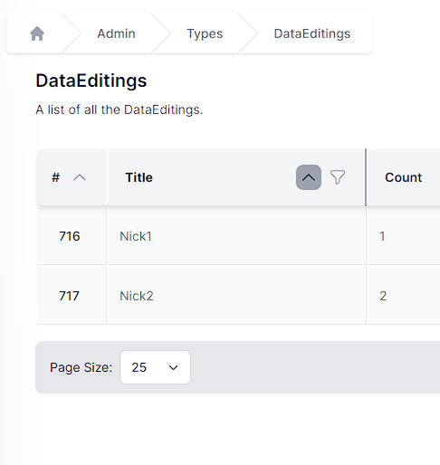
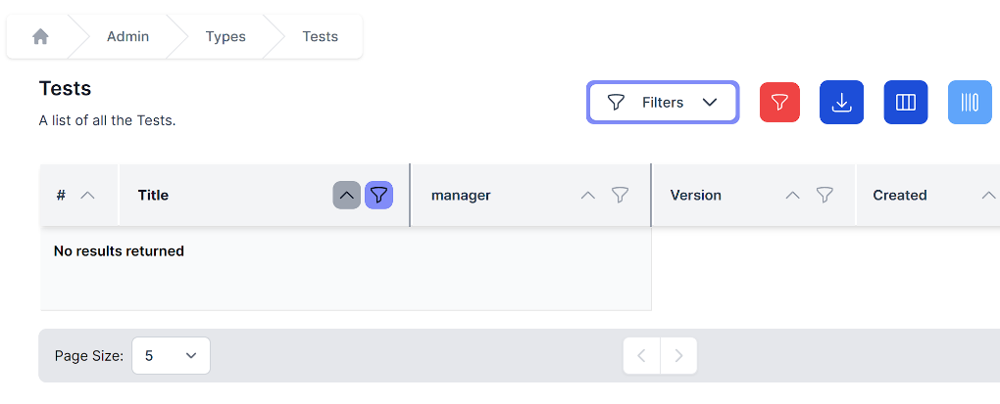

## Editing Data

World of Workflows offers sorting, filtering, inline editing and bulk editing of your data. These features make it incredibly simple to manipulate your data in the system to ensure you have the correct data ready to work with.

Clicking on *Admin* then *Tables* then clicking the name of the Table you want to work with takes you to the data editing screen

This screen allows you to manipulate your data as follows:

## Columns

Columns can be resized and reordered. You can resize columns by hovering over the vertical separator between the column headers, clicking and dragging left and right.

Columns can be re-ordered by editing the order of the column.

Columns can be hidden/shown with the hide/show columns button.

## Sort and Filter

To sort your data by column, click the **^** icon in the column header. When sorted the **^** icon in the column header will be highlighted as shown below:

To filter your data, click the  icon in any column header. This will bring up the filter window.

Either type into the filter window or click the null or not-null radio buttons to create your filter.

When a column is filtered, the filter button will be shown as highlighted

To clear all filters, click the  button on the top of the data table, and to edit filters, click the Filters dropdown at the top of the table.

## Add Columns

To add a column, click the  button on top of the data table. You will see the same interface as in add column, above.

## Edit Columns

To edit columns, click the  button on top of the data table. You will then be navigated to the column editing screen.

## Add Item

To add an item, click the  button. The same slide-in will appear as in *add an item* above.

## Inline edit

Clicking  will change the mode to Inline Edit. From here, you can individually edit all the items.

Click  to exit inline edit.

## Bulk Delete

To bulk delete, enter inline edit mode, select several items by clicking the checkboxes and click the  button.

## Bulk Edit

To bulk Edit, enter inline edit mode, select a number of items and click . By entering data in the slide-in, you will be able to edit multiple rows at once.

## Refresh data

To refresh the data, click the  button on the top right which will reload the data for you.

## To Choose the number of rows shown

To choose the number of rows shown, click the page size dropdown, bottom left.

## Move between pages

To move between pages, click the **\<** or **\>** buttons on the bottom middle of the data editor.

## Export

To export your data, click the  button at the top of the data table. Your browser will automatically download a CSV of that data. `Export` respects any `Filter` you have applied.

