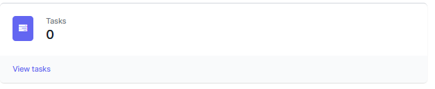
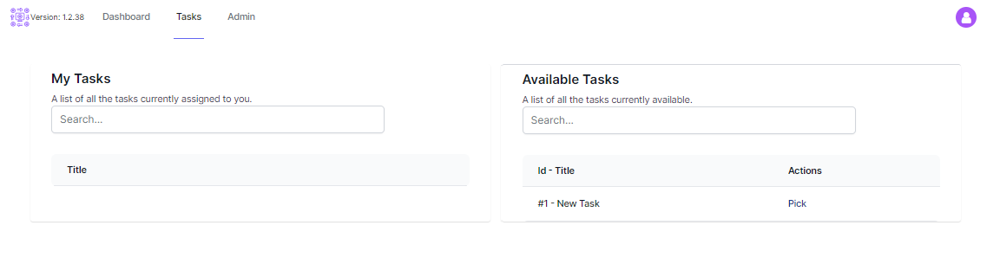

# Opening the task Pane

From the Dashboard, click **Tasks** or chose **Tasks** from the top Menu bar.

The Task Queue will be displayed.

The left hand column contains the tasks the user has chosen and is working on.

The Right hand column contains tasks which are available to work on. 

You can filter the list of tasks by entering text in the search button.

# Pick a Task

When you click **pick** on a task it removes it from the queue and assigns it to you.

Tasks assigned to you appear in the "My Tasks" pane.
An important aspect of Tasks is that only 1 person can be assigned to a task at one time.  A task can be unassigned and reassigned to another person, but when it is assigned to someone, noone else can access that task.  (Administrators can use the [All tasks](./all-tasks.html) function to see any task.)