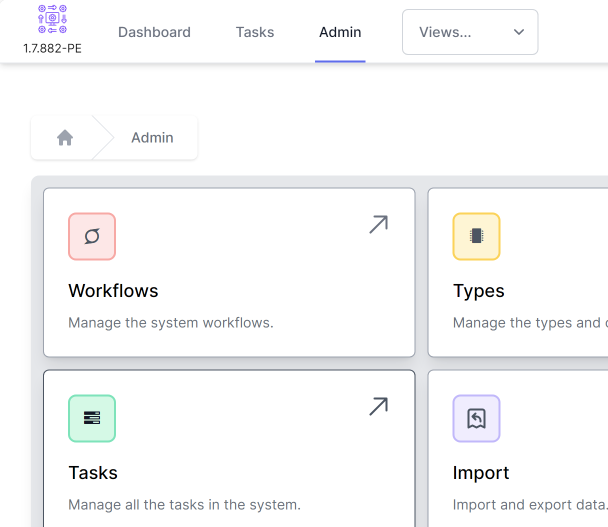
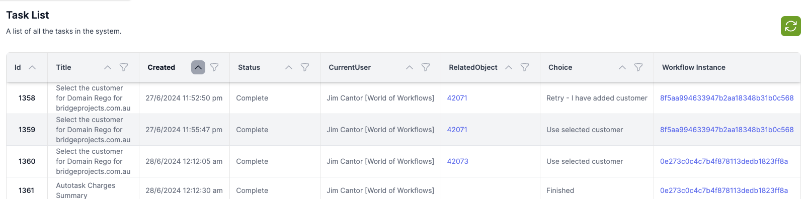

# Reviewing with all Tasks

__Description:__ 
The Admin / Tasks function allows you to work directly with every task created by and available in the system. Use this view to update, assign or unassign tasks

From the Admin menu, choose tasks

The Tasks function shows the summary information about a task, including
- Id - this is unique, incrementing number and can be used in Task activities to manipulate the task
- Title - the string of text displayed to users in the Available Tasks and My Tasks menus
- Created - the time, converted to local time of the browser, when the task was created
- Status - a task have a Status of 'Available', 'Picked' 'Complete' or 'Error'
- Current User - the name of the user assigned to the task, if any
- Related Object - if a task is designed to update an object in the User Configurable Database, this will show the ObjectId of that object.
- Choice - If the task is designed to allo wthe user to select froma range of choices (or branches) and the task is Complete, this will show the choice made by the user.
- Workflow Instance - a link to the Instance of the workflow that created the task. 

