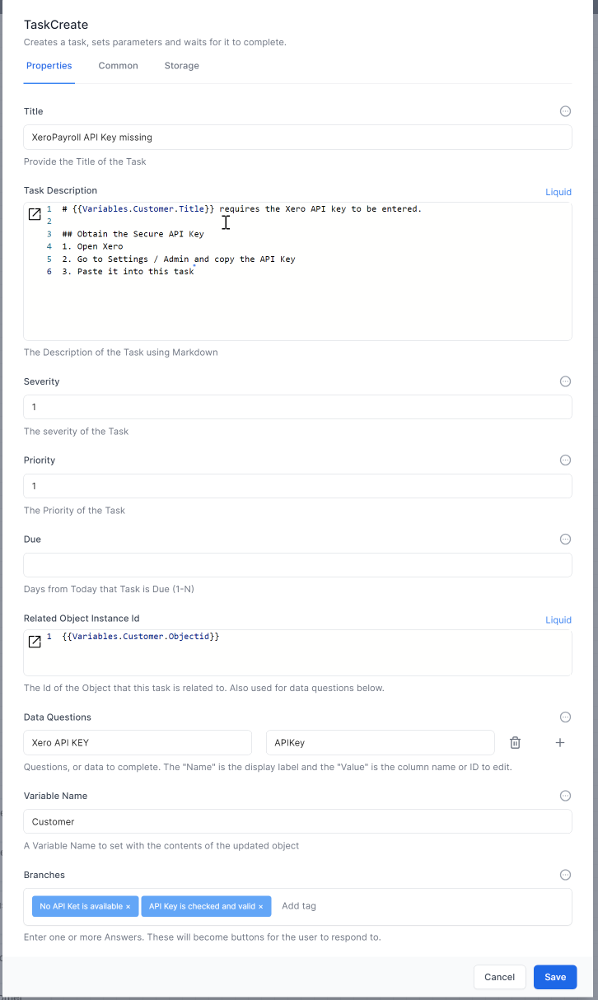
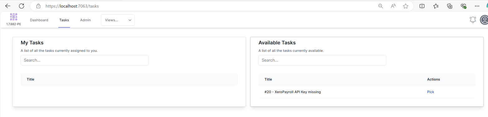
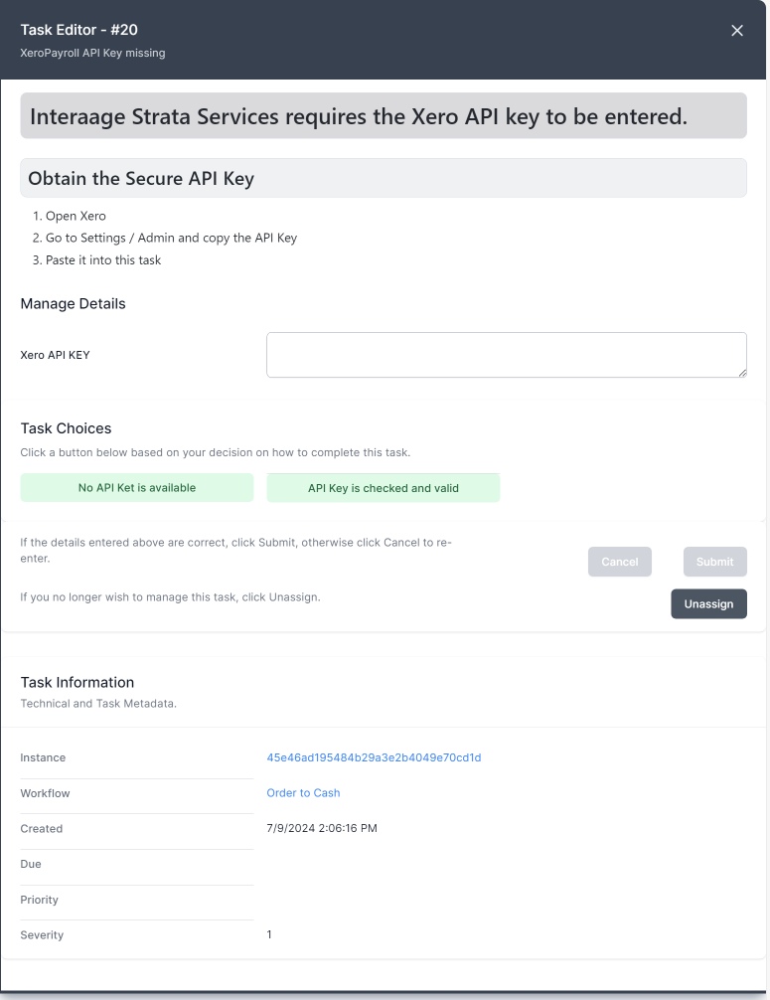

# Tasks in Workflows

Creating workflows to work with tasks commonly involves working with the **Task Create** Activity.

This activity takes the following information

- **Title** - This is the title of the task and is the information shown to the user in the task lists. It can be created using plain text, JavaScript or Liquid.
- **Task Description** - This is the description of the task and contains instructions for the user on how to perform the task. It can be formatted using [markdown](../24_reference/04-markdown/README.html) - a simple and easy to use language you can use to format almost any document.
- **Severity** - This is the severity of the task and is used to manage the default order in task lists.
- **Priority** - This is the priority of the task and is used to manage the default order in task lists.
- **Due** - This is the number of days from the date the task was created for the task to be overdue
- **Related Object InstanceId** - This determines the object that the user can manipulate in the task. Tasks have the ability to allow a user to update chosen fields of an object of choice from the database. This is really useful when asking an end user to enter data into the system.
- **Data Questions** - This chooses the fields that the user is going to use to update data. You choose the display label for the user in the Name location and the field name in the Value location.
- **Variable Name** - If the user updates an object, place the object into the variable name you choose.
- **Branches** - Here you can choose to add branches to the workflow. These appear as action buttons for the end user.

The workflow will wait once a task has been created for a user to complete it.

Here is an example task:

Once the workflow generates the task, it is available for a user to pick.

Once a user PICKs the task, they can display it and perform the requested action:
