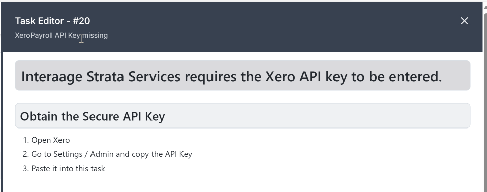

# Working with a Task

When working with a task, click the task in the `My Tasks` pane to open the task.

The task window can be resized from the default; new task windows will remain that size until resized.

You can read the instructions, complete data, unassign the task or complete the task with one or more answers.

## Header

The Task header shows the Task Title and the Task Id. The Task Id is a number.

## Description

Below the task header is the task description. This is formatted text which can include links, images, tables and more. Two examples are provided.  This is created by the workflow developer and contains instructions for you to complete the task. Every task can be different, so always read the instructions!

## Manage Details

Directly below the description is a set of data for you to edit or complete. This is created by the workflow developer and can be anything from a simple text field to a complex form. Not all workflows will require data to be entered: in those cases this section will be omitted.  Every task can be different, so always read the instructions!

## Task Choices

Below this are the task choices. These are choices on how you wish to complete this task. These are chosen by the task developer. When you click one of these buttons, the Cancel and Submit buttons will become available.

- Click **Submit** to save the data you entered.
- Click **Cancel** to revert all changes to the task.
- If you no longer want to work with this task, click **Unassign** to remove it from your queue.
  
Once the task is submitted it will dissapear and the workflow process will continue.

## Task Information

Finally you can see information on this task.
The instance link takes you to the instance log of the workflow that ran to produce the task.

The Workflow link takes you to the definition of that workflow that produced the task.

## Full example

