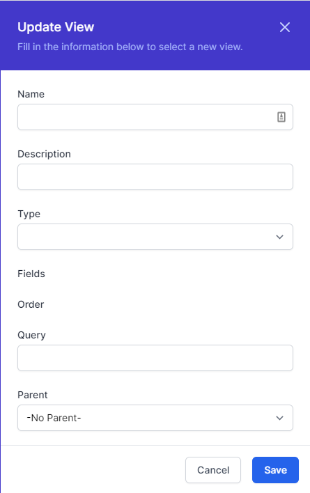
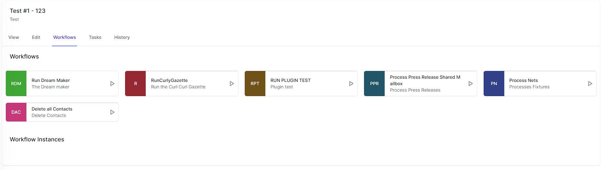
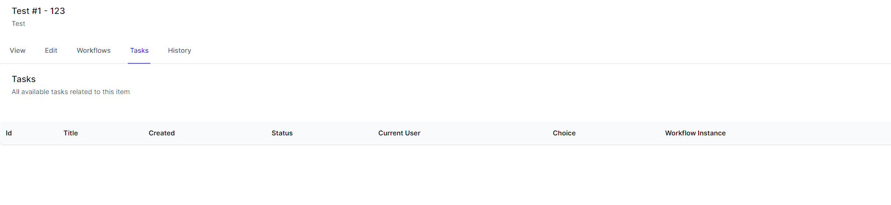

# Views

*Views* are a powerful feature in World of Workflows that allow you to create customized, reusable views of your data by defining queries, selecting fields, and specifying the sorting order. With the ability to establish a hierarchy among views, you can create organized, easily accessible menu structures. This chapter will guide you through the process of creating, managing, and organizing views in the User Configurable Database.

## Overview of Views

Views enable you to:

- Create custom, reusable data views based on specific queries and filters.

- Select which fields to display and customize the order in which they appear.

- Specify the sorting order for records.

- Organize views hierarchically, with top-level views appearing in the main menu and child views accessible via buttons within their parent view.

## Creating a new view

To create a new view, follow these steps:

1.  Navigate to **Admin -\> Views** in World of Workflows.

2.  Click on the **Add View** button.  
    

3.  Enter a name and a brief description for the view (optional).

4.  Choose the *Type* from which the *View* will show the data.

5.  Define the fields which will be shown for the view:

    1.  click the **+** next to the field name.

    2.  Use the **=** handle to drag the fields to the correct order.

    3.  Use the  to remove this field from the view.

6.  Choose the fields to order the view by clicking the **+** next to the field name. Use the up and down arrows to select the direction of sorting.  
    

7.  Create a query for the View, using *oData Query Syntax*

8.  If applicable, choose a parent view from the **Parent View** dropdown menu. If no parent is selected, the view will appear in the top menu.

9.  Click **Create View** to confirm.

## Managing views

To edit or delete an existing view, follow these steps:.

1.  Navigate to **Admin** -\> **Views** and locate the view you want to modify or remove.

2.  Click on the **Edit** button to modify the view's settings, such as the name, description, filters, displayed fields, sorting order, or parent view.

3.  Click **Save Changes** to confirm any modifications.

To delete a view, click on the **Delete** button. Be cautious, as this action is irreversible.

## Organizing views with hierarchy

Views can be organized hierarchically, which allows you to create structured navigation and improve the user experience. When a view has a parent, it will appear as a button within that parent view. To create a hierarchical structure, follow these steps:

1.  While creating or editing a view, select the desired parent view from the **Parent View** dropdown menu.

2.  **Save** your changes. The view will now appear as a button within the parent view.

3.  To rearrange the order of child views within a parent view, navigate to the parent view's settings and use the drag-and-drop functionality to rearrange the child views.

4.  Save your changes.

By utilizing the *Views*, you can create customized, organized representations of your data, making it easier for you and your team to access and analyze essential information.

### Inline Edit

When using a view, you have the same inline and bulk edit/delete features that you have with types.

## Data Editor

The data editor is where you can view data, edit fields, run workflows, view tasks and examine history.

Clicking any instance of a type or in a view brings up the data editor.

### View Data

The first tab is called view and here you can view all the data in an instance, and also the date it was first created, the date it was last modified and the reason for the modification.

### Edit Data

The Edit data tab allows you to edit data associated with this object

### Workflows

The Workflows tab allows you to run any workflow which contains the **Object Instance Trigger** activity which is associated with the type of the object you are viewing.

The **Workflows** section shows workflows you can run using this object as reference and the **Workflow Instances** section shows workflows you can resume using this object as a reference.

### Tasks

Tasks can be associated with an object instance and the Tasks tab shows all of the tasks associated with this object.

### History

The History tab shows all the different modifications to this object over time.

