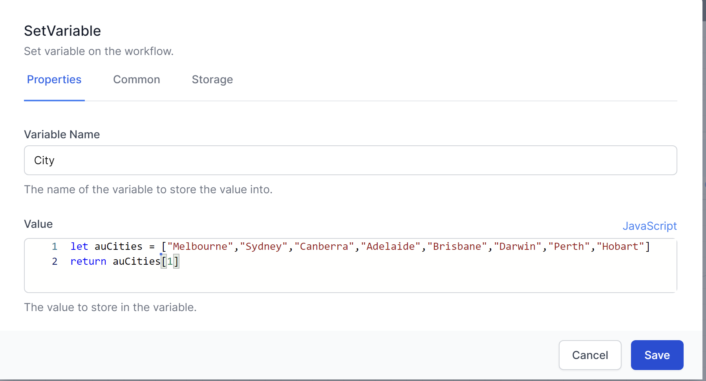

# Workflow Development

In order to work effectively with workflow development World of Workflows, it's important to understand its terminology. Below is a list of words that represent important concepts.

# What are Workflows?

*Workflows* are like small processes which run in the system to complete a business process. There are many of the structures one might find in programming languages. The section below is for complete novices at programming or telling computers to do things.

Computers are machines which follow our instructions exactly. Sometimes it doesn’t seem like this because modern computers are performing billions of operations every second and it is difficult to see what the instructions are.

Workflows allows you to write instructions for the computer to follow. These can include sending emails, reading data or writing and saving files. Workflows makes this simpler, by providing a simple graphical interface.

A workflow consists of a series of steps called **activities** that are connected to one another. A workflow maintains all sorts of information, such as the following:

- Which activity is currently executing?
- What variables are set?
- What activities are blocking (or waiting) further execution?

Once an activity is done executing, the workflow checks its outcome and if there's another activity connected to it. If so, that activity is scheduled for execution.

This goes on until there are either no more activities to execute or an activity is encountered that instructs the workflow runner to suspend the workflow.

- See [Activities](./activities.html) for a summary of how to configure activities in World of Workflows
- See [Flow Control](./flowcontrol.html) to understand how to add logic to your workflows
- See [Variables](./variables.html) for a discussion on how to read and write data variables in World of Workflows

# JavaScript and Liquid

You can enter information into the Properties of *Activities* using either the default format (ie just typing in text, numbers or dates.

For example, here is the `SetVariable` activity. It asks for a *Variable Name* and a *Value*. You would enter the variable name as normal text.

 
Using this icon,  the *Value* can be entered as either **JavaScript**, **Liquid** or **Default** text. 

An example of setting a variable with JavaScript.

`JavaScript` is a powerful language which is simple to learn.  
`Liquid` is often simpler to use.  It also allows the creation of strings from other variables.

> **Remember** World of Workflows is Case Sensitive.  Ensure you use a consistent case when referring to variable and field names.