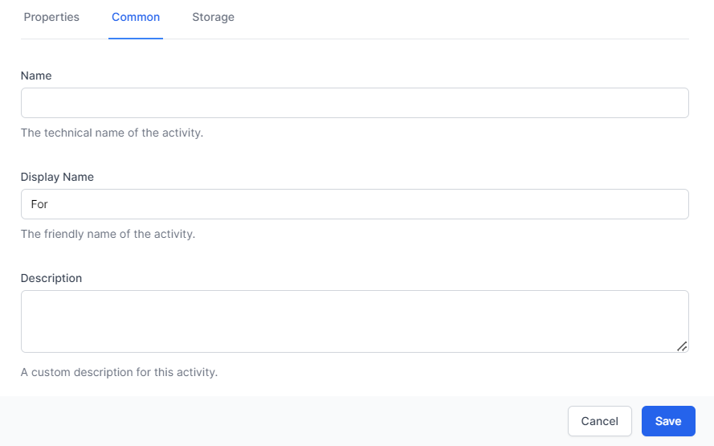

# Activities

As discussed, Workflows are made up of a series of Activities, linked together on a drag-and-drop palette. [Review this chapter](../04_getting_started/README.html#getting-started--my-first-workflow) for instructions on how to craete a workflow and activities.  

Every *Activity* in *Workflows* allows you to set the following:

## **Common Settings**

> **Common settings** are the same for every activity. They include Name, Display Name and Description and are used as follows:

- **Name**: Use this name to refer to this activity in future activities using Liquid or JavaScript.

- **Display Name** – Use this to change how the activity is named in the designer.

- **Description** – Use this to show other workflow developers how this activity is used and what it is for.

See [Activity Input and Output](../24_reference/ActivityInputOutput.html) for a list of Activities