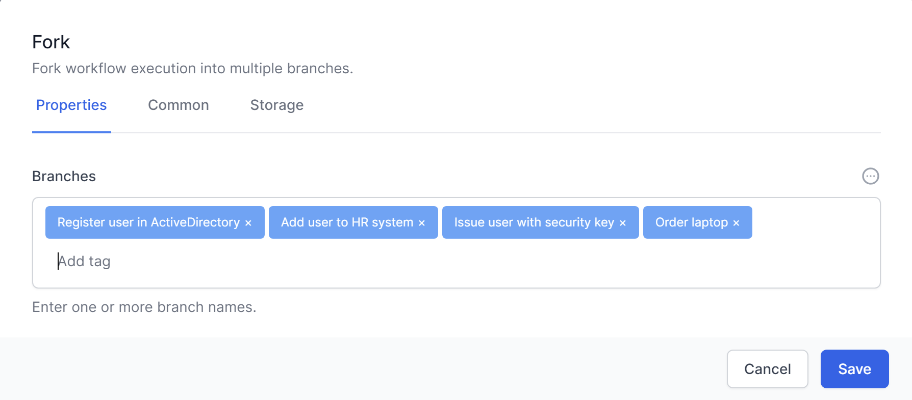

# Flow control

You will use the flow control features in Workflows to link your Activities in Workflows, and provide the logic required to formalise your business process.

This chapter will provide an overview of the core Flow Control activities, including *Break*, *For*, *For Each*, *Fork*, *If/Else*, *Join*, *Parallel For Each*, *Switch*, *While*, *Set Variable*, and *Set Transient Variable*.

## If/Else

The *If/Else* activity provides conditional branching based on a specified condition. If the condition is met, this Activity will run the **<span class="smallcaps">True</span>** branch; otherwise, the activities in the **<span class="smallcaps">False</span>** branch will be executed.


### Loops

We often want computers and workflows to repeat themselves. For example we might want the same process to occur for every row of a spreadsheet or every lead in a database. For this we use loops. In workflows we have a several types of loops:

## For Loops

> The `For` Loop has a starting number, an ending number and a step. This loop will maintain a counter. On the first pass (iteration), the counter is set to the starting number. On the second iteration, the counter has the step value added to it. The system then compares the counter to the ending number and will only keep going if the counter is less than the ending number.
>
> The `For` loop is useful when we want to count through several things where we know or can easily calculate the starting number or step.
>
> *For loops can count up (Step \>0) or down (Step\<0) and the comparison can be any of less than, less than or equal to, greater than and greater then or equal to.*
>
> The `For` activity requires an initial value, an end value, and an optional step value. The loop will continue to execute the activities within it until the end value is reached or a Break activity is encountered.


> The `For` activity allows you to set the following:

- **<span class="smallcaps">Start</span>** – This is a number which defines the start counter for the loop. This can be entered directly into the activity or calculated using Javascript or Liquid.

- **<span class="smallcaps">End</span>** – This is a number which defines the end comparison for the loop. This can be entered directly into the activity or calculated using JavaScript or Liquid.

### For Each

> The `For Each` activity is designed to iterate over a collection of items, such as an array or a list. It will execute the activities within the loop for each item in the collection. The loop will continue until all items have been processed or a Break activity is encountered.
>
> Imagine we have a variable with the colors in the rainbow. We might represent it as:
```
    [  
    "Red",  
    "Orange",  
    "Yellow",  
    "Green",  
    "Blue",  
    "Indigo",  
    "Violet"  
    ]
```
> The item above is known as a **JSON array**. A *For Each loop*, using this JSON array as the **<span class="smallcaps">Items</span>**, would run through seven times and return “Red”, “Orange” etc until it finished with “Violet”.

### Parallel For Each

> Workflows also has the `Parallel For each` activity which performs each iteration in parallel, increasing performance as many things happen at the same time.
>
> The `Parallel For Each` activity is similar to the `For Each` activity. However it deals with each of the items in the collection concurrently. This can improve performance by parallelizing the processing of tasks. Just be aware of any logic problems that this may lead to.  We recommend being careful when using this activity.

### While

The `While` activity is a loop structure that executes activities within the loop as long as a specified condition remains true. The loop will continue until the condition becomes false or a Break activity is encountered.

## Break

The `Break` activity allows you to exit a loop (e.g., *For, For Each, While*) prematurely when a certain condition is met. By implementing the `Break` activity, you can optimize your workflows and prevent unnecessary iterations.


The `Break` activity has no need for specific customisable attributes, apart from the standard common and storage sections.

## Fork

The `Fork` activity allows you to create parallel branches in your workflow, running the branches one at a time. The workflow will continue once all branches have completed.



This could be represented in a *Workflow* like this:


The sequence that the forks are executed are non-determinative - so you cannot be sure in which order the forks will be run.

## Join

The `Join` activity can be used in conjunction with the `Fork` activity to synchronize parallel branches. When parallel branches have completed their execution, the workflow will continue at the Join activity, merging the branches back into a single path.

`Join` has a *Mode* to perform 2 distinct types of *Join*.

> **<span class="smallcaps">WaitAll</span>** will ensure that execution of the workflows will wait until all of the branches linked to the join have completed.
>
> **<span class="smallcaps">WaitAny</span>** will continue execution of the workflow after the first branch completes. The other branches may continue execution, but the join operation will occur after just 1 branch completes.  Ensure that your workflow logic is valid whilst the rest of your workflow continues. 


## Switch

The `Switch` activity provides multi-way branching based on the value of a specified expression.  You can think of it as as essentially a group of If/Else activities in a single activity.

It allows you to define multiple cases, each with a set of activities that will be executed when the expression matches the case value.


This could be represented in a *Workflow* like this:


