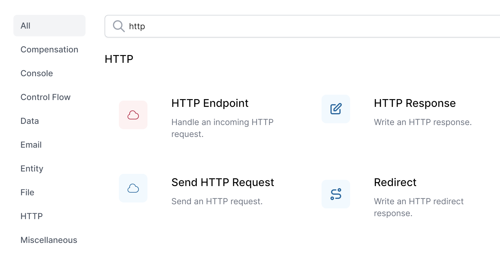
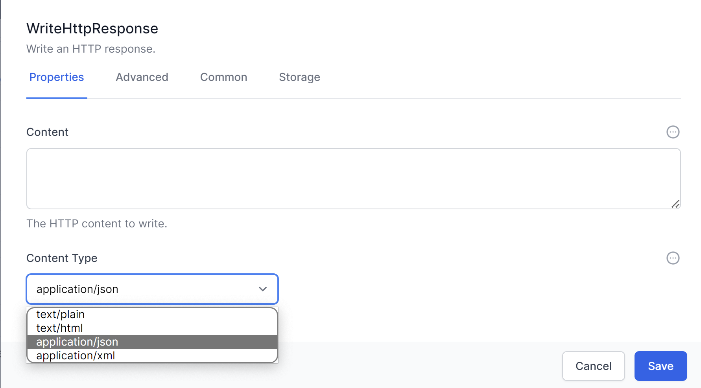
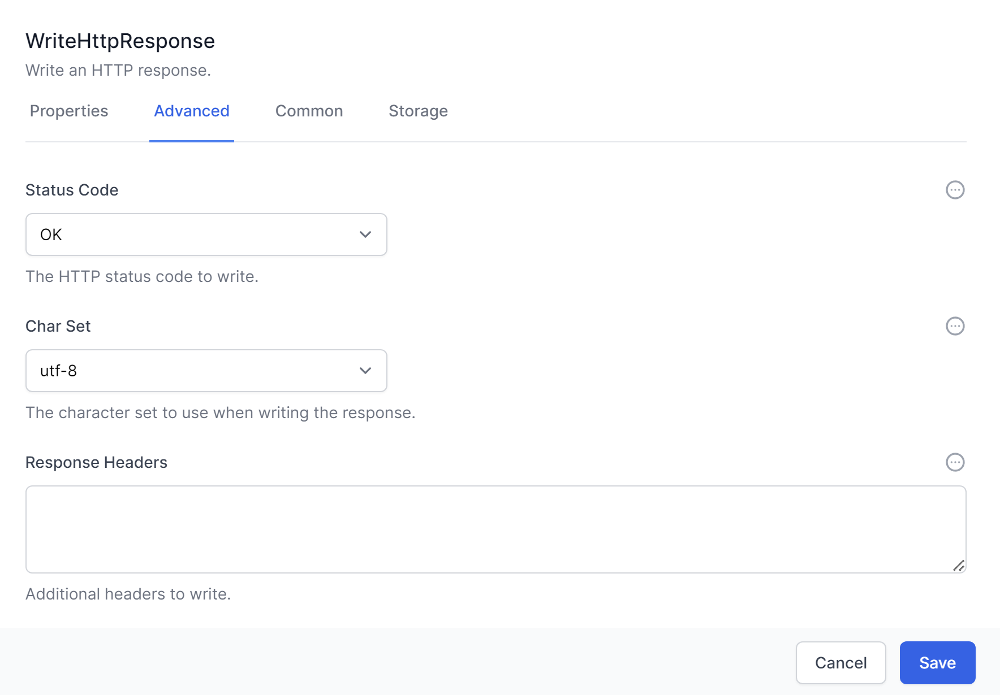
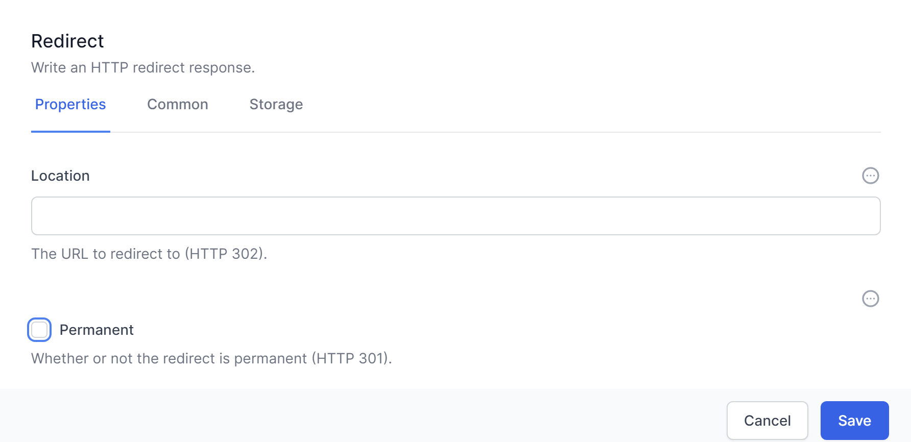

# HTTP Activities in Workflows

**HTTP activities** in Workflows enable seamless integration with external web services and APIs, as well as handling incoming HTTP requests within your workflows.

> *Note: While we call these HTTP activities, they almost always run over https.*

This chapter will provide an overview of the three primary HTTP activities: `HTTP Endpoint`, `Send HTTP Request`, and `HTTP Response`, along with the `Redirect` activity.

## HTTP Endpoint

The `HTTP Endpoint` activity allows you to handle incoming HTTP requests within your workflow. It supports various HTTP methods, including GET, POST, PUT, DELETE, PATCH, OPTIONS, and HEAD.

Key features of the HTTP Endpoint activity include:

- **Path**: Define a custom path for the endpoint.

- **Read Content**: Choose whether or not to read the request content, and specify the format (e.g., JSON, XML, or plain text).

- **JSON Schema**: In the **Advanced** tab, you can define a JSON schema for validating incoming request data.

- **Security**: Secure the endpoint by enabling the **Authorize** option in the **Security** tab, which restricts access to authorized users.

## HTTP Response

The `HTTP Response` activity allows you to send an HTTP response to an HTTP Endpoint within your workflow. It provides options for customizing the response, including the status code, headers, and content.

Key features of the HTTP Response activity include:

- **Status Code**: Select the appropriate HTTP status code for the response.

- **Headers**: Define any custom headers to include in the response.

- **Content**: Provide the response content, which can be in various formats such as JSON, XML, or plain text.

## Send HTTP Request

The `Send HTTP Request` activity enables your workflows to interact with external web services and APIs by sending HTTP requests and processing the responses.

Key features of the Send HTTP Request activity include:

- **HTTP Method**: Select the desired HTTP method (e.g., GET, POST, PUT, DELETE, etc.).

- **URL**: Specify the target URL for the request.

- **Headers**: Define any custom headers to include in the request.

- **Request Body**: Provide the request body content, if applicable.

- **Authorisation:** Use **[Credential Manager](../20_solutions/sample%20solutions/AIProspector/README.html#3-create-credentials)** to store and manage *OAuth* and other authorization credentials for secure access to external services, then select the Authorisation here.

## Redirect

The `Redirect` activity writes an HTTP Redirect response, allowing you to redirect the client to a different URL within your workflow. This can be useful for scenarios such as user authentication or navigation between different pages in a web application.

Key features of the Redirect activity include:

- **URL**: Specify the target URL for the redirection.

- **Permanent**: Select for the redirection to be 301 / permanent redirect, deselect for 302 / temporary redirect.

By leveraging these HTTP activities in Elsa Workflows, you can create powerful and flexible workflows that interact with external web services and APIs, as well as handle incoming HTTP requests efficiently. Understanding these HTTP activities will help you better design and optimize your workflows to meet the unique requirements of your organization in World of Workflows.

