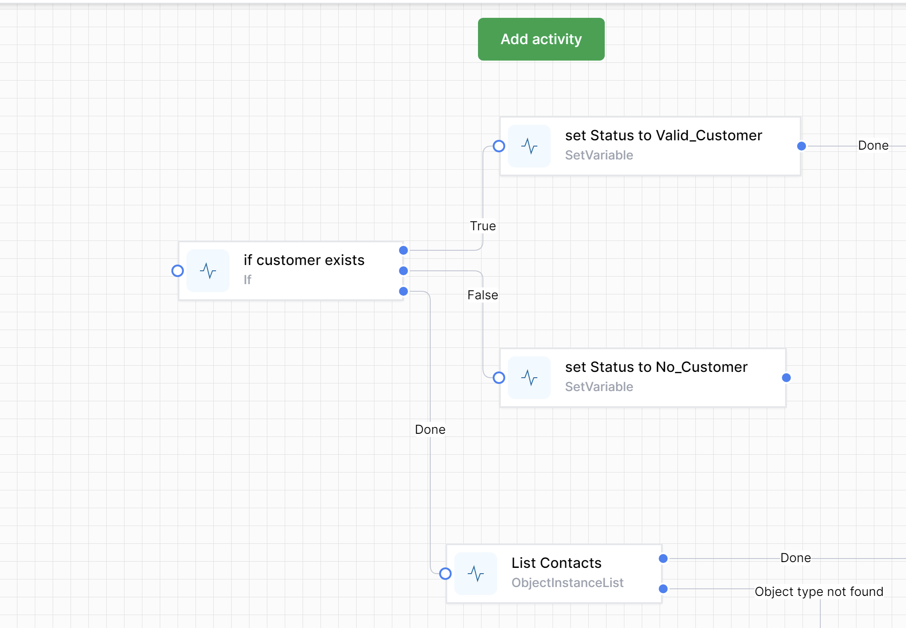
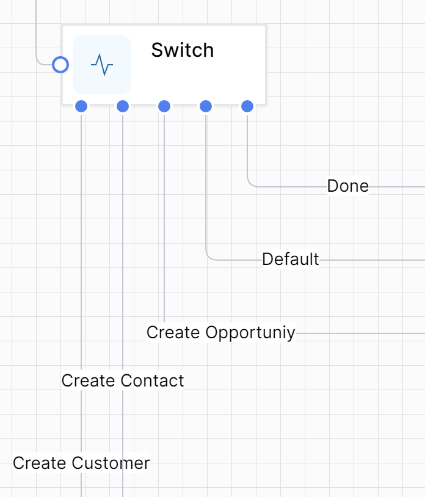
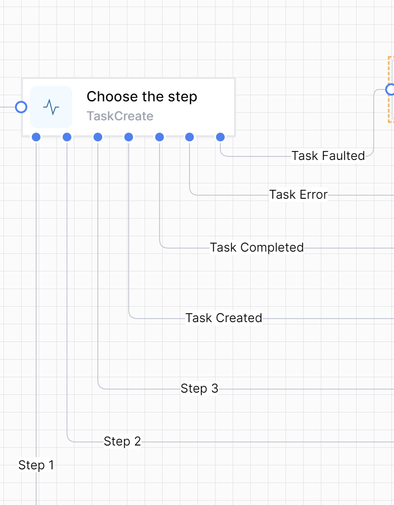

In order to work effectively with workflow development World of Workflows, it's important to understand its terminology. Below is a list of words that represent important concepts.

## Workflow

A workflow consists of a series of steps called **activities** that are connected to one another. A workflow maintains all sorts of information, such as the following:

- Which activity is currently executing?
- What variables are set?
- What activities are blocking further execution?

Once an activity is done executing, the workflow checks its outcome and if there's another activity connected to it. If so, that activity is scheduled for execution.

This goes on until there are either no more activities to execute or an activity is encountered that instructs the workflow runner to suspend the workflow.

## Activity

An activity is an atomic building block that represents a single executable step on the workflow. Activities can do all sorts of things and take input from you and provide output.

## Starting Activity
An activity that is the starting point of the workflow and does not have any inbound connections. They are the entry points to the workflow.  An activity without any preceding activity is a starting acttivity.  `Note that you can accidentally create an entry point by creating an unconnected activity.  `

`HTTP Endpoint` is a common starting activity, and a workflow can have one or many of these. 

## Blocking Activity
When an activity runs, it returns an activity execution result. There are various possible results that can be returned, but the most commonly used ones are Done, Outcomes and Suspend.

When Suspend is returned (as is typically the case with blocking activities), the workflow will enter the Suspended state and the activity will be registered as a blocking activity.

## Suspended Workflow

Suspended workflows are blocked by one or more blocking activities. The only way to resume such a workflow is to trigger it with the name of one of the blocking activities.

## Connection

A connection represents a connection between two activities. This is how the workflow runner knows what activities to execute next. A connection between two activities holds 3 pieces of information:

- The source activity ID.
- The source outcome name (e.g. Done).
- The target activity ID.

For each possible outcome of a given activity, a connection can be established from that outcome to another activity.

For example, let's say we have a workflow with three activities, an `If` activity and 2 `Set Variable` activities. The `If` Activity has 3 outcomes called `True`, `False` and `Done`.  We wish to connect the true and false branches to activities to set a variable.  Once the True/False branches are completed, the Done outcome is performed.

This means we need the following three connections:

**Connection 1**

- Source: **If Activity**
- Outcome: **True**
- Destination: **Set Variable Activity 1**
- 
**Connection 2**

- Source: **If Activity**
- Outcome: **False**
- Destination: **Set Variable Activity 2**

**Connection 3**

- Source: **If Activity**
- Outcome: **Done**
- Destination: **List Contacts**

Visually, this would look like this:

The number and labels of the branches of activities depend on the type of activity.  As you can see, `If` has True/False/Done branches, `Set Variable` has 1 branch.

For some activities, such as `Switch` and `Task Create`, you can create your own branches:

## Long Running Workflows

A long-running workflow is a workflow that doesn't run from start to end in one go. Instead, it might have one or more blocking activities that will instruct the workflow engine to suspend the workflow until it receives the appropriate stimulus to resume execution.  Often we use a `Task Create` activity to suspend a workflow until a human has answered a question &/or supplied some information. 

## Short Running Workflows

A short-running workflow is a workflow that, in contrast to long-running workflows, runs from start to end without suspending.

## Burst of Execution

A burst of execution refers to the execution of a sequence of activities one after another until either one of the following occurs:

- No more activities were scheduled (the end of the workflow was reached), or
- A blocking activity was encountered.

## Workflow Variables
Every workflow instance can have a set of workflow variables.

A workflow variable is a simple key/value pair stored as part of the workflow instance and is useful to store information that can later be used by other activities.

Variables can be created several ways:  
1. Add a `Set Variable` activity to a Workflow
2. Using the JavaScript command `SetVariable()`
3. Declare variables up-front on the workflow definition itself, called `Default Variables`

