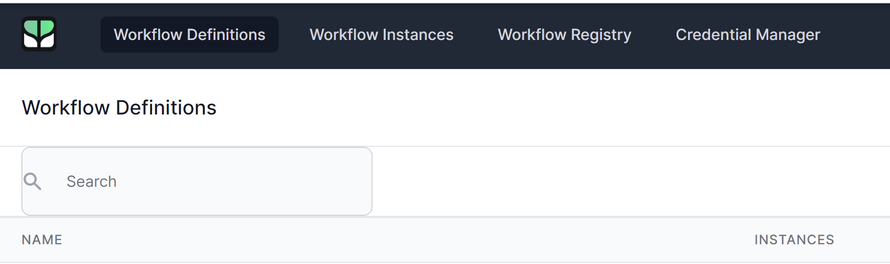
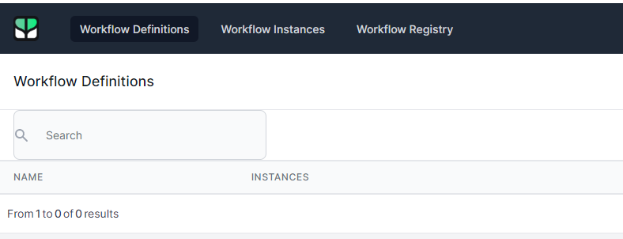
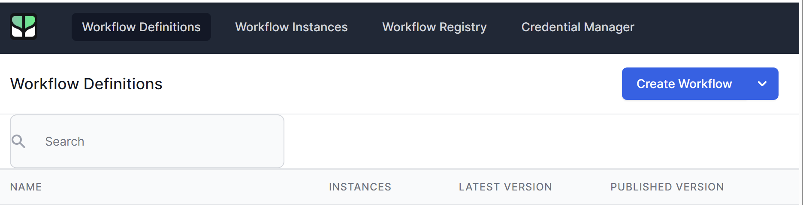
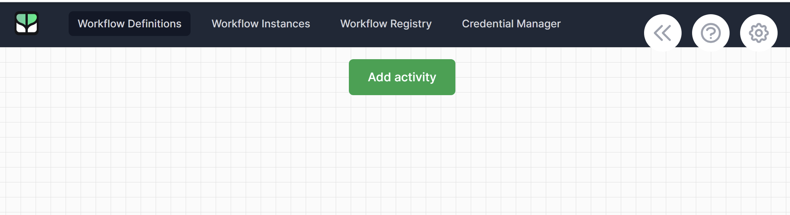
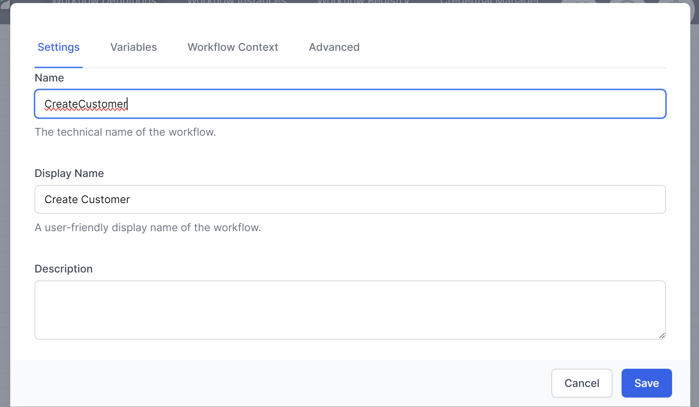

# Creating a Workflow

To Work with your workflow definitions, you need to be an admin in the system. If you are an Admin, you will see the **Admin** tab in the top Menu. Click **Admin** the click **Workflows** to go to the Workflow Dashboard:

This will open the **Workflow Dashboard** in the **Workflow Definitions Page**

The four main sections of the Workflow Dashboard are:

- **Workflow Definitions** - Lets you work with your workflow definitions, the blueprints of your workflows.
- **Workflow Instances** - Lets you work with workflow instances, those times your workflow definitions have run
- **Workflow Registry** - This shows not just your workflows but any additional workflow definitions created by plugins.
- **Credential Manager** - This is where you can create and maintain security information that your workflows can use to supply authentication to external APIs.

## Create a Workflow
To create a new workflow, click the **Create Workflow** button in the **Workflow Definitions** section.

The Workflow designer will open. You can now start to build your workflow.

- Click **Add activity** to begin adding activities.
- The **Publish** dropdown allows you to publish, import and export a workflow definition.
- The **<<** button shows additional information on your workflow including general information, and Version History.
- The **?** icon gives help on using the designer.
- The **Cog** setting allows you to set various options for this workflow.

## Configuring a Workflow:

Clicking the Cog icon will open the Workflow Settings dialog.

### Settings

The **Name** of the workflow is the internal name it is known by.  You can use this in the `Run Workflow` activity to call the workflow as a Child Workflow.

The **Display Name** is the name that will be shown to your end users in the interface.

The **Description** is a useful place to store information on the workflow and why you created it in the first place.

