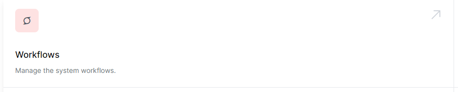
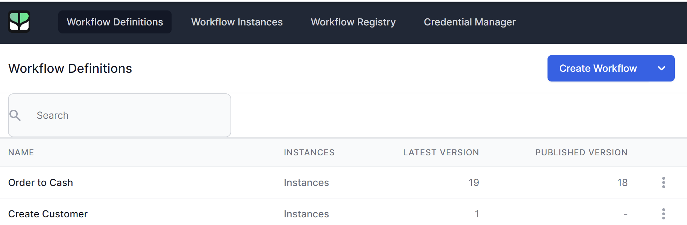
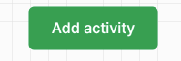
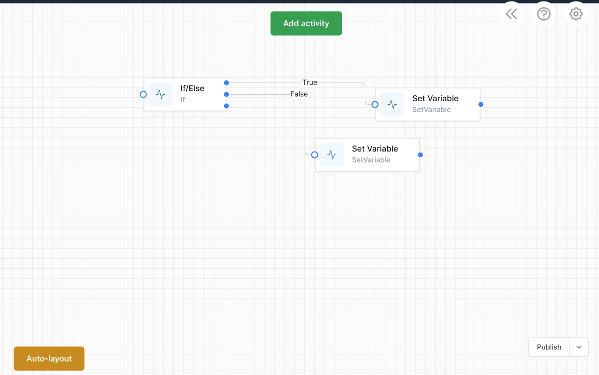

# Editing a Workflow

To Work with your workflow definitions, you need to be an admin in system. If you are an Admin, you will see the **Admin** tab in the top Menu. Click **Admin** the click **Workflows** to go to the Workflow Dashboard:

This will open the **Workflow Dashboard** in the **Workflow Definitions Page**

Now click on the workflow you wish to edit

The Workflow designer will open. You can now start to edit your workflow.

Add activities with the  button.

Copy activities with the standard copy (`ctrl-c`) and paste (`ctrl-v`) keyboard keystrokes.

{: .key }

When done, click **Publish** to publish the new version of your workflow definition. The designer saves every change automatically, so you don't need to worry about losing your work.