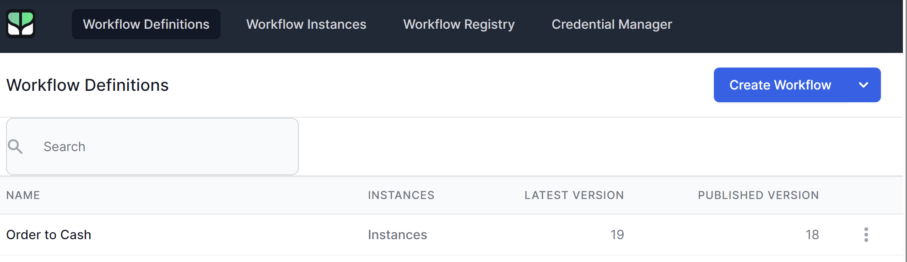
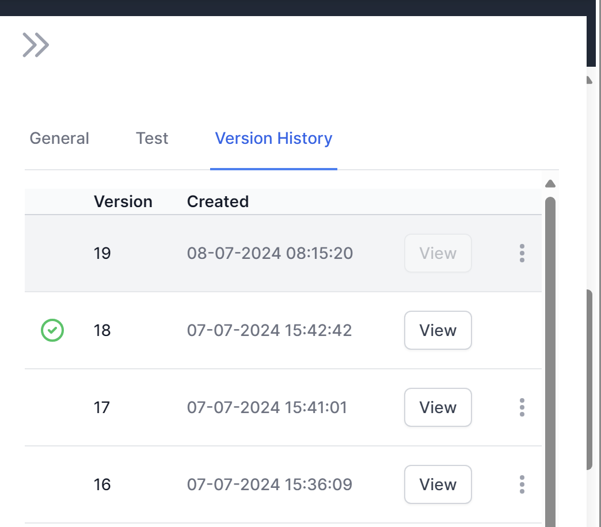
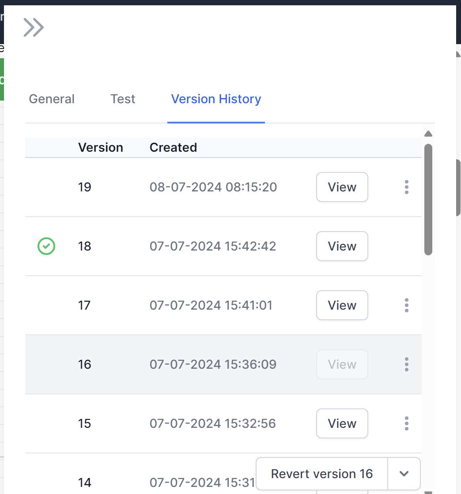

# Reverting a Workflow

World of Workflows maintains a backup copy of every change you make to your workflows.  This version control system allows you to confidently make changes, knowing that you can revert to a previous version if you change yoru mind.

The Workflow Definitions page shows the Version Number of the workflow.
The verison number is incremented whenever you `publish` your workflow.

In this example, we have published the `Order to Cash` workflow 18 times, and made another edit to the workflow without publishing it.

If we want to revert our changes, we open the workflow, click the `<<` icon and navigate to the `Version History` page.  Here you can see all the previous and choose which to view.

Select the version and then click `Revert to version xx`  to go back to your earlier version.  A new version (20 in this case) will be created, so you can go back to verison 19 if you need to.  

