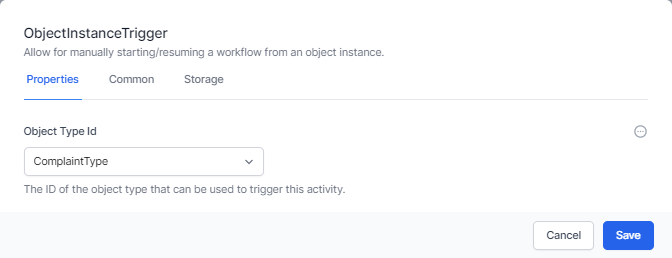

# Starting Workflows

There are three main ways to start a workflow:

1. **Timer based** Workflow - World of Workflows comes with a comprehensive scheduling system allowing you to run workflows at times that suit you.
2. **Http Based** Workflow - Using the Http Activity, you can start a workflow by calling a URL that you create.
3. **Data Instance** based workflow - Using the Object Instance Trigger activity, you can start a workflow from the Object Edit Screen.

These are described below:

## Timer Based Workflow

1. Start by creating a New workflow
2. Click Start and choose the **Timers** category and the `Cron` activity.
   
3. Configure the `Cron` activity to run at the time you want the workflow to run. This is done using a Cron Expression. You can find examples of these [here](https://www.freeformatter.com/cron-expression-generator-quartz.html)
   
4. Click **Save**

Now your workflow will run at the time you specify.

## Http Based Workflow

1. Start by creating a New workflow.
2. Click Start and choose the **HTTP** category and the `HTTP Endpoint` activity.
   
3. Give the activity a path (a relative url, such as `/runMe`), and select a method (you should use GET if you wish to run the workflow from a desktop shortcut). 
4. Select **Read Content** if you wish to use data sent as a part of this request later in your workflow.
   
5. Click **Save**

Now, whenever you navigate to the URL you specified, the workflow will run.
> **Remember** The path (URL) is case sensitive!

> **Note**: In Personal Edition, you may need to run this from a new *InPrivate* or *Incognito* session in your browser.
> 
## Data Instance based workflow

1. Start by creating a New workflow.
2. Click **Add Activity** and choose the **Data** category and the `Object Instance Trigger` activity
3. Right Click and Choose Edit
   
4. Select the **Type** you wish to trigger the workflow from.  This could be a Customer type if your database contains a list of customers.
5. Click **Save**

Now, whenever you open an instance of the Type specified, this workflow will appear in the workflow tabs.

`Admin`-> `Types` -> *`[Type Name]`* -> *`[Instance Name]`* -> `Workflows`

