# Pass data to a Workflow

Accessing data passed to a workflow differs, depending on the initiation method for the workflow.

Consider this example, which has 3 starting points:
1. a Cron activity to start once a month at 8am
2. an HTTP Endpoint activity which will respond to /1st
3. an Object instance trigger, which will start the workflow from any Customer object
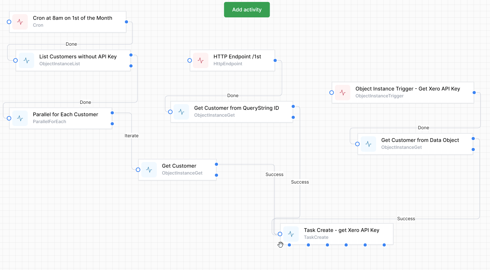

The Cron activity does not collect or generate any data: in this case it is used to initiate a review of customers matching a criteria (no API Key in our example) and kicks off a task for each customer.

## QueryString to HTTP Endpoint
The HTTP Endpoint uses the QueryString parameter to accepot an ID passed.  An example would be https://localhost:7063/1st?ID=394
In this case, 394 is an ObjectId of a customer record that we can use to test our workflow.

We named the HTTP Endpoint htt1st  
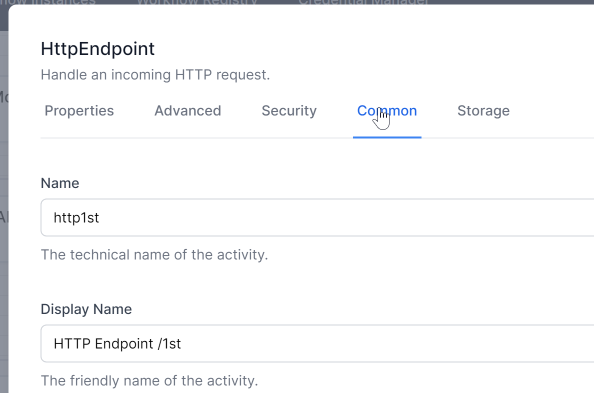

Now we can use that ID in our workflow:  We comment out the hard-coded test number, and replace it with   
`activities.http1st.Output().QueryString.ID` and use this to create the variable `Customer`  

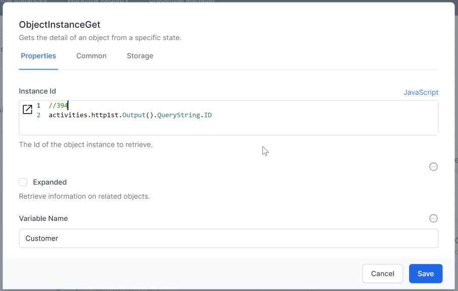

## Instance & InstanceId from ObjectInstanceTrigger
The Object Instance Trigger has built-in outputs called Instance and InstanceId.  The InstanceId is the ObjectId of the data object (eg a customer record) the was open when the user clicked the workflow.  The Instance is the whole object as JSON.
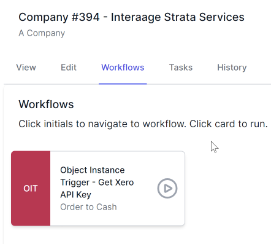
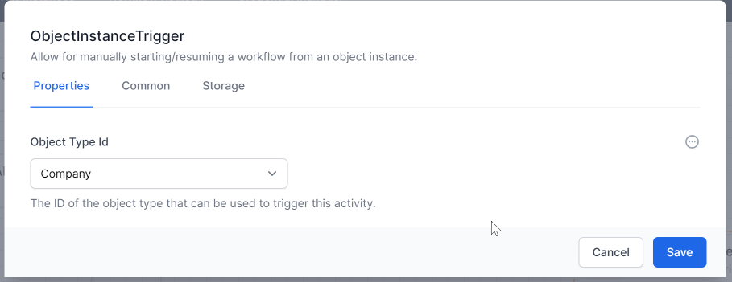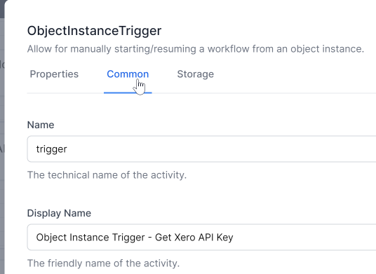

This is how we would use the data from the trigger:
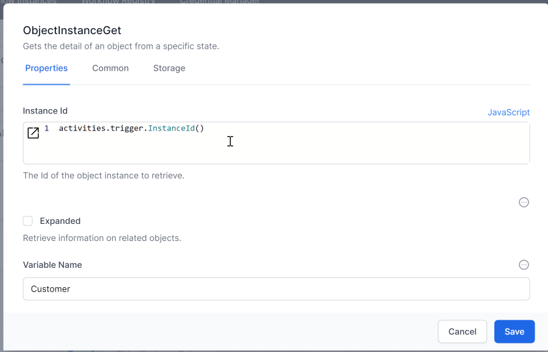

## 'Child' Workflows - accessing data passed from the parent workflow run by the `Run Workflow` activity

A special JavaScript variable is available when a workflow is run by another workflow using the `Run Workflow` activity.
The first activity in a workflow can access a special JavaScript variable called `input`. 

Here is an example of a (parent) workflow calling a (child) workflow:
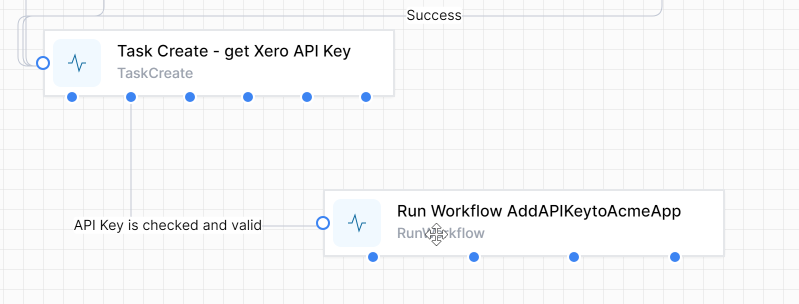
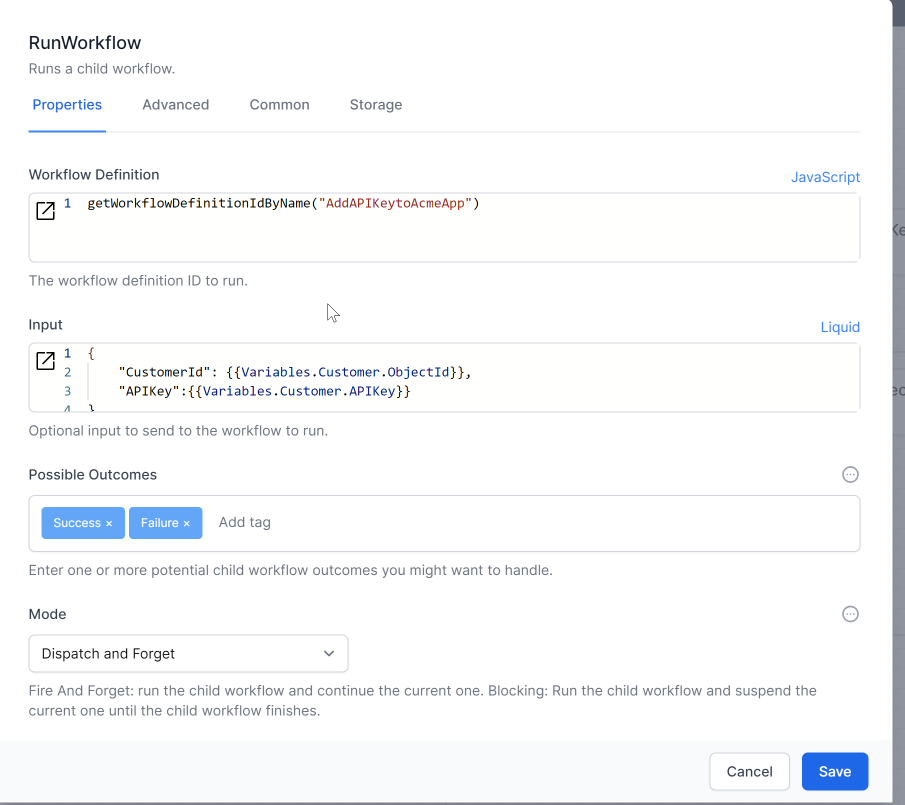

In this case we are passing a JSON object built by a small liquid script.  
This is the equivalent in JavaScript:
 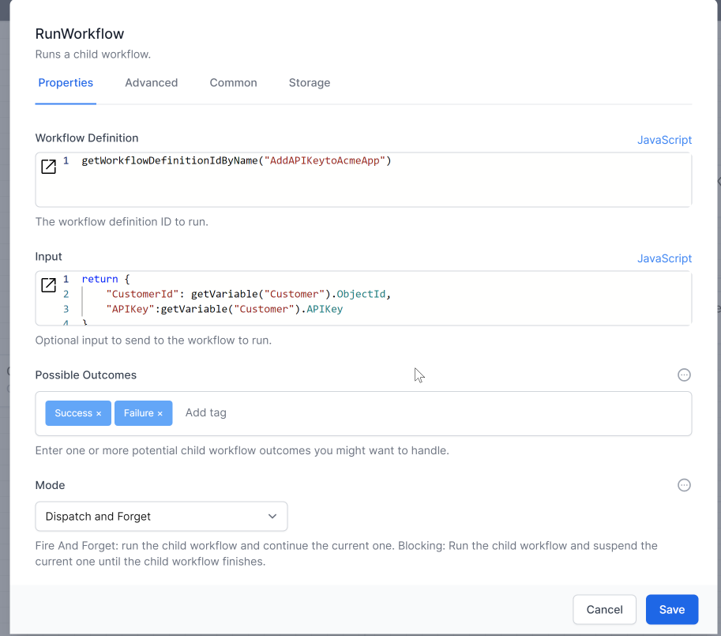
 
 The child workflow can now access the data using the special `input` variable in the very first activity.
 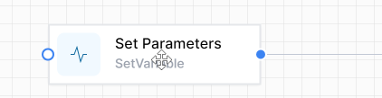
 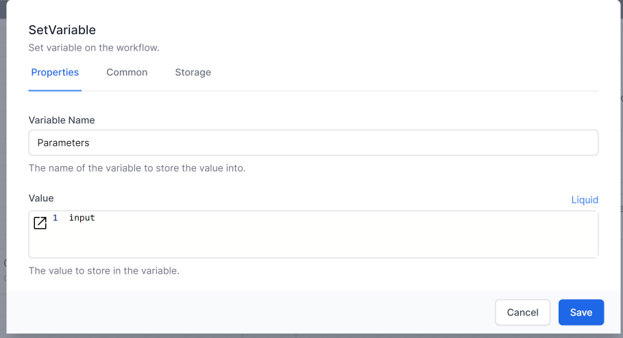  

 Subseqient activities in the child workflow will see the data as
 `Parameters.CustomerId` and `Parameters.APIKey` 
 
  For example, in JavaScript it would be
 `getVariable("Parameters").APIKey`
and liquid would be `{{Variables.Parameters.APIKey}}`

> **Remember** World of Workflows is Case Sensitive.  Ensure you use a consistent case when referring to variable and field names.