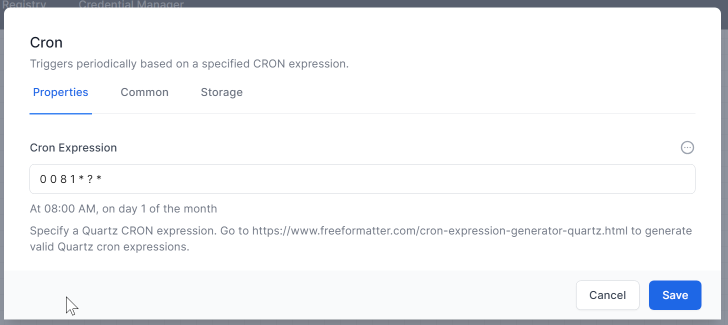
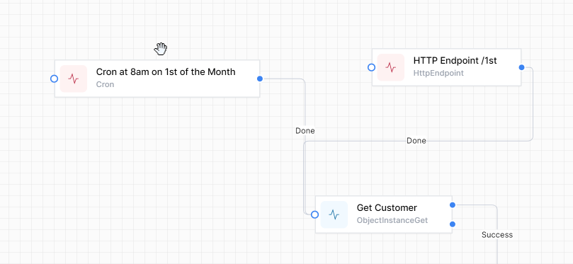

# Dual Triggers

It is common to have a workflow based on a timer.
During the development of the workflow you will want to test on demand as well.  

The following example achieves this:

1. Create a `Cron` activity as normal.  eg to run on a specific date & time.

3. Add an `Http Endpoint` activity, giving it a suitable url (eg '/1st')
4. Link the tasks like this:

The workflow will now run either at the specified time, or upon pointing a browser at `<host>/<endpoint>`. eg https://localhost:7063/1st