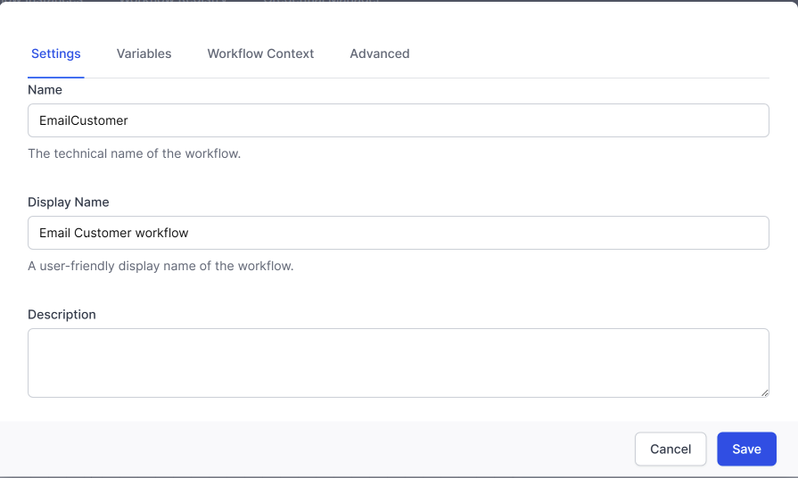
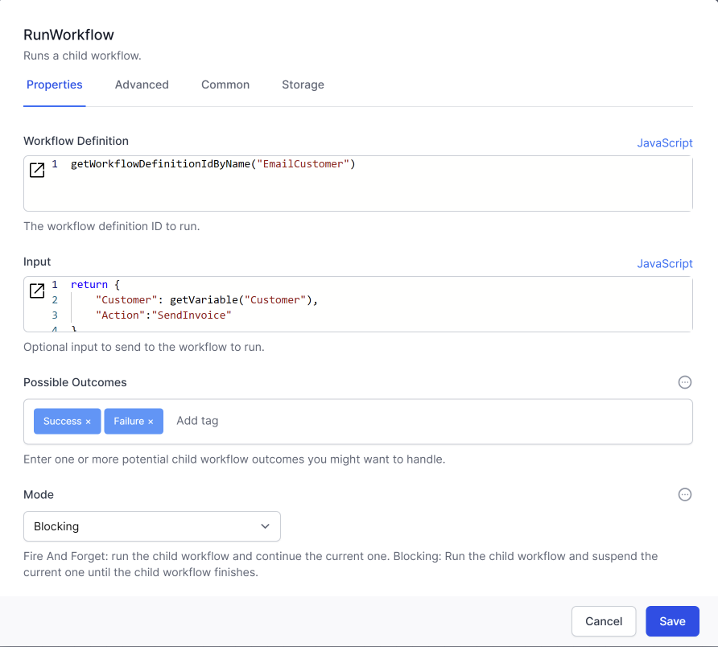
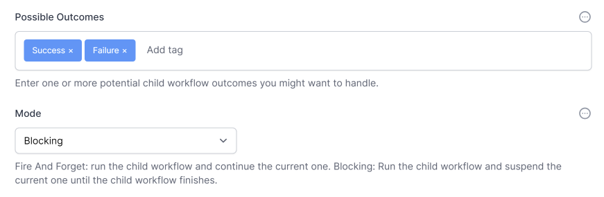
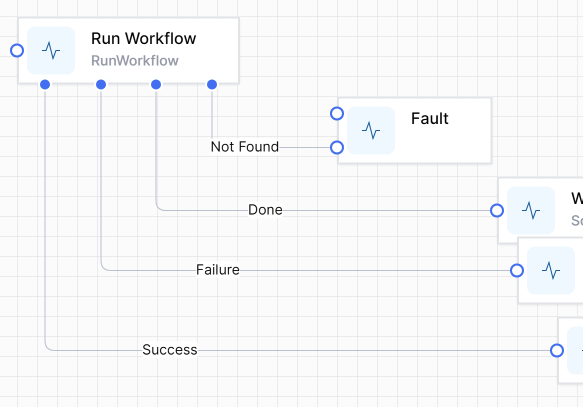
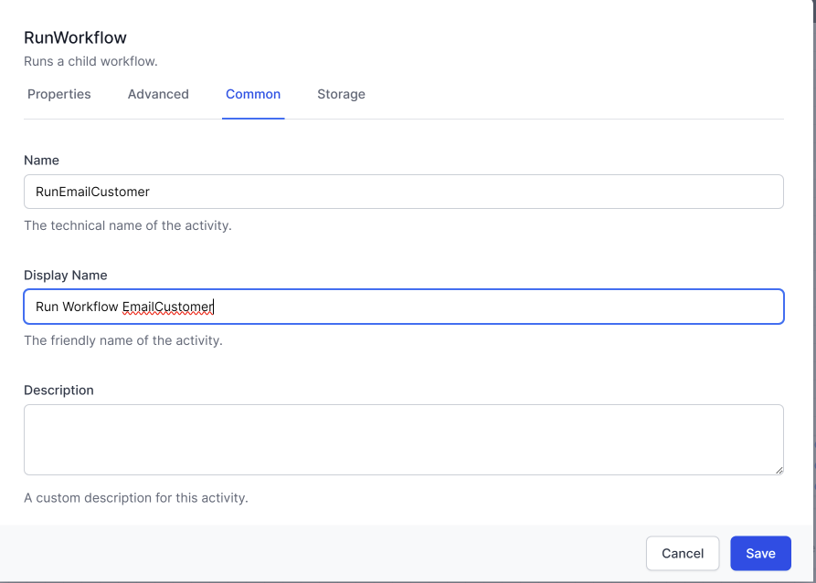
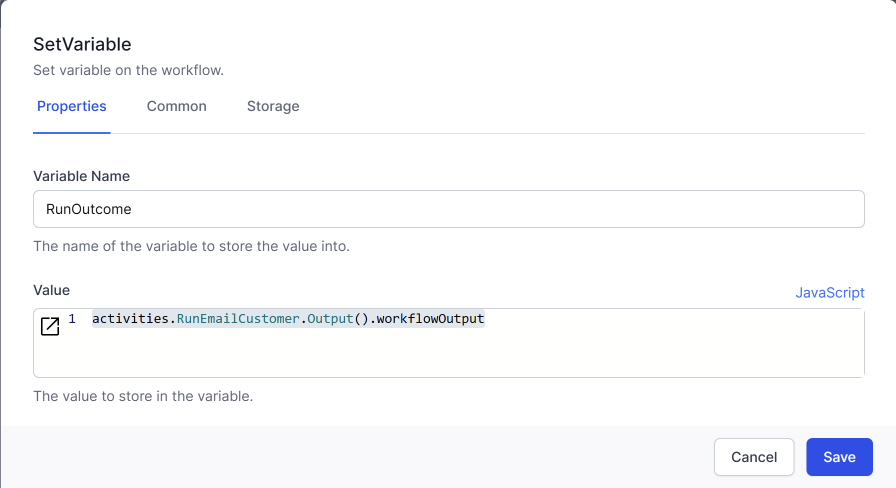
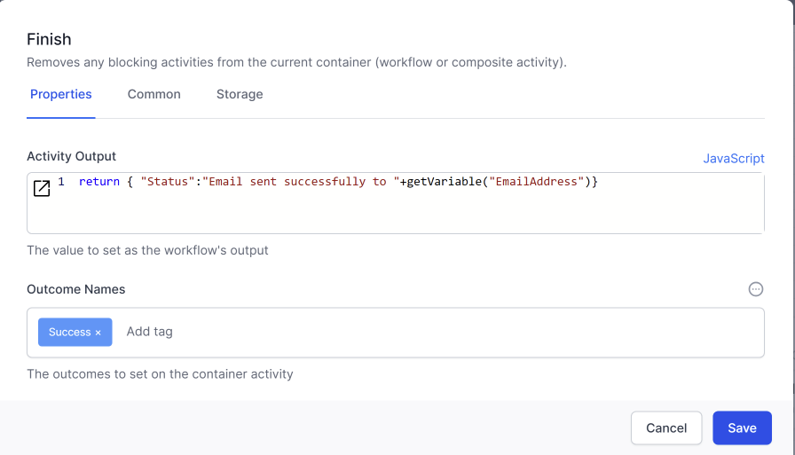

## Calling other workflows

The `Run Workflow` activity allows chaining between workflows.  You can think of this like calling a function or subroutine if you are familiar with some programming languages.


{: .key }
We refer to the *calling* workflow as the **Parent**.  The *called* workflow is referred to as the **Child**.

To identify the child workflow, we use the **Name** parameter of the Child Workflow.  
 -->> 


In the parent workflow, you set the *Workflow Definition* field to the ID of the child workflow:

In JavaScript we use `getWorkflowDefinitionIdByName("<<ChildWorkflowname>>")`  

In Liquid we use 
```liquid
  {{ "<<ChildWorkflowname>>" | workflow_definition_id}}  
```



The child workflow will likely need some context, such as some of the variuables in the parent workflow. In the example above, we passed 2 variables as JSON. [here is another example of how to pass the contents of the variables](./041-InputToWorkflow.html) from the Parent workflow in the `Run Workflow` activity.


### Telling the Parent what the Child did

Sometimes the parent workflow will call the child workflow and not need to wait for an outcome.  You can set the *Mode* parameter to `Fire and Forget` to make the child workflow go off and do it's thing without waiting for an outcome.

#### Setting up the Parent workflow

When you *DO* want to know that the Child workflow has finished you set the *Mode* parameter to `Blocking`.  This causes the parent workflow to wait until the child workflow finishes. 

> Note that if a child workflow is called with *Mode = Blocking* and the child workflow `Faults` then the parent workflow will also fault.

In addition to knowing that the child workflow has finished, you can also program the child workflow to tell the workflow something.  There are two ways to tell the parent something:

1. passing back an `outcome`  
    In the **Parent** workflow, set the field *Possible Outcomes** to the alternatives (as text)you expect the child to pass back to the parent
    
    This will create branches in the workflow for you.  eg:  
    
    > We often link the `Not Found` branch to the `Fault` activity because you want to know when the child workflow cannot be found.
2. passing back **Data**  
   You can also pass data **from** the child to the parent in the similar fashion as passing data **to** the child.  
   You will give the `Run Workflow` activity a name to later use the outtcome.  
    

   The outcome of the `Run Workflow` activity can be obtained with the JavaScript command  
       ```activities.<<RunWorkflowActivityName>>.Output().workflowOutput```  
   
   For example, this will get the data passed back from our `EmailCustomer` workflow:  
   
     

#### Setting up the Child workflow

   In the Child workflow, you will use the `Finish` activity to communicate with the Parent workflow.
    

The data returned in `Activity Output` will be available in the parent workflow with this JavaScript:  
       ```activities.<<RunWorkflowActivityName>>.Output().workflowOutput```  


## Accessing data 

Workflows need to create, read, update and delete data.  Temporary data is held in variables.  Variables exist only while the workflow is running.

To store data outside of the context of a workflow we use the [User Configurable Database](..\05_Database\README.html).  This allows you to store data ( `object instances`) in tables (`Types`).

Use [List Object Instances](..\12_workflow_activities/04_data/README.html#list-object-instances), [Get Object Instance](..\12_workflow_activities/04_data/README.html#get-object-instance), [Update Object Instance](..\12_workflow_activities/04_data/README.html#update-object-instance), [Delete Object Instance](..\12_workflow_activities/04_data/README.html#delete-object-instance) to interact with the User Configurable Database.


{: .key }
`Get Object Instance` accesses the data record in the database at that moment in time.  You will then treat that data as a `variable` in your workflow. If your workflow then changes the `variable` you might want to write that change back to the database, using `Update Object Instance`.

For more details, see [Working with Data](..\08_handling%20_the_data/README.html)

