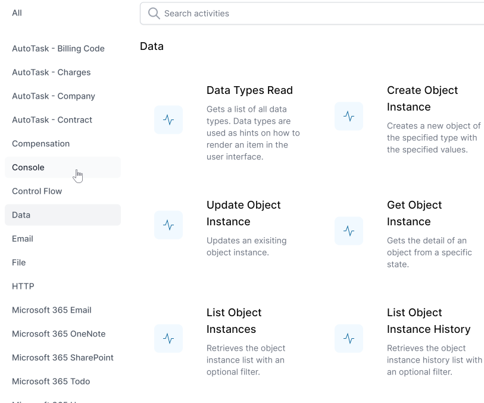
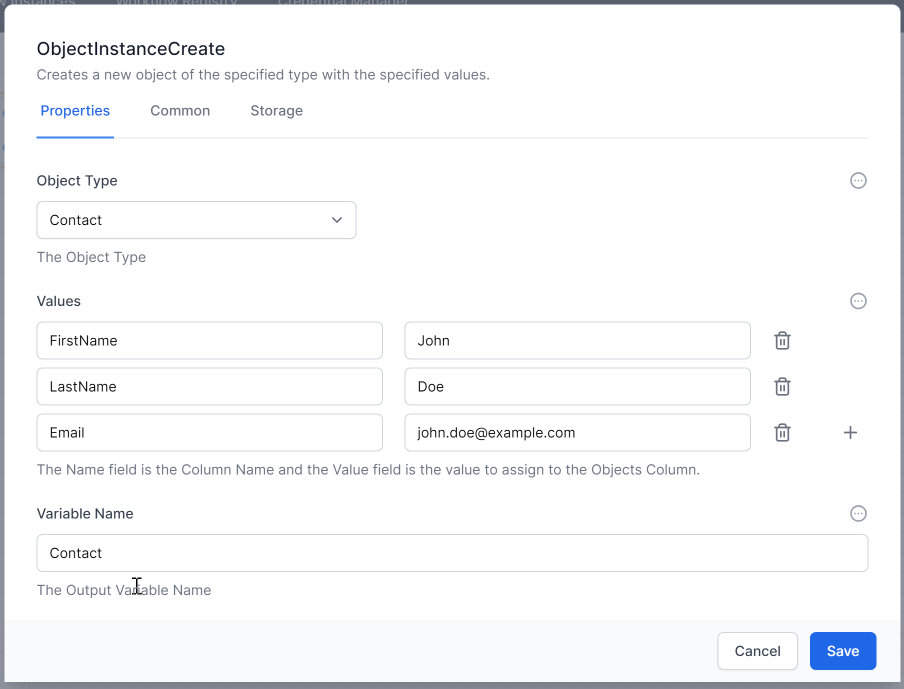
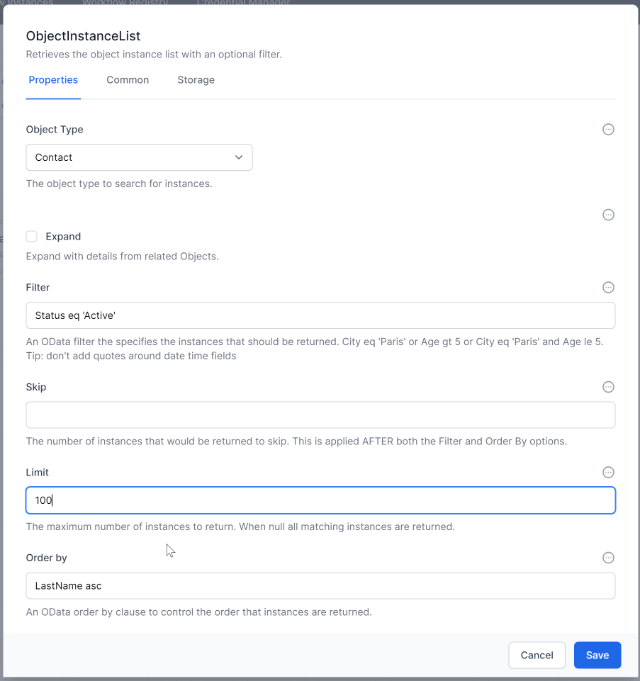

# Working with Data

World of Workflows provides robust capabilities for working with data stored in its database. This includes creating, listing, retrieving, updating, and deleting data as part of your workflows. Here’s a guide on how to work with data using activities in workflows.

## Relevant Activities

When you want manipulate data in the User Configurtable Database in World of Workflows you will use the `Data` activities.  Here are the most commonly used:


## Creating Data

To create data in the database, you can use the `ObjectInstanceCreate` activity. This activity allows you to define the data to be stored and specify the database table or collection where the data should be saved.

1. **Add the `ObjectInstanceCreate` Activity:**
   - Drag and drop the `ObjectInstanceCreate` activity into your workflow.
   - Specify the `Type` where the record should be created.
   - Define the fields and their values that you want to store in the record using JSON.
   - Define the variable name that you can use to refer to this object later on in the workflow.

   **Example JSON:**
   ```json
   {
       "FirstName": "John",
       "LastName": "Doe",
       "Email": "john.doe@example.com"
   }
   ```
   


## Listing Data

To list data from the database, you can use the `ObjectInstanceList` activity. This activity retrieves multiple records based on specified criteria. Note that filters in World of Workflows use `oData`.

1. **Add the `ObjectInstanceList` Activity:**
   - Drag and drop the `ObjectInstanceList` activity into your workflow.
   - Specify the `Type` from which to retrieve records.
   - Define any filtering criteria, sorting options, and the number of records to retrieve.

   **Example Configuration:**
   - **Table:** `Contact`
   - **Filter:** `Status eq 'Active'` (using oData syntax)
   - **Sort By:** `LastName asc`
   - **Limit:** `100`

   


### Advanced Options

In `ObjectInstanceList`, the `Expand` option returns the data for any referenced object. For example, if a Contact has a reference field called 'Company', the Contact.Company field will have the ObjectId of a Company record.

- **Expand Checkbox:**
  - **Not Ticked:** The output of `ObjectInstanceList` will include the Company field with the ObjectId.
  - **Ticked:** The ExpandedOutput of `ObjectInstanceList` will include the entire Company record as a child.

### Set the activity `Name`

You should always set an activity `Name` for *ObjectInstanceList* so you can easily refer to the outoput in sunbsequent steps.  You can use JavaScript to access the Output like this:

~~~js
   activities.ListContacts.ExpandedOutput() // if the Expand checkbox is ticked
   activities.ListContacts.Output()
~~~

### Set the activity `Display Name`

You should set the activity's `Display Name` for *ObjectInstanceList* because this shows in the workflow.

## Getting Data

To retrieve a specific record from the database, you can use the `ObjectInstanceGet` activity. This activity fetches a single record based on a unique identifier or other criteria.

1. **Add the `ObjectInstanceGet` Activity:**
   - Drag and drop the `ObjectInstanceGet` activity into your workflow.
   - Specify the `Type` from which to retrieve the record.
   - Define the ObjectId to select the record.

2. **Example Configuration:**
   - **Table:** `Contact`
   - **ID:** `12345`

### Looping through data records
- use for each
- set ObjectId

### Getting just 1 record
- use the [0].ObjectId syntax
  
### Updating Data

To update existing data in the database, you can use the `ObjectInstanceUpdate` activity. This activity modifies fields in an existing record based on specified criteria. Use JSON to define the fields and their new values.

1. **Add the `ObjectInstanceUpdate` Activity:**
   - Drag and drop the `ObjectInstanceUpdate` activity into your workflow.
   - Specify the table or collection where the record exists.
   - Define the unique identifier or criteria for selecting the record to update.
   - Specify the fields and their new values using JSON.

2. **Example JSON:**
   ```json
   {
       "Title": "Senior Manager",
       "Department": "Sales"
   }
   ```

### Deleting Data

To delete a record from the database, you can use the `DeleteObjectInstance` activity. This activity removes a specific record based on a unique identifier. You only need to supply the ObjectId, not the table.

1. **Add the `DeleteObjectInstance` Activity:**
   - Drag and drop the `DeleteObjectInstance` activity into your workflow.
   - Supply the ObjectId of the record to be deleted.

2. **Example Configuration:**
   - **ObjectId:** `54321`

### Integrating Data Activities in Workflows

When integrating data activities into your workflows, consider the following best practices:

1. **Sequencing:** Ensure that data activities are properly sequenced to maintain data integrity. For example, create records before listing or retrieving them.
2. **Error Handling:** Implement error handling to manage cases where data activities fail, such as when a record cannot be found or an update fails.
3. **Data Validation:** Validate data before performing create or update operations to ensure it meets your business rules and constraints.
4. **Security:** Secure access to data activities to ensure that only authorized users can perform certain operations, such as updating or deleting records.

By following these steps and best practices, you can effectively work with data in the database of World of Workflows, ensuring your workflows are robust, efficient, and reliable.