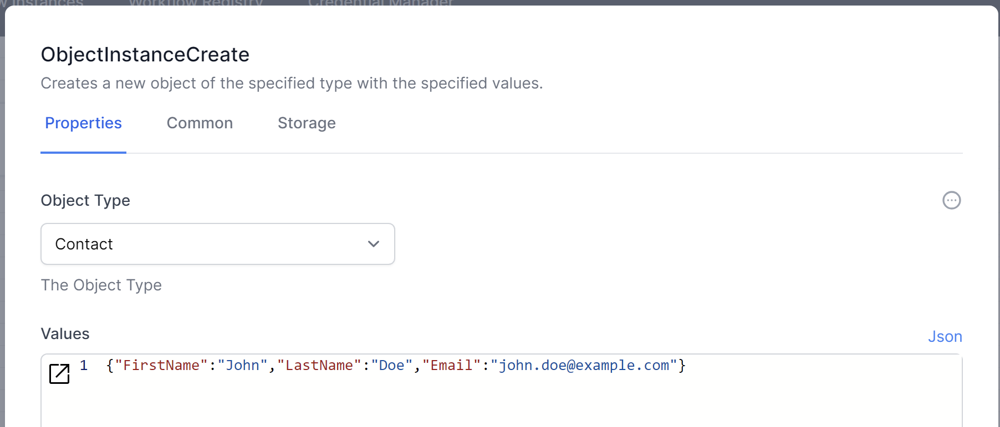
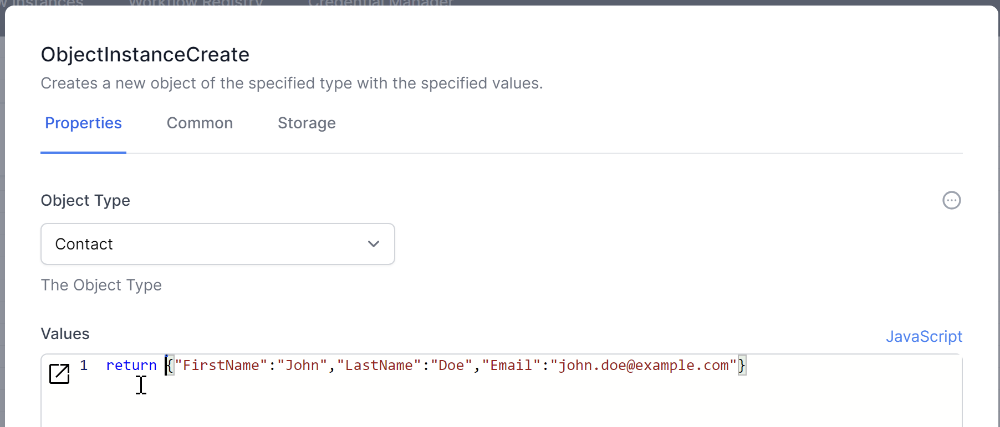
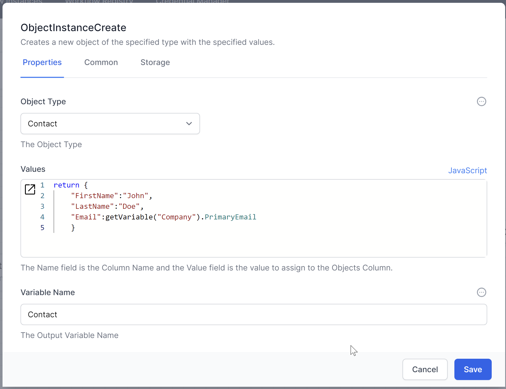
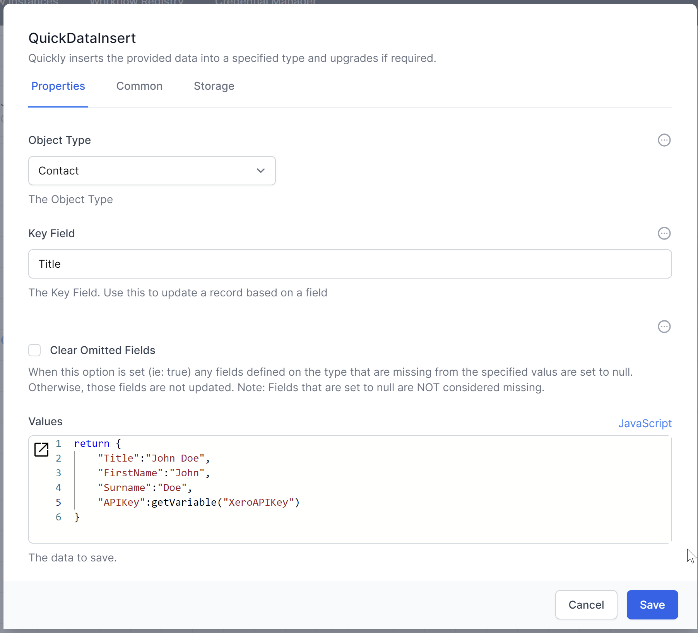

# Creating Data

To create data in the database, you can use the `ObjectInstanceCreate` activity. This activity allows you to define the data to be stored and specify the database table or collection where the data should be saved.

1. **Add the `ObjectInstanceCreate` Activity:**
   - Drag and drop the `ObjectInstanceCreate` activity into your workflow.
   - Specify the `Type` where the record should be created.
   - Define the fields and their values that you want to store in the record using JSON, JavaScript or entering the fields directly in the activity's user interface.
   - Define the variable name that you can use to refer to this object later on in the workflow.

   **Example JSON:**
   ```json
   {
       "FirstName": "John",
       "LastName": "Doe",
       "Email": "john.doe@example.com"
   }
   ```

Using the default UI to represent Values
   

Using JSON to represent Values
   

Using JavaScript to represent Values
   

Use JavaScript when using other variables to populate the data: 


## Adding JSON data 

The `JSON Data Insert` activity is another way to add data to the database.  This activity is especially useful when the data might contain more fields than exist in the database: `JSON Data Insert` will create any missing fields. 



