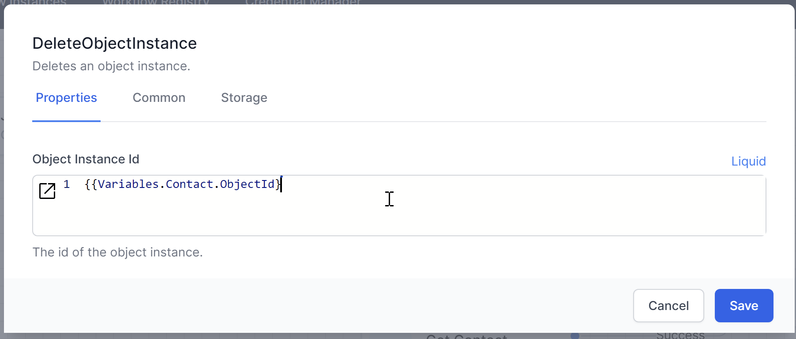

# Deleting Data

To delete a record from the database, you can use the `DeleteObjectInstance` activity. This activity removes a specific record based on a unique identifier. You only need to supply the ObjectId, not the table.

1. **Add the `DeleteObjectInstance` Activity:**
   - Drag and drop the `DeleteObjectInstance` activity into your workflow.
   - Supply the ObjectId of the record to be deleted.

2. **Example Configuration:**
   - **ObjectId:** `54321`

Note that the object cannot be retrieved once this activity succeeds.

{: .key }
> This activity will fail if the data object cannot be deleted.  This might occur if another data object is dependent on it.

> #### Consider this example:  
   > An application might have Contacts and Addresses.  Each Contact could have 0 or more Addresses defined, with a `Reference` field in the Contact type pointing to the Address type.  
   >  
   > Attempting to delete a Contact that has one or more Addresses defined wil fail.  
   This concept is commonly called `Referencial Integrity`.
