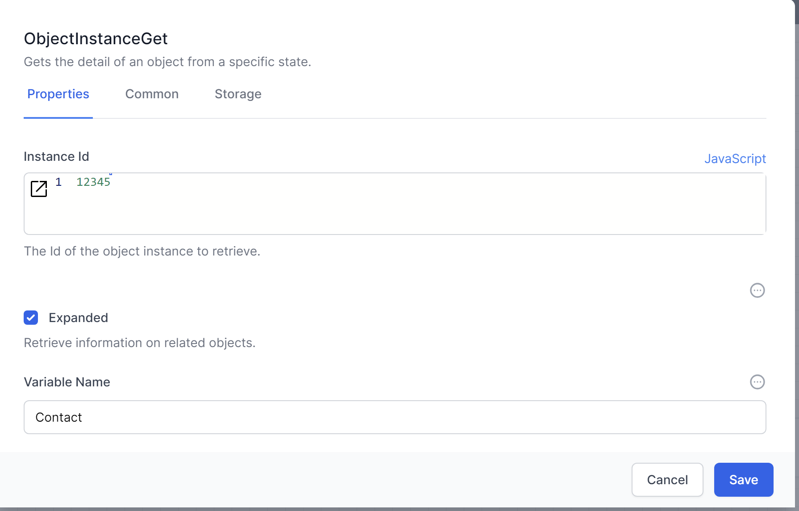
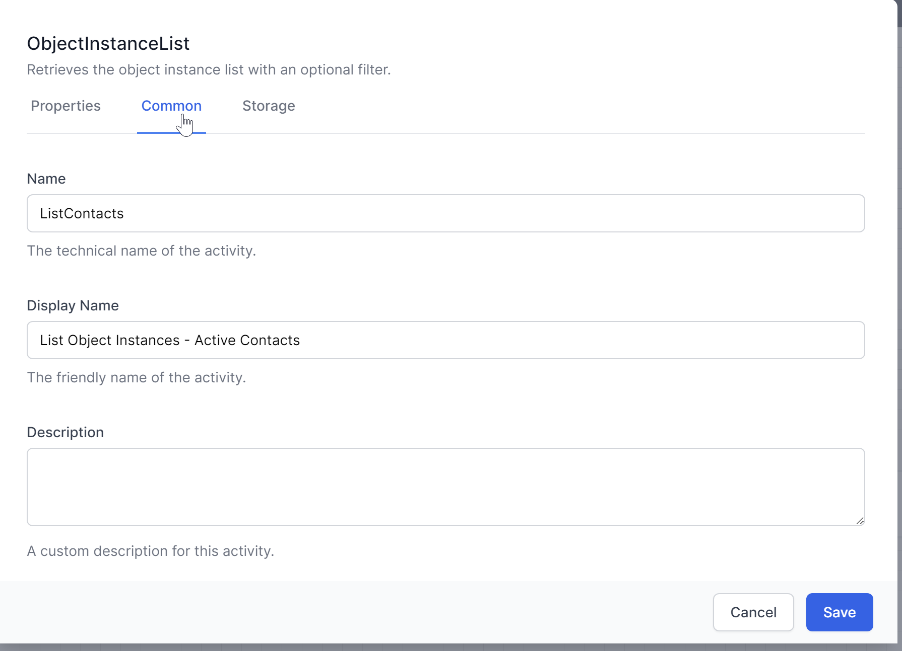
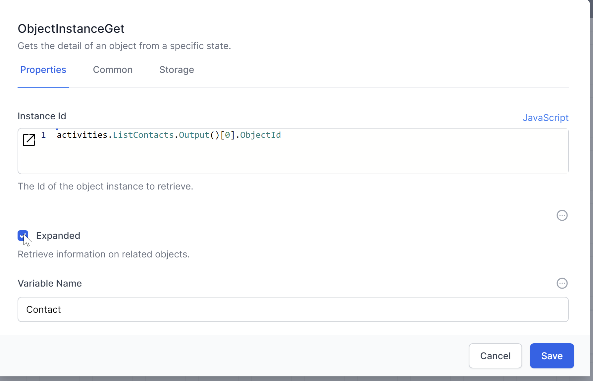
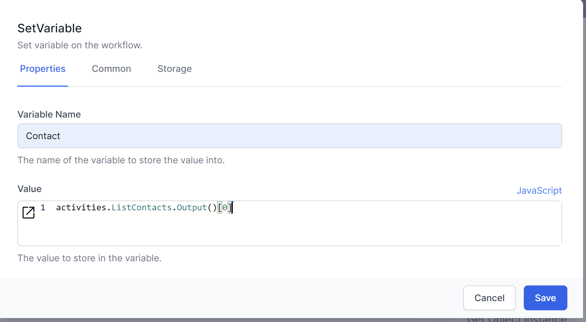
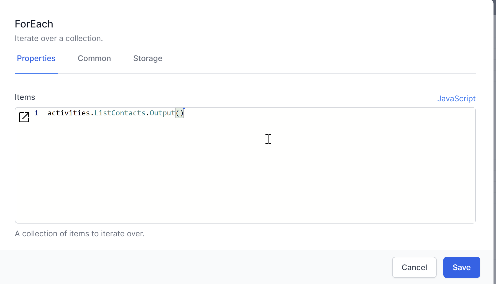
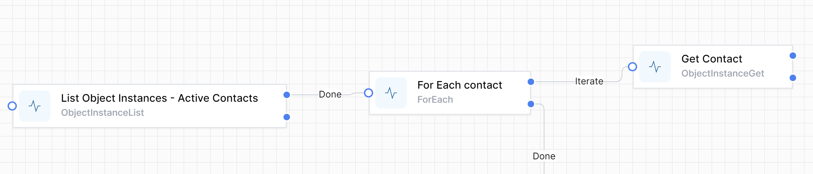

# Getting Data Records

To retrieve a specific record from the database, you can use the `ObjectInstanceGet` activity. This activity fetches a single record based on a unique identifier.

1. **Add the `ObjectInstanceGet` Activity:**
   - Drag and drop the `ObjectInstanceGet` activity into your workflow.
   - Define the ObjectId to select the record.

2. **Example Configuration:**
   - **ID:** `12345`

This example proves a point, but you normally do not know the Instance Id when developing a workflow.  Let's examine how to combine `ObjectInstanceGet` with `ObjectInstanceList`

## Combining `ObjectInstanceGet` with `ObjectInstanceList`

`ObjectInstanceList` returns an array of JSON objects.  This means you need to decide how to access this data in an efficient way.

{: .key }

If you only expect 1 result, perhaps because you have used a specific filter, you can access that result directly.  
If you are not certain that the results will be only 1 record, you should loop through the results.  

Let's examine both methods.

### Accessing the first (only) record

`ObjectInstanceGet` requires an Instance ID of a data record.  
You can use this syntax to complete the InstanceID of `ObjectInstanceGet`:

~~~JavaScript
    activities.<NameOfObjectInstanceList>.Output()[0].ObjectId
~~~

> {: .key }
Note that in JavaScript the first entry of an array is the [0] entry.

If the name you chose in your `ObjectInstanceList` is `ListContacts`:

you will use this JavaScript syntax:

~~~JavaScript
    activities.ListContacts.Output()[0].ObjectId
~~~

You can also use `SetVariable` to access the result.  

#### When to use `ObjectInstanceGet` vs when to use `SetVariable`?

### Looping through data records

The `For each` activity is a simple way to loop (or iterate) through the results from `ObjectInstanceList`.  Each *iteration* of `For each` returns a JSON representation of a row, and branches to *Done* when all the rows are processed.

Putting this all together:

  