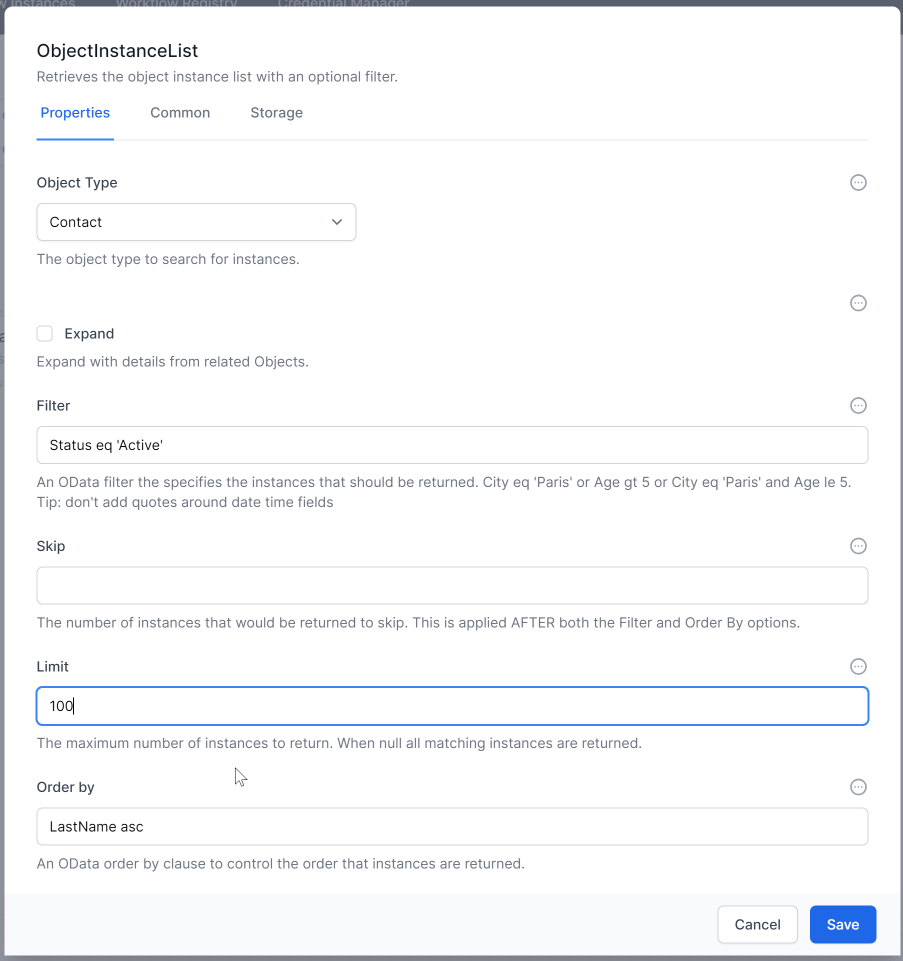
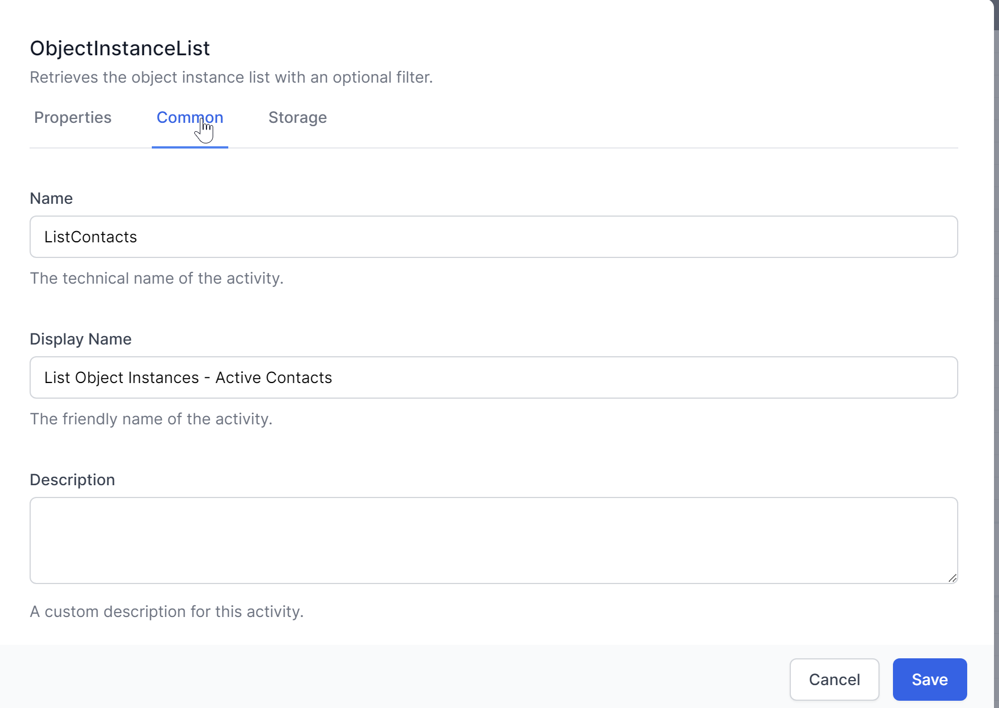

# Listing Data

To list data from the database, you can use the `ObjectInstanceList` activity. This activity retrieves multiple records based on specified criteria. Note that filters in World of Workflows use `oData`.

1. **Add the `ObjectInstanceList` Activity:**
   - Drag and drop the `ObjectInstanceList` activity into your workflow.
   - Specify the `Table` from which to retrieve records.
   - Define any filtering criteria, sorting options, and the number of records to retrieve.

   **Example Configuration:**
   - **Table:** `Contact`
   - **Filter:** `Status eq 'Active'` (using oData syntax)
   - **Sort By:** `LastName asc`
   - **Limit:** `100`

   

### Advanced Options

In `ObjectInstanceList`, the `Expand` option returns the data for any referenced object. For example, if a Contact has a reference field called 'Company', the Contact.Company field will have the ObjectId of a Company record.

- **Expand Checkbox:**
  - **Not Ticked:** The output of `ObjectInstanceList` will include the Company field with the ObjectId.
  - **Ticked:** The ExpandedOutput of `ObjectInstanceList` will include the entire Company record as a child.

### Set the activity `Name`

You should always set an activity `Name` for *ObjectInstanceList* so you can easily refer to the outoput in sunbsequent steps.  You can use JavaScript to access the Output like this:

~~~js
   // if the Expand checkbox is ticked
   activities.ListContacts.ExpandedOutput() 
~~~

~~~js
    // if the Expand checkbox is not ticked 
   activities.ListContacts.Output() 
~~~

### Set the activity `Display Name`

Set the activity's `Display Name` for *ObjectInstanceList* because this shows in the workflow.

