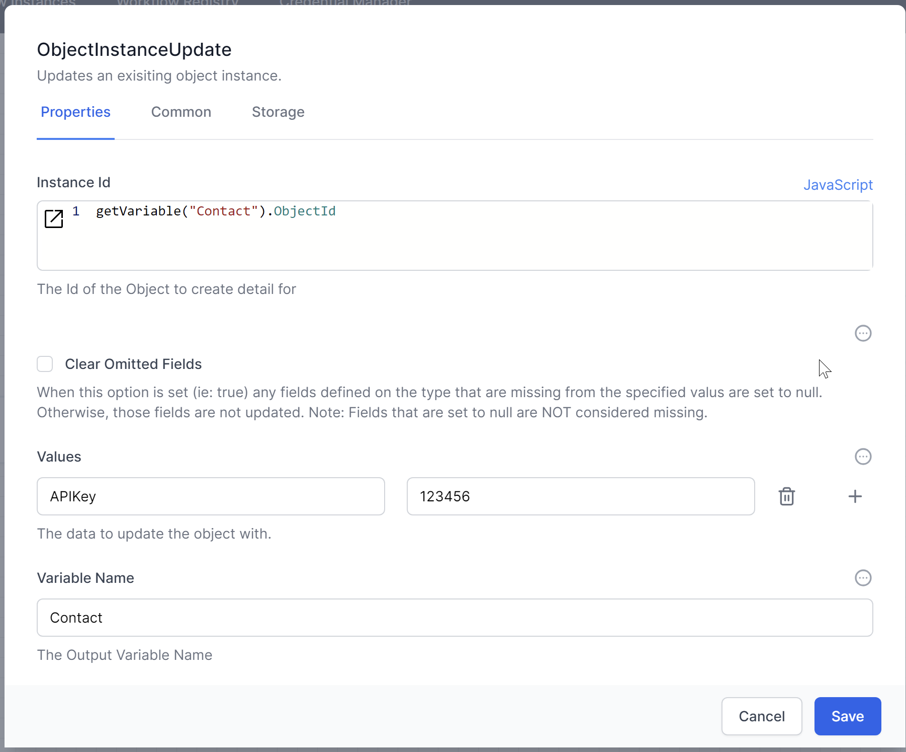
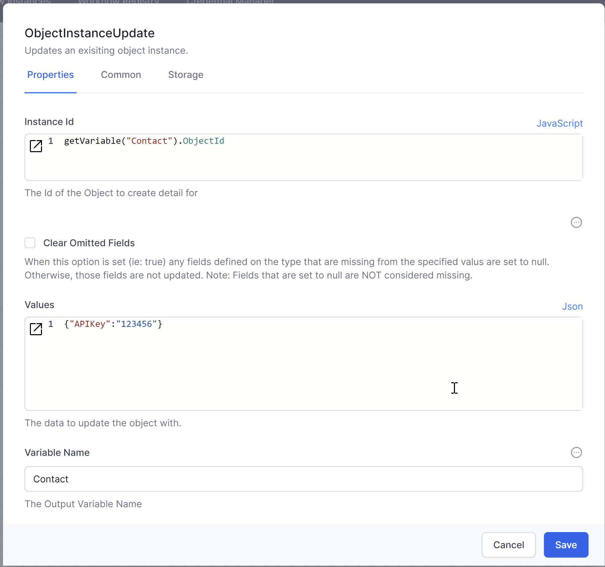
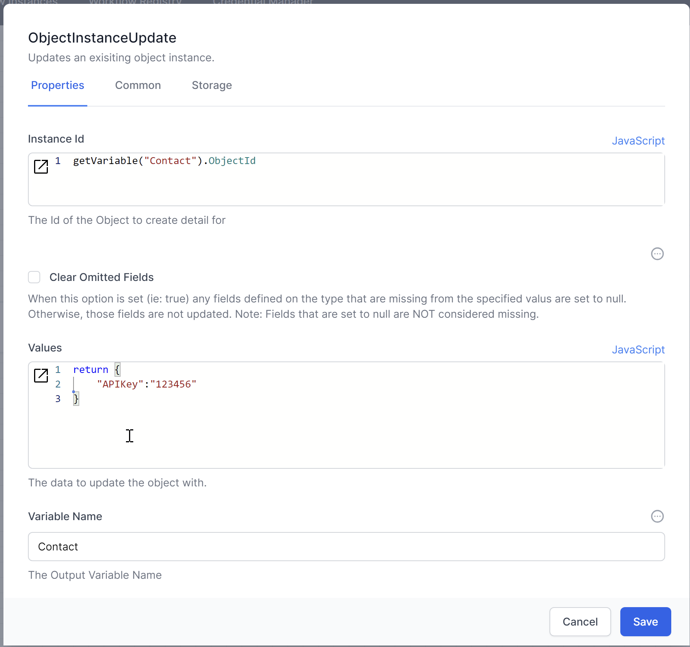
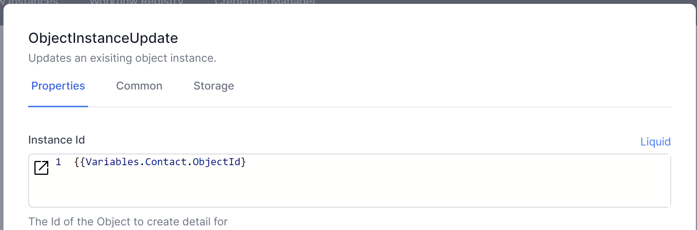
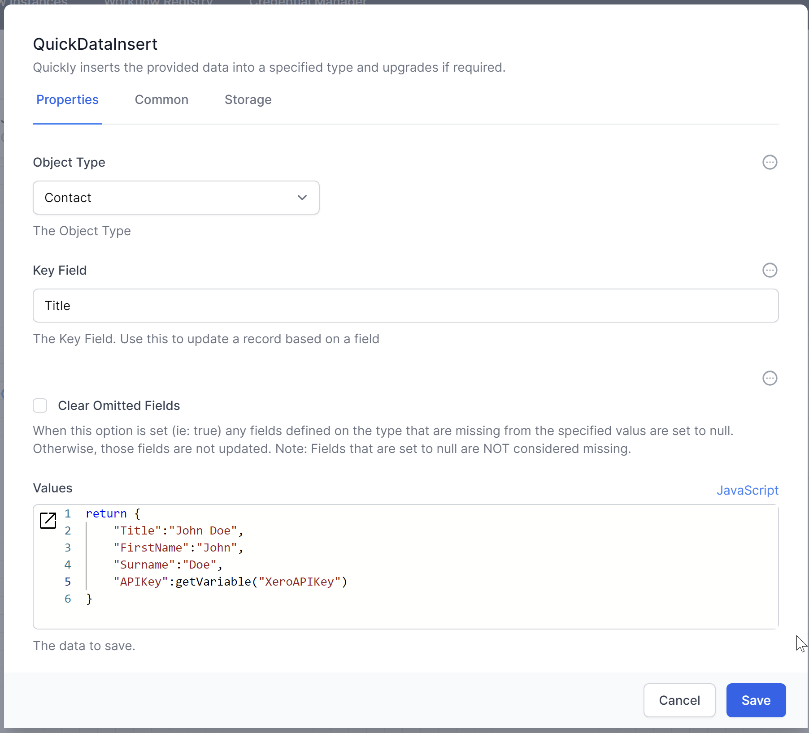

# Updating Data

To update existing data in the database, you can use the `ObjectInstanceUpdate` activity. This activity modifies fields in an existing record based on specified criteria. Use JSON to define the fields and their new values.

1. **Add the `ObjectInstanceUpdate` Activity:**
   - Drag and drop the `ObjectInstanceUpdate` activity into your workflow.
   - Specify the table or collection where the record exists.
   - Define the unique identifier or criteria for selecting the record to update.
   - Specify the fields and their new values using JSON.

2. **Example JSON:**
   ```json
   {
       "APIKey": "123456"
   }
   ```

Using default for Values


Using JSON representation for Values


Using JavaScript for Values


Using Liquid for the Instance Id


## Adding JSON data 

The `JSON Data Insert` activity is another way to add data to the database.  This activity is especially useful when the data might contain more fields than exist in the database: `JSON Data Insert` will create any missing fields. 



