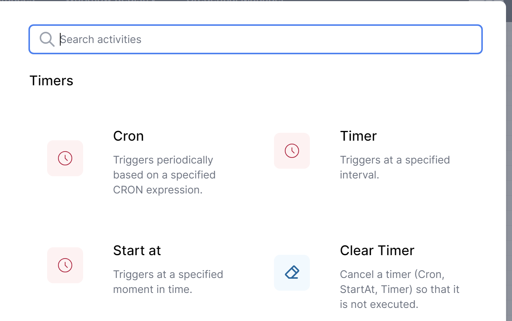
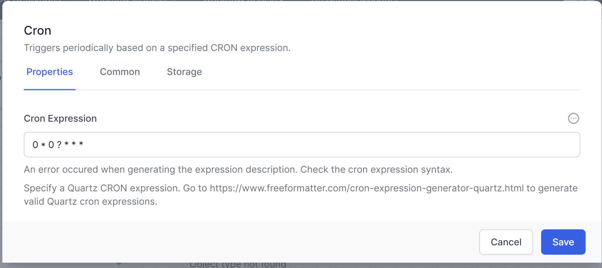
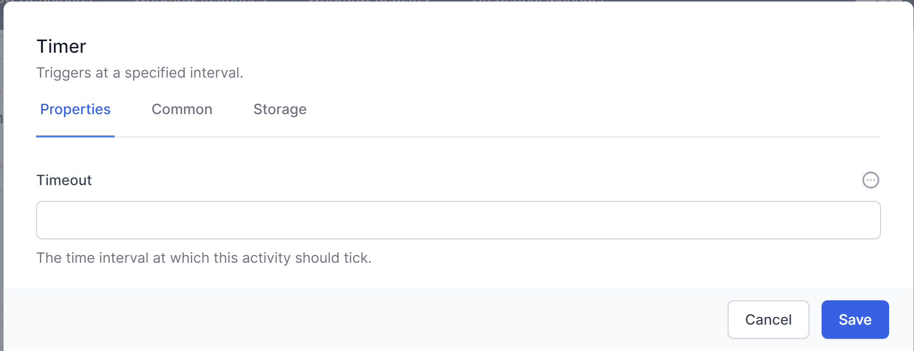
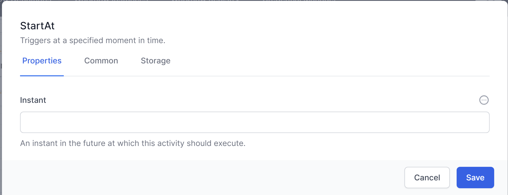
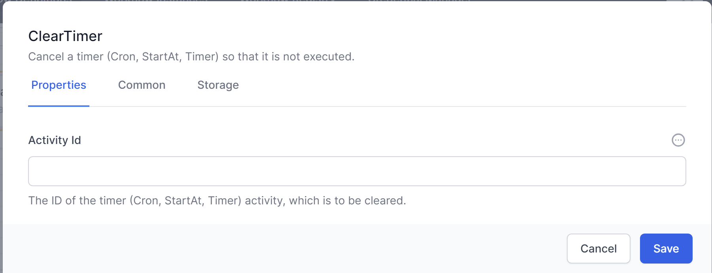

## Timer Activities

*Timer Activities in World of Workflows provide triggers to start and resume workflows based on server time*. It should be noted that when working with server time when world of workflows is hosted in Azure, AWS or GCP, the time is always stored in UTC.

This chapter will cover the essential Timer Activities, including **<span class="smallcaps">Cron, Timer, Start at and Clear timer</span>**


### CRON

The CRON activity starts a workflow based on a CRON expression. CRON started as a command-line utility, used as a job scheduler on Unix-like operating systems. You can use cron to schedule workflows to run periodically at fixed times, dates, or intervals.



Cron's name originates from chronos, the Greek word for time.

Specify a Quartz CRON expression. Go to https://www.freeformatter.com/cron-expression-generator-quartz.html to generate valid Quartz cron expressions.

The cron format has five time and date fields separated by at least one blank. There can be no blank within a field value. Scheduled tasks are executed when the minute, hour, and month of year fields match the current time and date, and at least one of the two day fields (day of month, or day of week) match the current date.

<table>
<colgroup>
<col style="width: 50%" />
<col style="width: 50%" />
</colgroup>
<thead>
<tr class="header">
<th>Field Name</th>
<th>Allowed Values</th>
</tr>
</thead>
<tbody>
<tr class="odd">
<td>Minute</td>
<td>0-59</td>
</tr>
<tr class="even">
<td>Hour</td>
<td>0-23</td>
</tr>
<tr class="odd">
<td>Day of month</td>
<td>1-31</td>
</tr>
<tr class="even">
<td>Month</td>
<td><p>1-12 where 1 is January, 2 is February etc</p>
<p>Uppercase, lowercase and mixed-case three character strings based on the English name of the month, for example jan, feb, mar, apr etc</p></td>
</tr>
<tr class="odd">
<td>Day of week</td>
<td><p>0-7 where 0 or 7 is Sunday, 1 is Monday and so on</p>
<p>Uppercase, lowercase or mixed case three character strings based on the English name of the day, mon, tue, wed, thu, fri, sat or sun</p></td>
</tr>
</tbody>
</table>

#### Ranges and lists

Ranges of numbers are allowed. Ranges are two numbers separated with a hyphen. The specified range is inclusive. For example, the range 8-11 for an hour entry specifies execution at hours 8, 9, 10 and 11.

Lists are allowed. A list is a set of numbers or ranges separated by commas. For example:

1,2,5,9

0-4,8-12

#### Unrestricted range

A field can contain an asterisk (\*), which represents all possible values in the field.

The day of a command's execution can be specified by two fields: day of month and day of week. If both fields are restricted by the use of a value other than the asterisk, the command will run when either field matches the current time. For example, the value 30 4 1,15 \* 5 causes a command to run at 4:30 AM on the 1st and 15th of each month, plus every Friday.

#### Step values

Step values can be used in conjunction with ranges. The syntax range/step defines the range and an execution interval.

If you specify first-last/step, execution takes place at first, then at all successive values that are distant from first by step, until last.

For example, to specify command execution every other hour, use 0-23/2. This expression is equivalent to the value 0,2,4,6,8,10,12,14,16,18,20,22.

If you specify \*/step, execution takes place at every interval of step through the unrestricted range. For example, as an alternative to 0-23/2 for execution every other hour, use \*/2.

#### Example

The following table lists values that you can use CRON activity:

Table 2. Example task schedules and the appropriate schedule argument values

Desired task schedule

| Schedule                                                                                            | Value                     |
|-----------------------------------------------------------------------------------------------------|---------------------------|
| 2:10 PM every Monday                                                                                | 10 14 \* \* 1             |
| Every day at midnight                                                                               | 0 0 \* \* \*              |
| Every weekday at midnight                                                                           | 0 0 \* \* 1-5             |
| Midnight on 1st and 15th day of the month                                                           | 0 0 1,15 \* \*            |
| 6.32 PM on the 17th, 21st and 29th of November plus each Monday and Wednesday in November each year | 32 18 17,21,29 11 mon,wed |

### Timer

The timer activity triggers at a specific timeout. It could run every 10 minutes, every 5 seconds or every hour.



To specify the timeout, you need to use a duration object, expressed as time.

| Interval | Meaning         |
|----------|-----------------|
| 00:00:05 | Every 5 seconds |
| 00:02:00 | Every 2 minutes |
| 01:00:00 | Every hour      |

Unlike Cron which runs when the system time matches a specific time and date, timer when started runs the duration after the previous run.

### StartAt

The StartAt activity triggers at a specific moment in time. If the time is in the past, the activity will not run. If it is in the future, it will wait until the time then start the rest of the workflow.



The date and time should be expressed as UTC and use the following format:

YYYY-MM-DDTHH:mm:ssZ (for example: 2023-07-10T12:00:00Z). This represents a date-time in the UTC timezone.

### Clear Timer

ClearTimer, is part of the "Timers" category. Its purpose is to cancel or clear a timer (of types Cron, StartAt, Timer), thus preventing it from executing.

The ClearTimer activity accepts ActivityId. This should be the ID of the timer activity (Cron, StartAt, Timer) that needs to be cleared. This input parameter supports JavaScript and Liquid syntaxes.

To use this, name the activity you want to cancel, then use the JavaScript syntax:

```js
getActivityID(“ActivityName”)
```



In essence, the ClearTimer activity provides a way to programmatically control the execution of a workflow by allowing timer activities to be cancelled based on certain conditions.