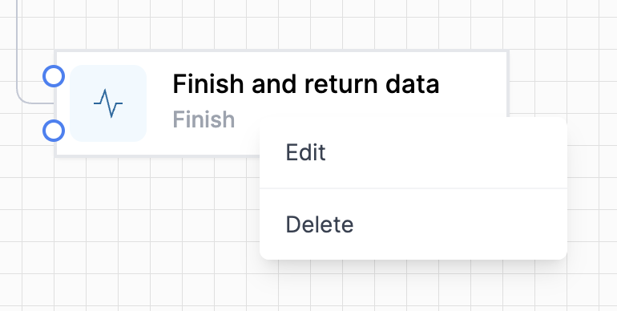
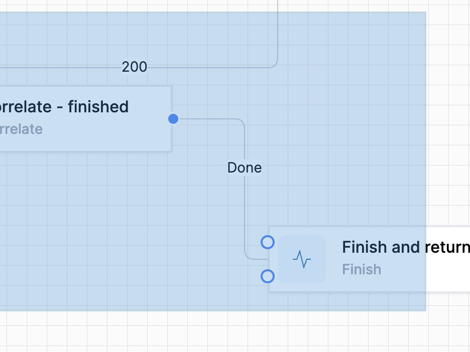
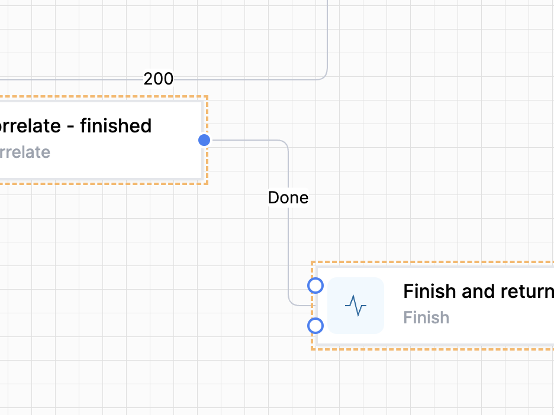

# Selecting Activities

Right-click on an activity to bring up the context menu:

Draw a marquee around several activities to select multiple activities.  

The selected activities now have a dotted orange border.

# Copying Activities

Activities can be easily copied and then pasted, either within the same workflow, or into a different workflow.

## Procedure:  

1. Select the activity or activities you want to copy.  

1. Press the copy key sequence (`Ctrl+C` for Windows, `Command+C` for Mac)

1. The selected activity/s are in memory.

1. Navigate to the place you want the copied activities to be pasted.  

1. Press the paste key sequence (`Ctrl+V` for Windows, `Command+V` for Mac)

