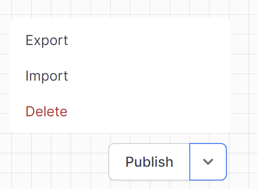

# Copying Workflows between instances

Copying workflows between instances, such as from `Personal Edition` to `Business Edition` is a similar process.

## Procedure:  

At the bottomn of every workflow there is a `Publish` button.  use the arrow beside the button to expose this menu  

1. Save your worklflow to disk by Exporting it  
   This creates a `<workflowname>.json` file in your browser's downloads folder 
3. Navigate to Admin -> Workflows in the other World of Workflows instance.
4. Create a new workflow  
  
5. Import the workflow from disk
   Click the arrow beside Publish again, click Import and find the `<workflowname>.json` file from step 1
6. Publish the new workflow.

