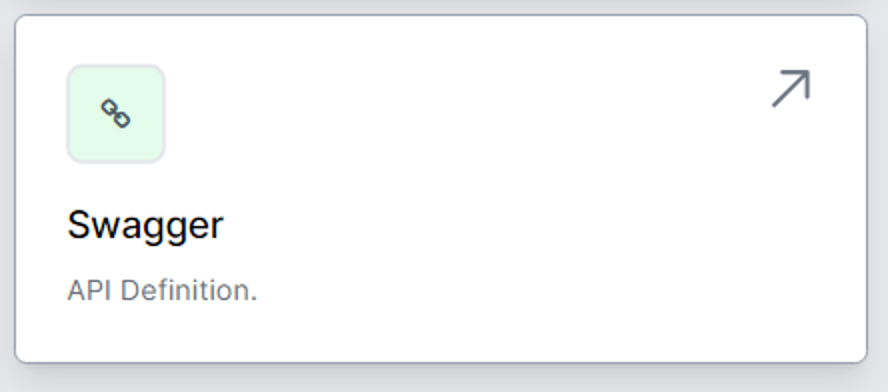

# Swagger - API Definition

World of Workflows is an OpenAPI platform.  All of the functionality of World of Workflows can be accessed via an API, and Swagger shows you this functionality.

Navigate to **Swagger** from the **Admin** page.

In World of Workflows, Swagger can be used to expose and document the API endpoints of the workflow system, making it easier for developers to integrate and interact with the workflow functionalities programmatically.

Here’s a brief overview of the Swagger function in World of Workflows:

1. **API Definition**: Swagger documents the structure of your API in a JSON or YAML format. This includes the endpoints, HTTP methods (GET, POST, PUT, DELETE, etc.), request parameters, request bodies, and response formats.

2. **Interactive Documentation**: Swagger provides a user interface that allows developers to explore and interact with your API directly from the documentation. This can include sending test requests and viewing responses, which is useful for debugging and understanding the API’s functionality.

3. **Code Generation**: Swagger can generate client libraries, server stubs, and API documentation in various programming languages. This helps streamline the development process by providing boilerplate code and reducing manual coding effort.

4. **Validation**: Swagger can be used to validate API requests and responses against the defined API schema, ensuring that they conform to the expected format and helping to catch errors early.

