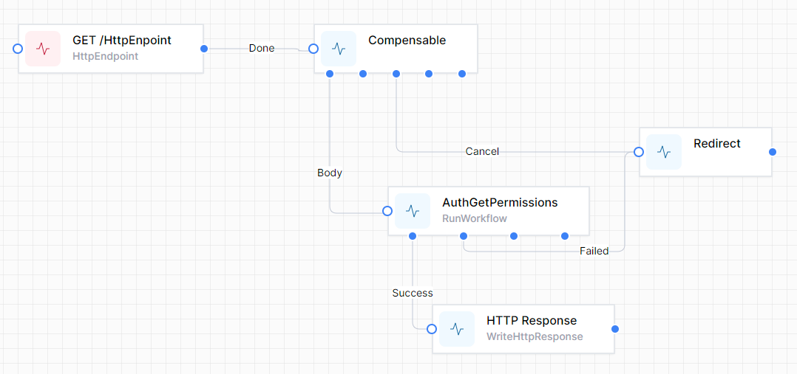

# Compensation

The Compensation system allows you to better handle errors in the operation of the workflow and gracefully revert.

## Compensable
Allows work that is executed after this activity to be undone.

The Compensable Activity has 5 outcomes:

- **Body** - The Body outcome lets the user specify what work to be done within the scope of the compensable activity.
- **Compensate** - If any activity causes an unhandled exception in the Done branch, the Compensate outcome of the compensable activity will be scheduled, allowing the workflow to undo actions as necessary.
- **Cancel** - If an activity within the Body branch faults, the Cancel outcome is scheduled.
- **Confirm** - Confirm
For some scenarios, compensable activities should no longer allow to be compensated anymore. To control this, the user should be able to explicitly confirm a compensable activity. When this happens, the ```Confirm``` outcome will be scheduled, allowing the user to do any work that finalizes some state.
- **Done** - Once the Body branch completes, the Done outcome is scheduled.


## Compensate
Invokes a specific compensable activity. 

Whenever an activity faults, any upper Compensable activity in its inbound branch will have its Compensate outcome scheduled for execution.

However, this is not always enough. Some activities can have an e.g. "Error" outcome. For example, the ```SendHttpRequest``` activity lets the user handle HTTP 500 status codes as an outcome. It is reasonable to allow the user to undo work that was done earlier in the workflow.

To allow for this, the user can add a ```Compensate``` activity and specify the name of the Compensable activity.


## Confirm
Confirms a specific compensable activity

To confirm a compensable activity, the user can use the Confirm activity by specifying the name of the compensable activity.

This will result in the ```Confirm``` outcome of the compensable activity to be scheduled for execution.

Confirmed compensable activities can no longer be compensated. Trying to do so will cause an exception.

## Example Use case
A Compensation activity which ensures the Redirect activity is scheduled regardless of the type of failure occurs in the RunWorkflow activity.



In this instance, only the ```Body``` and ```Cancel``` branches are required. Any exceptions thrown in the ```Body``` branch will cause the Workflow to proceed down the ```Cancel``` branch.