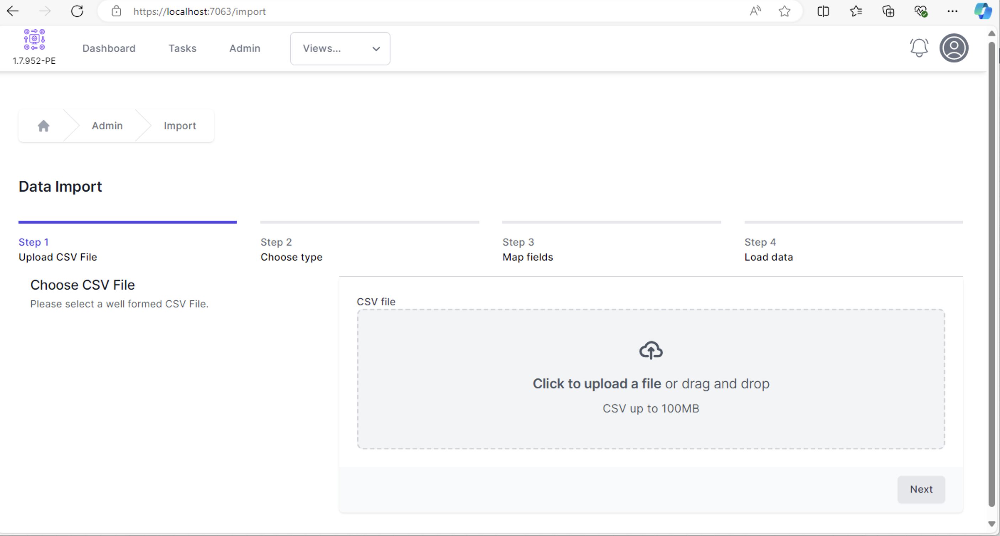
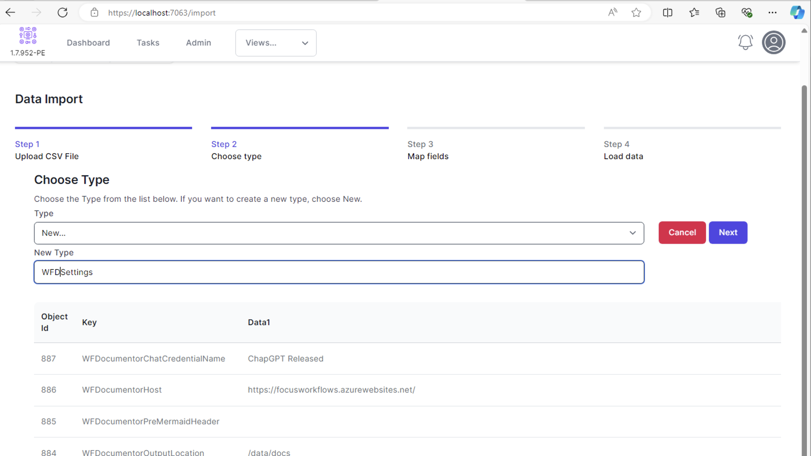
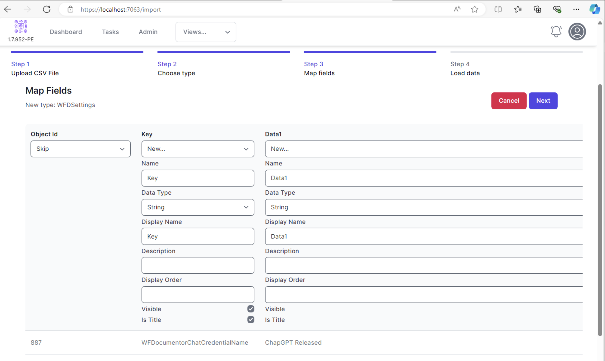
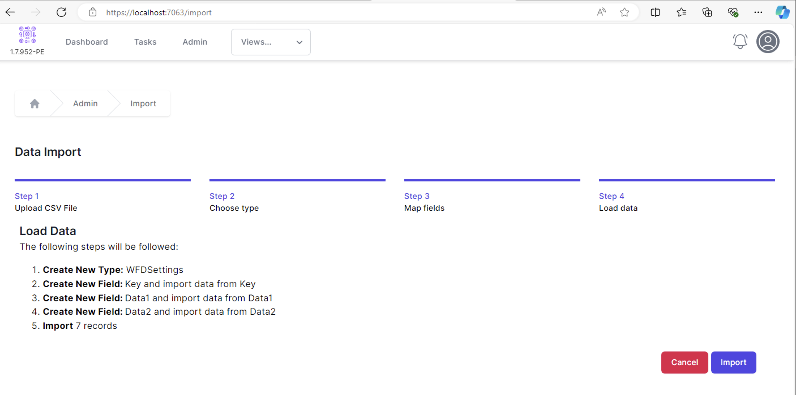

# Importing data into World of Workflows

World of Workflows has a powerful Import capability.  Processes are built on data, and being able to import data from CSV files is important in many projects.  

To import data, navigate to **Admin** => **Import**

Select a CSV file and select Next.
The first few lines of the file are displayed.

In the *Type* field, either create a new Type and enter a name for the new type, or select an existing Type into which you want the data created.  In this example we want to create a new Type, called **WFDSettings**

Step 3 is to map your data fields.  For a new Type, you will create new fields.

By default, all fields are set to Skip.  To create a new field, select New and complete the field details.  **Import** attempts to predict the data type based on the first few rows of data it finds.  You can change the data type as appropriate.

{: .key}
You must select one field to be a **Title** field.  This is the field that is shown when you link Types together with special fields called Reference fields.

When you have set all the fields up as needed, click Next.

Import will describe the actions it will perform and you can click Next to finish the import.
