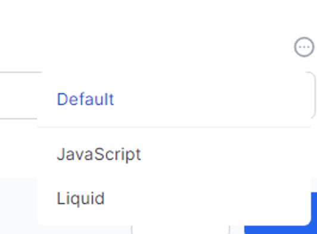

# Using Javascript and Liquid in Workflows

Almost all of the World of Workflows activities can use either JavaScript or Liquid to write small snippets of code to streamline your workflow development.  You choose which is more suitable for your workflow activity.  You can mix and match JavaScript,Literals and Liquid, even in the same activity.

This chapter discusses some of the more common techniques for using JavaScript and Liquid in World of Workflows activities.

On almost every field of all activities in World of Workflows there is a little 3-dot menu.  This allows you to choose the language to be used to set up that field.

{: .key }
After you switch between languages be sure to click **Save** on the activity before entering the formula for the other language.