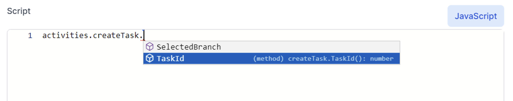
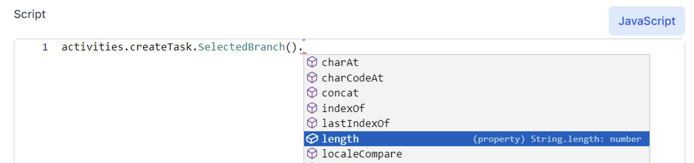
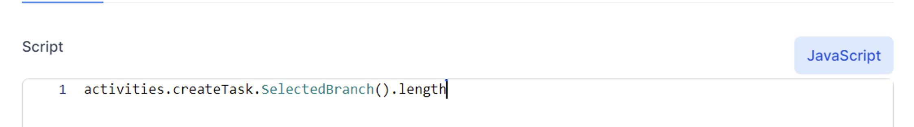

# JavaScript in World of Workflows
The following JavaScript expressions are supported:

## Variables

### Workflow Variables
Any workflow variable can be accessed directly as if they were a global variable.

For example, if the `Set Variable` activity sets a variable called `FirstName` to 'Luke', it can be accessed as follows:

```
return `Hello ${FirstName}`
```

 or it can be accessed by
 ```
 return 'Hello '+getVariable("FirstName")
 ```
Value returned will be:

`Hello Luke`

This also works when setting variables using the setVariable() function. Because ultimately, both the SetVariable activity and setVariable() function use the same API under the cover to set a workflow variable.

{: .key }
JavaScript and Liquid are case sensitive.  


## Activity Output
A activity might provide some output which can then be accessed from any other activity using workflow expressions. 
For example, to access an activity's output property called OUTPUT using a JavaScript expression, you can do so by specifying activities, then the activity name followed by `.Output()`.

{: .key }
You must put `()` at the end of a `method`, and not at the end of a `property`.

### Methods and properties

For example, if you have an activity named `MyActivity`, you can access its output as follows: 

```
activities.MyActivity.Output()
```

Note that the Intelisense prompts you to include () when you see `(method)` in the description.  For example


See the difference when intellisense shows a `property` is needed:

In this case you do not include the () at the end:



If the output is an object, you can access its properties too. For instance, the HTTP Endpoint activity returns the HTTP request as its output which is of type HTTPREQUESTMODEL. When you name this activity `MyHttpEndpoint`, you can access the HTTP request Body like this:

```
activities.MyHttpEndpoint.Output().Body
```

If you happened to post a JSON document to your HTTP endpoint that looks like this:

```
{
  "MyDocument": {
    "Title": "About Elsa Workflows"
  }
}
```

Then you can access the Title field like this:

```
activities.MyHttpEndpoint.Output().Body.MyDocument.Title
```

If your activity is a direct child of an HTTP Endpoint activity, you can access its output directly via the input variable, which will be an instance of HTTPREQUESTMODEL.

### input
Contains the input value that was received as output from the previously executed activity, if any.

```
input: object?
```

### workflowInstanceId
Contains the workflow instance ID of the currently executing workflow.

```
workflowInstanceId: string
```

### workflowDefinitionId
Contains the workflow definition ID of the currently executing workflow.

```
workflowDefinitionId: string
```

### workflowDefinitionVersion
Contains the workflow definition version of the currently executing workflow.

```
workflowDefinitionVersion: number
```

### correlationId
Contains the correlation ID of the currently executing workflow.

```
correlationId: string?
```

### currentCulture
Contains the current culture.

```
currentCulture: CultureInfo
```

Currently, this value is always set to CultureInfo.InvariantCulture.


### workflowContext
Contains the workflow context (if any) of the currently executing workflow.

```
workflowContext: object?
```

## Common Functions

### guid
Generates a new GUID value and returns its string representation.

`guid(): string`

This function is a thin wrapper around the following .NET code: 
`Guid.NewGuid().ToString()`.

### parseGuid
Parses a string into a GUID value.

`parseGuid(value: string): Guid`

This function is a thin wrapper around the following .NET code: 
`Guid.Parse(value)`.

### setVariable
Sets a workflow variable to the specified value.

`setVariable(name: string, value: object): void`

This function is a thin wrapper around the following .NET code: 
`activityContext.SetVariable(name, value)`.

### getVariable
Returns a workflow variable with the specified name.

`getVariable(name: string): object`

Instead of using getVariable(name: string), you can access workflow variables directly as described above in the Workflow Variables section.

This function is a thin wrapper around the following .NET code: 
`activityContext.GetVariable(name)`.

### getConfig
Provides access to a .NET configuration value.

`getConfig(name: string): string`

As an example, let's say you have the following JSON in appsettings.json:
```
{
  "Elsa": {
    "Smtp": {
      "Host": "localhost",
      "Port": 2525
    }
  }
}
```
You can access the configured Port value using the following expression:

`getConfig("Elsa:Smtp:Port") // returns '2525'`

This function is a thin wrapper around the following .NET code: 
`configuration.GetSection(name).Value`
where configuration is an instance of IConfiguration.

### isNullOrWhiteSpace
Returns true if the specified string is null, empty or consists of white space only, false otherwise.

`isNullOrWhiteSpace(value: string): boolean`

This function is a thin wrapper around the following .NET code: 
string.IsNullOrWhiteSpace(value).

### isNullOrEmpty
Returns true if the specified string is null or empty, false otherwise.

`isNullOrEmpty(value: string): boolean`

This function is a thin wrapper around the following .NET code: 
string.IsNullOrEmpty(value).

 
## Workflow Functions

### getWorkflowDefinitionIdByName
Returns the ID of the specified workflow by name. This is useful when for instance you are using the RUNWORKFLOW activity, which requires the ID of the workflow definition to run.

`getWorkflowDefinitionIdByName(name: string): string?`

For example: set the Workflow Definition in a RUNWORKFLOW activity to MyWorkflow : 
getWorkflowDefinitionIdByName(‘MyWorkflow')


### getWorkflowDefinitionIdByTag
Returns the ID of the specified workflow by tag. This is useful when for instance you are using the RUNWORKFLOW activity, which requires the ID of the workflow definition to run.

`getWorkflowDefinitionIdByTag(tag: string): string?`

## HTTP Functions

### queryString
Returns the value of the specified query string parameter.

`queryString(name: string): string`

### absoluteUrl
Converts the specified relative path into a fully-qualified absolute URL.

`absoluteUrl(path: string): string`

### signalUrl
Generates a fully-qualified absolute signal URL that will trigger the workflow instance from which this function is invoked.

`signalUrl(signal: string): string`

## Date/Time Functions

### instantFromDateTimeUtc
Returns a new Instant object from the specified DateTime value.

Make sure that the `DateTime` value's Kind property is `DateTimeKind.Utc`.

### currentInstant
Returns the current date/time value in the form of a NodaTime's Instant object.

`currentInstant(): Instant`

### currentYear
Returns the current year.

`currentYear(): number`

### startOfMonth
Returns the start of the month of the specified instant. If no instant is specified, the current instant is used.

`startOfMonth(instant: Instant?): LocalDate;`

### endOfMonth(instant: Instant?)
Returns the end of the month of the specified instant. If no instant is specified, the current instant is used.

`endOfMonth(instant: Instant?): LocalDate;`

### startOfPreviousMonth
Returns the start of the previous month of the specified instant. If no instant is specified, the current instant is used.

`startOfPreviousMonth(instant: Instant?): LocalDate;`

### plus
Adds the specified Duration to the specified Instant and returns the result.

`plus(instant: Instant, duration: Duration): Instant`

### minus
Subtracts the specified Duration from the specified Instant and returns the result.

`minus(instant: Instant, duration: Duration): Instant`

### durationFromDays
Returns a duration constructed from the specified number of days.

`durationFromDays(days: number): Duration`

### formatInstant
Formats the specified Instant using the specified format string and CultureInfo. If no culture info is provided, CultureInfo.InvariantCulture is used.

`formatInstant(instant: Instant, format: string, cultureInfo: CultureInfo?): string`

### localDateFromInstant
Returns the LocalDate portion of the specified Instant.

`localDateFromInstant(instant: Instant): LocalDate
`
### instantFromLocalDate
Creates an Instant from the specified LocalDate value (start of date).

`instantFromLocalDate(localDate: LocalDate): Instant`

