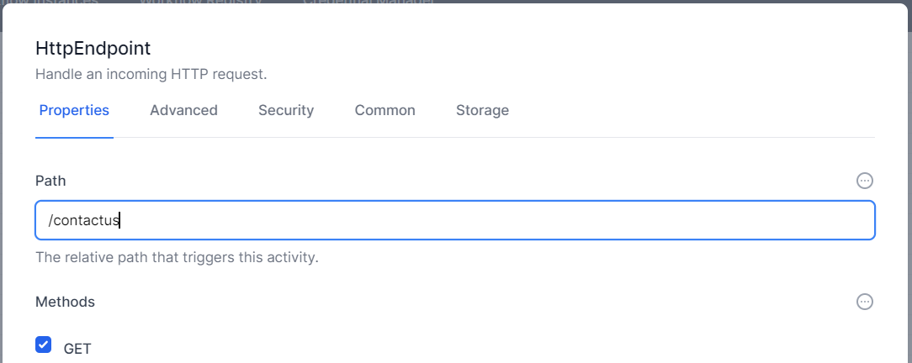

# Simple Form

In this example, we will create a simple Contact-Us form for a Website. This form will allow end users to enter their name and details and the system will create an entry in a table in World of Workflows.

The process is as follows:

1. **Create Type** - Create any types in the database you require
2. **Create Columns** - Create columns that are required
3. **Create Form** - Create a simple form
4. **Create For POST Target** - Create somewhere to handle when a user clicks **Submit**

Once that's complete, we'll add some extensions

5. **Handling Reference Columns** - How to handle columns that reference another type.
6. **Handling UPSERT** - How to handle "duplicate" entries using UPSERT (Update or Insert)

## Create Type

1. Navigate to **Admin --> Types**
2. Click **+**
3. Name the Type **Lead**, with the description **A Lead** and click **Save**
   

## Create Columns

1. Click  **Edit Columns**
2. Click **+** to add columns and add the following string columns:
   1. **FirstName**
   2. **LastName**
   3. **Email**
   4. **Phone**
   5. **Company**
   
3. You should now have six columns as shown below:
   

## Create Form

1. Navigate to **Admin->Workflows**
2. Click **Create Workflow**
3. Click the cog  and name the Workflow **Lead Form** and click **Save**
4. Click **Add Activity** and choose **HTTP** on the left and click **HTTP Endpoint**
   
5. Right Click the HTTP Endpoint activity on the Design Surface and choose **Edit**
6. Make the Path ```/contactus``` and leave the Method as **Get**.
   
7. Click the **Common** tab and change the Display Name to ```GET /contactus```
   
8. Click **Save**
9. Click **Add Activity** and choose **HTTP** on the left and click **HTTP Response**
10. Drag the **HTTP Repsonse** activity across to the right and slightly down.
11. Connect the two activities by dragging from the blue dot on the right of the HTTPEndpoint activity to the blue circle on the left of the WriteHTTPResponse activity
12. Right Click the HTTP Response Activity and choose **Edit**
13. Click the ellipsis  to the top right of the textbox under Content and choose **Liquid**
14. Paste in the following text
    ```html
    <!DOCTYPE html>
    <html lang="en">
    <head>
        <meta charset="UTF-8">
        <meta name="viewport" content="width=device-width, initial-scale=1.0">
        <title>Contact Us</title>
        <link href="https://cdn.jsdelivr.net/npm/tailwindcss@2.2.19/dist/tailwind.min.css" rel="stylesheet">
        <script>
            function updateFullName() {
                const firstName = document.getElementById('firstName').value;
                const lastName = document.getElementById('lastName').value;
                document.getElementById('fullName').value = `${firstName} ${lastName}`;
            }
        </script>
    </head>
    <body class="bg-gray-100 flex items-center justify-center h-screen">
        <div class="bg-white p-8 rounded-lg shadow-lg w-full max-w-md">
            <h2 class="text-2xl font-bold mb-6 text-gray-800 text-center">Contact Us</h2>
            <form action="/contactuspost" method="POST">
                <div class="mb-4">
                    <label for="firstName" class="block text-gray-700">First Name</label>
                    <input type="text" id="firstName" name="firstName" class="mt-1 p-2 w-full border rounded-lg focus:outline-none focus:ring-2 focus:ring-blue-500" oninput="updateFullName()" required>
                </div>
                <div class="mb-4">
                    <label for="lastName" class="block text-gray-700">Last Name</label>
                    <input type="text" id="lastName" name="lastName" class="mt-1 p-2 w-full border rounded-lg focus:outline-none focus:ring-2 focus:ring-blue-500" oninput="updateFullName()" required>
                </div>
                <div class="mb-4">
                    <label for="email" class="block text-gray-700">Email</label>
                    <input type="email" id="email" name="email" class="mt-1 p-2 w-full border rounded-lg focus:outline-none focus:ring-2 focus:ring-blue-500" required>
                </div>
                <div class="mb-4">
                    <label for="phone" class="block text-gray-700">Phone</label>
                    <input type="tel" id="phone" name="phone" class="mt-1 p-2 w-full border rounded-lg focus:outline-none focus:ring-2 focus:ring-blue-500" required>
                </div>
                <div class="mb-4">
                    <label for="companyName" class="block text-gray-700">Company Name</label>
                    <input type="text" id="companyName" name="companyName" class="mt-1 p-2 w-full border rounded-lg focus:outline-none focus:ring-2 focus:ring-blue-500" required>
                </div>
                <div class="mb-4">
                    <label for="fullName" class="block text-gray-700">Full Name</label>
                    <input type="text" id="fullName" name="fullName" class="mt-1 p-2 w-full border rounded-lg focus:outline-none focus:ring-2 focus:ring-blue-500" readonly>
                </div>
                <button type="submit" class="w-full bg-blue-500 text-white py-2 rounded-lg hover:bg-blue-600 focus:outline-none focus:ring-2 focus:ring-blue-500">Submit</button>
            </form>
        </div>
    </body>
    </html>
    ```
15. Change the **Content Type** to text/html.
    
16. Click **Save**
17. Click **Publish** *On the bottom right of the design surface*

> **Note from Customer Success Team** You don't need to be a HTML genius to create this form. We created it using ChatGPT. Our Prompt was: *Create a beautiful contact us HTML form which posts to /contactuspost with the following fields: First Name, Last Name, Email, Phone and Company Name. Add a calculated field of FullName. Style the form with tailwindcss.*

### Testing the Form
Let's test the form. It doesn't work yet (as it cannot send the data anywhere), but it should be visible.

If you are running Personal Edition, Navigate to [https://localhost:7063/contactus](https://localhost:7063/contactus). If you are using Business Edition, navigate to https://YourServer/contactus.

### Troubleshooting ideas
If the form did not display as expected, try the following:

1. No Form or Error Displayed
   1. [ ] Did you spell ```/contactus``` correctly in the HTTP Endpoint?
   2. [ ] Did you join the activities
   3. [ ] Did you paste the HTML text above and change the type to **Liquid**?
2. Form is just HTML
   1. [ ] Did you change the Content Type to text/html?

## Form Post Target
If we examine the following line in our HTML, we can see the text ```<form action="/contactuspost" method="POST">```. This means when we click **Submit**, the form will ```POST``` the data to the endpoint ```/contactuspost```. This section shows you how to make workflows understand and handle this response.

1. If not open, navigate back to your workflow. **Admin --> Workflows --> Workflow Definitions --> Lead Form**.
2. Click **Add Activity**, Choose HTML and choose **HTTP Endpoint**
3. Drag the new activity down.
4. Right Click and choose **Edit**
5. Make the path ```/contactuspost```
6. Make the Method ```POST```
7. Check **Read Content**
   
8. Click the **Common** Tab
9. Change the DisplayName to be ```POST /contactuspost```
10. Change the Name to be ```PostContactUs```
11. Click **Save**
12. Click **Add Activity**, Choose **Data** and choose **Create Object Instance**
13. Drag this slightly below and to the right of the HTTP Endpoint above
14. Connect the two workflows by dragging from the blue disk on the right of the POST /contactuspost activity to the blue circle on the left of the ObjectInstanceCreate activity.
15. Right Click the CreateObjectInstance Activity and choose **edit**
16. Make the Object Type **Lead**. Click the  to the top right of values and choose **JavaScript**.
17. Paste the following
    ```js
    var result = 
    {
        "Title": activities.PostContactUs.Output().Body.fullName,
        "FirstName": activities.PostContactUs.Output().Body.firstName,
        "LastName": activities.PostContactUs.Output().Body.lastName,
        "Email":activities.PostContactUs.Output().Body.email,
        "Phone":activities.PostContactUs.Output().Body.phone,
        "Company": activities.PostContactUs.Output().Body.companyName
    };
    return result;
    ```
18. Change the Variable name to be ThisLead
19. Click **Save**
20. Click **Add Activity**
21. Choose **HTTP** and **HTTP Response**
22. Drag the new activity to the right and slightly below the ObjectInstanceCreate Activity
23. Right click the new HTTP Response activity and choose edit
24. Click the  on the top right of content and choose **Liquid**.
25. Paste the following into the content box:
    ```html
    <!DOCTYPE html>
    <html lang="en">
    <head>
        <meta charset="UTF-8">
        <meta name="viewport" content="width=device-width, initial-scale=1.0">
        <title>Thank You</title>
        <link href="https://cdn.jsdelivr.net/npm/tailwindcss@2.2.19/dist/tailwind.min.css" rel="stylesheet">
    </head>
    <body class="bg-gray-100 h-screen flex items-center justify-center">
        <div class="bg-white rounded-lg shadow-lg p-8 max-w-lg mx-auto text-center">
            <svg class="w-20 h-20 mx-auto text-green-500" fill="currentColor" xmlns="http://www.w3.org/2000/svg" viewBox="0 0 20 20">
            <path fill-rule="evenodd" d="M10 18a8 8 0 100-16 8 8 0 000 16zm3.707-10.707a1 1 0 00-1.414-1.414L9 9.586 7.707 8.293a1 1 0 00-1.414 1.414l2 2a1 1 0 001.414 0l5-5z" clip-rule="evenodd" />
            </svg>
            <h1 class="text-2xl font-bold text-gray-800 mt-4">Thank You!</h1>
            <p class="text-gray-600 mt-2">Your message has been successfully sent. We appreciate you reaching out to us. One of our team members will get back to you shortly.</p>
            <a href="/" class="inline-block mt-6 px-6 py-2 text-white bg-blue-500 rounded-full hover:bg-blue-600 transition-colors">Return Home</a>
        </div>
    </body>
    </html>
     ```
26. Change the Content Type to be ```text/html```
27. Click **Save**
28. Click **Publish** at the bottom right of the page

> **Note from Customer Success Team** You don't need to be a HTML genius to create this thank you page either. We created it using ChatGPT. Our Prompt was: *Create a beautiful thank you page to be shown when someone creates a contact us form in HTML with tailwindcss.*

## Testing our Form

1. Navigate to https://localhost:7063/contactus  
   
2. Enter your details and click **Submit**  
   
3. Navigate to Types in World of Workflows (**Admin --> Types**)
4. Click **Lead**  
   
5. You can now see the new lead in the system.  